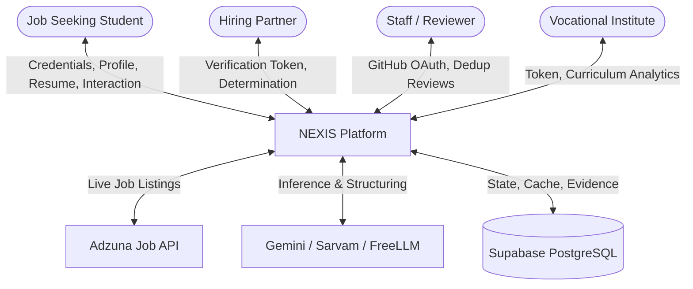
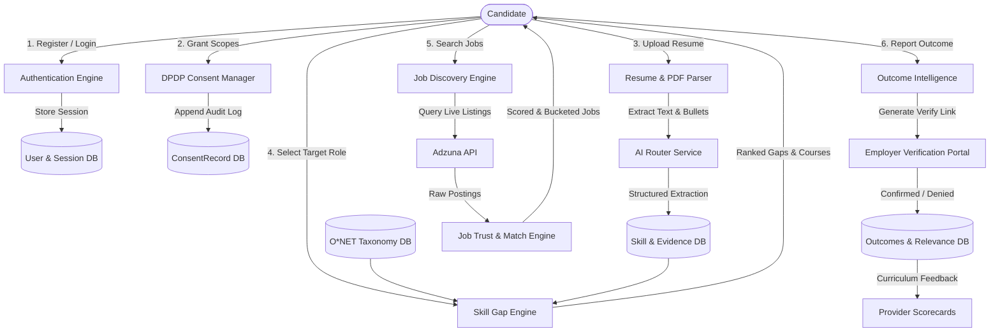
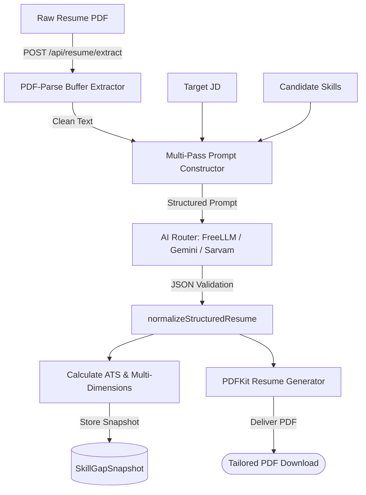
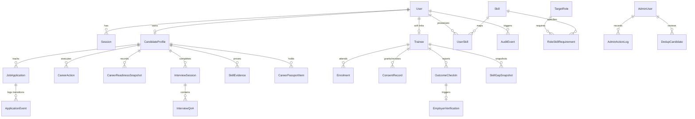

# NEXIS Architecture & Technical Specification

## 1. System Overview

NEXIS is an **Evidence-Based Career Operating System** that turns unverified claims into grounded, verifiable career progression. The architecture integrates an interactive 3D WebGPU simulation, structured O\*NET taxonomy, live job aggregation, deterministic scoring engines, and a DPDP Act 2023 compliance layer.

```
┌─────────────────────────────────────────────────────────────────────────────┐
│                            CLIENT (Browser / Mobile)                        │
│  React 19 + TypeScript + Vite + TailwindCSS v4 + Zustand                     │
│  ┌───────────────────────────────┐     ┌─────────────────────────────────┐  │
│  │    Three.js WebGPU Scene      │     │       UI Overlay Views          │  │
│  │  - Instanced Node Shaders     │     │  - SkillGapsView                │  │
│  │  - Semi-Ragdoll Physics       │     │  - JobMatchesView               │  │
│  │  - Stage & Lighting           │     │  - InterviewPrepView            │  │
│  │  - Raycast Pointer Grab       │     │  - OutcomeStatusView            │  │
│  └───────────────┬───────────────┘     └────────────────┬────────────────┘  │
└──────────────────┼──────────────────────────────────────┼───────────────────┘
                   │                                      │ HTTP / SSE / REST
                   ▼                                      ▼
┌─────────────────────────────────────────────────────────────────────────────┐
│                       BACKEND API (Express 5 Runtime)                       │
│  - Hosted on Vercel Serverless Function (/api/* -> api/index.js)            │
│  - Local dev on Node.js port 8787                                           │
│                                                                             │
│  ┌──────────────────────────────┐     ┌──────────────────────────────────┐  │
│  │       Auth & Identity        │     │         Career & Scoring         │  │
│  │  - authService (scrypt)      │     │  - skillGapEngine (O*NET)        │  │
│  │  - otpService                │     │  - jobTrustEngine                │  │
│  │  - consent (DPDP scopes)     │     │  - matchingService (Jaro-Winkler)│  │
│  │  - adminAuth (GitHub OAuth)  │     │  - relevanceScoringService       │  │
│  └───────────────┬──────────────┘     └─────────────────┬────────────────┘  │
└──────────────────┼──────────────────────────────────────┼───────────────────┘
                   │ Prisma ORM                           │ External APIs
                   ▼                                      ▼
┌──────────────────────────────────────┐     ┌────────────────────────────────┐
│      SUPABASE POSTGRESQL 17          │     │        EXTERNAL SERVICES       │
│  - AWS ap-south-1                    │     │  - Adzuna Job Aggregator       │
│  - Pooled (Supavisor port 6543)      │     │  - Google Gemini API           │
│  - Direct connection (port 5432)     │     │  - Sarvam AI                   │
│  - 34 Models, relational constraints │     │  - FreeLLMAPI Gateway          │
└──────────────────────────────────────┘     └────────────────────────────────┘
```

---

## 2. Data Flow Diagrams (DFD)

### Level 0 DFD — Context Diagram


### Level 1 DFD — Subsystem Breakdown


### Level 2 DFD — Resume Optimization & Evidence Flow


---

## 3. Database Architecture & Relationships

The database is managed through **Prisma ORM** against **PostgreSQL 17** in Supabase.

### Core Entity Relationships


---

## 4. Frontend Architecture

- **Rendering Engine**: Three.js WebGPU with TSL node shaders (`MeshStandardNodeMaterial`).
- **Instanced Attributes**: `posAttribute`, `velAttribute`, `colorAttribute`, `procWeightAttribute`, `orientationAttribute`.
- **Character Physics**:
  - `GrabController`: 3D plane projection preserving local offset.
  - `CharacterPhysicsController`: Critically damped tracking spring, torso tilt, free-fall gravity, angular momentum.
  - `SecondaryMotionController`: Spring-damper physics for limbs and head responding to local acceleration and gravity dangle.
  - `ImpactController`: Velocity-dependent ground compression (squash/stretch) and damped wobble shockwave.
  - `RecoveryController`: Cubic ease-out balance restoration and procedural weight decay back to autonomous AI idle.
- **State Management**: Zustand stores (`useCoreStore`, `useUiStore`, `useAuthStore`).
- **Views**: 10 primary workflow views mounted inside `App.tsx` with zero route unmounting overhead.

---

## 5. Security & Authentication Architecture

1. **User Authentication**:
   - Primary: Phone + password. Passwords salted with 16 random bytes and hashed using `crypto.scrypt` (64 bytes derived key).
   - Comparison: Constant-time evaluation via `crypto.timingSafeEqual`.
   - Sessions: Cryptographically generated 256-bit random tokens, stored hashed with SHA-256 (`tokenHash`) with 7-day expiration.
2. **Admin Authentication**:
   - Secondary / RBAC: GitHub OAuth for staff and reviewers.
   - Roles: `SUPER_ADMIN` > `REVIEWER` > `ANALYST`.
   - Audit trail: All admin operations logged append-only to `AdminActionLog`.
3. **DPDP Compliance Layer**:
   - 4 Scopes: `JOB_SEARCH_DATA`, `EMPLOYER_SHARING`, `ANALYTICS`, `GOVT_CROSS_CHECK`.
   - Append-only audit trail in `ConsentRecord` table.
4. **Rate Limiting**:
   - `aiLimiter`: 30 requests per 15 minutes per IP.
   - `otpLimiter`: 5 OTP requests per 15 minutes per phone number.

---

## 6. Database Access Architecture & Defense-in-Depth RLS

### 6.1 Current Access Architecture
- **Client Tier**: Browser client connects exclusively to the Express backend (`/api/*`). The frontend contains zero direct connection to Supabase or `@supabase/supabase-js`.
- **Backend Tier**: Express routes execute queries via Prisma ORM 5.10.2 (`@prisma/client`).
- **Connection Mode**: Prisma connects to Supabase PostgreSQL 17 using a pooled connection string (Supavisor transaction pooler on port 6543) and a direct connection string for migrations (port 5432).
- **PostgreSQL Role**: Prisma connects as the table owner `postgres`.

### 6.2 Threat Model
- **Vulnerability**: Supabase exposes an HTTP PostgREST API at `https://<ref>.supabase.co/rest/v1/`. If tables in the `public` schema have Row Level Security disabled, any external request providing the public `anon` key could query or manipulate tables directly via PostgREST, bypassing backend Express authentication middleware.
- **Remediation Strategy**: Enable Row Level Security across public schema tables. Because PostgREST requests from `anon` and `authenticated` roles do not possess bypass rights, all direct PostgREST access is denied by default.
- **Prisma Impact**: Prisma connects via direct TCP/SSL connection as `postgres`. When RLS policies are applied, tables must either grant access to `postgres` or connection pooling must preserve the superuser role.
- **Rollback Strategy**: RLS can be immediately disabled or reconfigured per table via:
  ```sql
  ALTER TABLE public."<tablename>" DISABLE ROW LEVEL SECURITY;
  ```

---

## 7. Deterministic 5-Factor Job Matching Engine

Implemented in `server/services/jobTrustEngine.js`:

$$\text{OverallScore} = 0.35 \times S_{\text{skill}} + 0.20 \times S_{\text{exp}} + 0.20 \times S_{\text{title}} + 0.15 \times S_{\text{proj}} + 0.10 \times S_{\text{loc}}$$

- **Skill Score ($35\%$)**: Jaccard overlap between candidate proven competencies and job description requirements.
- **Experience Score ($20\%$)**: Seniority fit matching candidate experience years against role level (Senior, Mid, Junior).
- **Title Score ($20\%$)**: Token similarity between user target role and job title.
- **Project/Evidence Score ($15\%$)**: Provenance-backed project evidence relevance boost.
- **Location Score ($10\%$)**: Exact city match ($95$), remote/flexible ($95$), domestic tech hub ($75$), or mismatch ($35$).

### Actionable Bucket Thresholds:
- **`APPLY_NOW`**: $\text{Score} \ge 75$
- **`LEARN_THEN_APPLY`**: $55 \le \text{Score} < 75$
- **`STRETCH`**: $35 \le \text{Score} < 55$
- **`IGNORE`**: $\text{Score} < 35$
