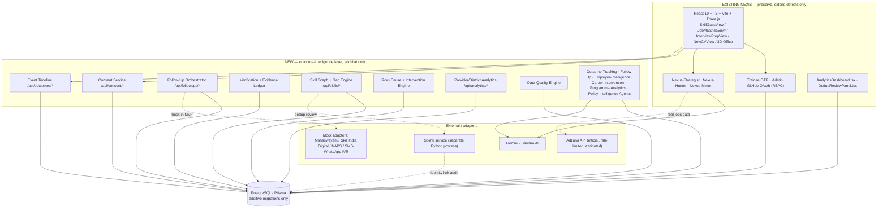

# NEXIS — Antigravity Master Implementation Specification

**Problem Statement:** SIH26135 — "Difficulties in tracking employment outcomes, skill gaps, and the impact of skilling initiatives"
**Sponsor:** Government of Maharashtra — Maharashtra State Innovation Society (MSIS), Department of Skills, Employment, Entrepreneurship & Innovation
**Document status:** Execution contract for Antigravity. Supersedes prior brainstorm/context files for this project.
**Prepared:** September 2026. **Revision 2:** added Section 15.5 (Agent Orchestration Engine), updated Phase 12, the Decision Log, Section 21.2, and Section 32 after reviewing a second supplied research report — see 15.5 for what was kept vs. rejected from it.

---

## 0. How to use this document

**Audience:** Antigravity, operating directly on the NEXIS repository. This document is not a suggestion list — directive language (`MUST`, `SHOULD`, `MUST NOT`, `VERIFY`, `DEFER`) is binding unless marked `OPTIONAL`.

**Source hierarchy** — when a statement below conflicts with what Antigravity finds in the live repository, the live repository wins. Rank order used throughout:

| Tag | Meaning | Where it comes from in this doc |
|---|---|---|
| `CONFIRMED` | Stated directly by the project owner in a prior working session, not yet re-verified against live code | Existing NEXIS file paths, agent names, known bugs (Section 5) |
| `VERIFIED` | Checked against a live external source during this research pass (Sept 2026) | Repo licenses/activity, DPDP Rules dates, Adzuna ToS, Antigravity capabilities (Section 4, 32) |
| `RESEARCH-BACKED` | Drawn from the supplied SIH brief's cited government/research sources | PMKVY, Mahaswayam, NAPS, OECD/ILO/World Bank findings (Section 4) |
| `INFERRED` | This document's own reasoning from the above, not independently checked | Most of the architecture in Sections 12–24 |
| `PROPOSED` | A new recommendation this document adds on top of the supplied brief | Competitive differentiation (Section 3), phase reordering (Section 27), API/DB field-level detail (Sections 13–14) |
| `EXPERIMENTAL` | Explicitly optional, higher-risk, or not required for the hackathon demo | Splink service, ML attrition scoring, Phase 2 integrations |

**What this document is not:** it is not a live audit of the NEXIS repository. No repository path, directory tree, or source file was available in this session — only prior-session statements (`CONFIRMED`, listed with their origin) and the supplied research brief. **Phase 0 exists specifically so Antigravity performs the real audit before anything else proceeds**, and every `CONFIRMED` fact below must be checked against actual code before Antigravity relies on it.

**Provenance of this document itself:** built from three inputs — (1) `PROJECT_SIH_BREIF.docx`, a prior research/architecture pass already covering problem decomposition, existing-system landscape, ~30 external references, a 9-agent target design, a 45-entity data model, and an 11-phase roadmap (referred to below as "the Brief"); (2) prior-session facts about the current NEXIS codebase; (3) fresh verification research performed while building this document (repo license/activity checks, the current SIH26135 competitive field, DPDP Rules 2025 phase dates, Adzuna's actual API terms, and Antigravity's actual current capabilities). Where this document repeats the Brief's analysis, it is condensed; where it extends or corrects the Brief, that is flagged explicitly.

---

## 1. Executive Summary

The SIH26135 problem is not "build another job portal." Maharashtra already runs Mahaswayam, Skill India Digital/PMKVY, and NAPS. What none of them reliably do is answer, months after certification: *did training convert into a livelihood, did it last, and if not, why not.* `RESEARCH-BACKED` — PMKVY 4.0 already mandates post-certification tracking for up to a year, which validates the problem but means NEXIS's job is the **measurement, evidence and intervention layer**, not a fourth registration portal.

NEXIS should position as: **an evidence-aware longitudinal outcome-intelligence layer that sits alongside existing government systems**, built on top of the NEXIS platform that already exists (`CONFIRMED` stack: React 19 + TypeScript + Vite, Express + Prisma, trainee OTP auth, GitHub-OAuth admin RBAC, a 3D "Office"/agent-simulation interface, and three working AI agents — skill-gap, job-matching, interview-prep). The MVP does not replace any of that. It adds a consent layer, an append-only outcome-event timeline, an evidence-labelled employment-confidence model, a non-placement root-cause engine, and provider/district analytics — while fixing five specific defects already identified in the current build (Section 5.3).

**Core differentiator**, carried from the Brief and validated against nine other public SIH26135 submissions found during this research pass (Section 3): most competing teams built a placement/attrition **prediction** dashboard. Almost none built an **evidence-provenance** model that separates self-reported, employer-confirmed, and document-verified claims, or a working 3D orchestration interface. That combination — evidence discipline + the existing 3D Office — is NEXIS's actual edge, not "AI".

**MVP vertical slice** (unchanged from the Brief, now sequenced into 22 execution phases in Section 27):
Consent → stable trainee identity → training/certification (existing) → employment/self-employment/apprenticeship timeline → scheduled follow-up → evidence + confidence → skill gap (existing, extended) → root cause → intervention → provider/district analytics — with the existing 3D Office preserved as the orchestration surface, not replaced.

**Five defects already known in the current build** (`CONFIRMED`, Section 5.3) are folded into the earliest phases rather than treated as new scope: the DPDP consent screen does not run correctly, job-match results link to generic search instead of a real jobs API, skill-gap output is perceived as unrealistic, interview-prep responses are slow, and the visual design needs to read as a credible government platform rather than a generic SaaS dashboard.

---

## 2. Problem Definition

**Problem statement ID:** SIH26135 (`VERIFIED` against public listings of the same problem statement — see Section 3).
**Sponsor:** Government of Maharashtra, MSIS / Department of Skills, Employment, Entrepreneurship & Innovation.
**Category:** Software.

### 2.1 What existing systems already do well (`RESEARCH-BACKED`)
Registration, attendance, assessment, certification, and basic placement claims are already captured across Skill India Digital/PMKVY, Mahaswayam, and NAPS.

### 2.2 What they do not reliably capture (`RESEARCH-BACKED`)
Whether employment actually started; whether it lasted 3/6/12 months; whether the role was training-relevant; wage movement; employer switches; self-employment/gig transitions; *why* a person was never placed; whether a provider's reported placement is credible; whether the same learner appears fragmented across programmes under inconsistent identifiers.

### 2.3 Root cause structure

| Layer | Core difficulty | NEXIS response |
|---|---|---|
| Identity | Phone numbers, names, addresses, programme IDs all drift over time | Consent-based stable internal ID + multiple verified contact points, not phone-as-identity |
| Data integration | Different systems, different schemas, no shared key | Canonical outcome model + explicit source provenance on every record |
| Follow-up | People do not respond consistently | Scheduled low-burden multichannel outreach with escalation, never inferring unemployment from silence |
| Outcome definition | "Placed" collapses offer/join/report/retain into one boolean | Explicit outcome state machine (Section 19) |
| Verification | Employer/provider reports incomplete or biased | Four-level evidence ledger, never presented as fact when it is inference |
| Analysis | Placement rate hides retention, relevance, wages | Cohort, survival, wage and relevance metrics with denominators shown |
| Action | Dashboards describe problems without recommending anything | Root-cause taxonomy linked to specific interventions (Section 19.5) |

### 2.4 Livelihood scope
NEXIS must model employment broadly, not just salaried placement: formal/informal wage employment, apprenticeship, self-employment, entrepreneurship/family enterprise, freelance/gig work, agriculture-linked livelihood, contract work, actively/not-actively seeking, further education, migration/unreachable, and training dropout. This matches PMKVY 4.0's own emphasis on self-employment and informal-sector skilling (`RESEARCH-BACKED`, msde.gov.in PMKVY 4.0 guidelines).


---

## 3. Competitive Landscape (`PROPOSED` — new in this document, not in the Brief)

The Brief could not check who else is building against SIH26135. This session searched for it. At least **nine other public repositories** target the identical problem statement. This is high-value information the Brief did not have — it changes what counts as a differentiator.

| Team / repo | Stack | Headline approach | What it signals |
|---|---|---|---|
| Skill Sync (`sahooarnav2007-gif/proj2`) | Not disclosed in listing | "Enterprise-grade" attrition prediction via Random Forest, multi-channel ingestion (WhatsApp/IVR/USSD/SMS/PWA), "3-way signal triangulation" | ML-prediction is the default competitive move — expect judges to have seen several attrition-prediction pitches already |
| Maharashtra Skilling Outcomes Ledger / "MSOL" (`Mohit-Sable/...`) | Not disclosed | In-app AI assistant ("MSOL Sahayak") grounded in the trainee's own record; APAAR-linked skill passport; NPTEL remedial matching; a punchy demo stat ("82% TPO-claimed vs 41% verified 90-day retention") | The claimed-vs-verified gap as a single headline number is a strong demo device NEXIS should adopt (Section 31) |
| SkillTrack / Hexcore (`marthdholariya/Hexcore-sih`) | Node-style API | AI job matching, employment prediction, "what-if" simulator, real-time KPI dashboard | Broad feature list, conventional dashboard UI |
| SKILLARC (`prav99n-34/Skillark1`) | Python/Flask/Jinja2/SQLite/SQLAlchemy | 140+ synthetic trainees, role-based navigation (state admin sees everything, other roles scoped), audited persistence | Straightforward, well-tested conventional build |
| SIH-26135 (`Shreyas25869/...`) | Supabase, Postgres RLS | 17-table shared schema, row-level security as the authorization boundary | Competent data-governance baseline, no differentiated UX mentioned |
| skilloutcome (`Mrinal444/skilloutcome`) | Python, scikit-learn-style pipeline | Calibrated placement/attrition models with chronological train/test splits and a feature-contract fingerprint | The most ML-mature entry found; a real bar if judges compare model rigor |
| SkillGapPlatform (`ankurpatelankur45-ops/...`) | Web | Cites the "Maharashtra Skill Gap Analysis Report 2023" as a reference dataset | Worth the same citation for NEXIS's district demand-supply narrative |
| Faaz6475/sih | Chart.js dashboard | Static charts, no workflow | Lower bar — not a competitive threat, but confirms judges will see dashboard-only entries |

### 3.1 What this means for NEXIS (`PROPOSED`)

1. **Do not pitch "AI-powered prediction" as the differentiator.** At least three other teams already lead with ML attrition/placement prediction. NEXIS has that too (Section 19.6, explainable-signals version, not black-box), but it is table stakes here, not a wow-moment.
2. **Adopt the "claimed vs. verified" headline stat as the opening demo beat** (Section 31) — it is the single most effective device seen across competitors, and it is a natural fit for NEXIS's evidence-ledger model, which most competitors do not have.
3. **The existing 3D Office is a genuine, unmatched differentiator.** Nothing found in the competitive scan has an equivalent. Section 21 treats it as the orchestration surface, not a demo toy, specifically because of this.
4. **APAAR linkage** (India's academic permanent ID, used by one competitor for identity continuity) is worth a `PROPOSED` Phase-2 evaluation as a *better* long-term identity anchor than pure fuzzy matching for the training-history portion of a trainee's identity — see Section 19.2.
5. **Evidence provenance is the least-copied idea in the field.** Keep it central; it is the part of the Brief's design most worth defending to judges (Section 31, judge question 20 already exists in the Brief and should be answered with this comparison in mind).

None of the above repositories were code-inspected beyond public README/description text returned by search — this is landscape awareness, not a security or licence review, and none of their code should be copied.

---

## 4. Research Findings & External References Consulted

### 4.1 What the Brief already established (`RESEARCH-BACKED`, condensed — see Section 32 for full citation list)
- PMKVY 4.0 requires post-certification tracking through Skill India Digital.
- Mahaswayam positions itself as Maharashtra's convergence platform for skilling, employment and entrepreneurship, but no public longitudinal-outcome API is documented.
- NAPS 2.0 supports apprenticeship lifecycle management with real-time dashboards; no confirmed public API for NEXIS to consume.
- OECD's skills-mismatch framework: a skill gap must be measured via occupational requirements + proficiency + skill use, not keyword overlap alone.
- World Bank evaluations of Indian skilling programmes: descriptive before/after is not a causal claim without a comparison design.
- DHIS2 Tracker, ODK Central, and CommCare are the strongest *architectural* references for longitudinal case tracking and offline follow-up — not systems to embed directly.
- ESCO provides a multilingual skills/occupations taxonomy (EUPL 1.2 API, some Apache-2.0 components) usable as a crosswalk, not a substitute for an Indian taxonomy.

### 4.2 Verified or updated during this session (`VERIFIED`, Sept 2026)

| Item | Brief's claim | Verified status now |
|---|---|---|
| Splink (`moj-analytical-services/splink`) | MIT, 2.4k★/265 forks/79 contributors, v4.0.17 as of Sept 2026 | Confirmed active and MIT-licensed; the project is mid-development on a **Splink 5** branch (large volume of merged `Splink 5 -` PRs). `VERIFY` exact pinned version immediately before adoption — do not assume v4 API surface without checking. |
| SkillNER (`AnasAito/SkillNER`) | "License must be verified" | MIT confirmed. ~207★/68 forks. **Last push 28 Jan 2024** — over 2.5 years stale. Usable as a local baseline but treat as unmaintained; do not expect fixes upstream. Built on the EMSI skill database (EMSI has since rebranded to **Lightcast**) — verify the bundled skill DB is still adequate or plan to swap it. |
| ESCO Skill Extractor (`KonstantinosPetrakis/esco-skill-extractor`) | "License must be verified" | No license file surfaced in this pass. `VERIFY` explicitly before any code reuse — treat as **all-rights-reserved by default** until confirmed otherwise. The technique (transformer embeddings + cosine similarity against ESCO skill/occupation vectors) is worth reimplementing independently of the code if licensing is unclear. |
| DPDP Act — Rules status | Brief cites "2025 Rules" via MeitY, generically | **The DPDP Rules, 2025 were notified 13–14 November 2025** and are already in force in phases: **Phase 1 (procedural/DPBI establishment) is live now**; **Phase 2 (consent-manager provisions) becomes binding 13 November 2026 — under two months from this document's date**; Phase 3 at 18 months (~May 2027). This is materially more specific than the Brief had and directly affects Phase 3 of the implementation plan (Section 27) — the consent architecture should be built against the Phase-2 consent-manager shape now, not retrofitted later. |
| Adzuna API | Brief says "preserve existing integration, subject to terms" | Official ToS (developer.adzuna.com) checked directly: free-tier limits are **25 req/min, 250/day, 1,000/week, 2,500/month**; permissible default use is publishing Adzuna listings, salary estimates, or personal research; **any government, commercial or academic use beyond that is explicitly capped at a 14-day trial before a licence agreement is required**; displaying listings requires a specific "Jobs by Adzuna" attribution badge (≥116×23px, both words hyperlinked). This directly resolves the job-match-links defect (Section 5.3, Section 18) — Adzuna's official API is the correct fix, but Phase 7 must include requesting/confirming a licence given NEXIS is a government-context product, not assume the free trial covers production use indefinitely. |
| Google Antigravity (the execution agent for this document) | Not covered in the Brief | Antigravity is Google's agent-first development platform (launched Nov 2025 alongside Gemini 3; became "Antigravity 2.0" at I/O 2026, May 2026). Current surfaces: a desktop app with multi-agent orchestration, **subagents**, and **scheduled background tasks**; a Go-based **CLI**; an **SDK** for custom agent behaviour with MCP support; a **Managed Agents** API; and enterprise deployment with audit trails. It produces **Artifacts** — plans, task lists, screenshots and browser recordings that document what an agent actually did. Section 33 is written against these real capabilities: phase sign-off should use Antigravity's own Artifact output as the acceptance-evidence trail. |

### 4.3 New research this document adds (`RESEARCH-BACKED`, not in the Brief)
- The SIH26135 competitive field itself (Section 3).
- Precise DPDP Rules phasing and dates (above).
- Adzuna's exact rate limits, attribution rule, and government-use licensing caveat (above).
- Antigravity's actual current capabilities, used to write Section 33 concretely instead of generically.

---

## 5. Existing NEXIS System — Confirmed State

**Antigravity: treat every line in this section as `CONFIRMED` (stated by the project owner in a prior working session) but UNVERIFIED against live code. Phase 0 is where you check each of these against the actual repository before building on top of it. Do not assume any file below still exists at that exact path, or still behaves as described, without checking.**

### 5.1 Confirmed stack
- Frontend: React 19 + TypeScript + Vite, TailwindCSS v4, Zustand for state, Three.js for the 3D interface. Dev server on port 3000.
- Backend: Express 5 + Prisma ORM. SQLite in development, PostgreSQL in production. Dev server on port 8787.
- AI/data providers already integrated: Google Gemini, Sarvam AI (Indian multilingual model provider), Serper.dev (Google-search API wrapper used for job-lead discovery).
- The Brief's independent architecture pass (Section 29 of the Brief, written without repository access) also names an **Adzuna** integration and a **GitHub repository analysis** feature that were not in the prior-session notes above. Both are plausible extensions of the same system. **`VERIFY` in Phase 0** whether Adzuna and GitHub-repo analysis exist today, are partially built, or are aspirational — do not assume either without checking, and reconcile before Phase 7.

### 5.2 Confirmed authentication
- **Trainee login:** phone + OTP. Dev mode logs the OTP to console; production sends real SMS via MSG91 when configured. Implementation referenced at `server/services/otpService.js` and `server/routes/otpAuth.js`.
- **Admin login:** GitHub OAuth, referenced at `server/utils/auth.js` and `server/utils/adminAuth.js`. Roles: `SUPER_ADMIN`, `REVIEWER`, `ANALYST`. Admin actions are audit-logged to an `AdminActionLog` model.
- **DPDP consent:** a `ConsentScreen.tsx` component at `src/interface/onboarding/ConsentScreen.tsx`, covering four scopes — `JOB_SEARCH_DATA`, `EMPLOYER_SHARING`, `ANALYTICS`, `GOVT_CROSS_CHECK`.

### 5.3 Confirmed feature views and known defects — **these five items are not new scope, they are earliest-priority fixes**

| # | Area | Confirmed current state | Confirmed defect / request | Where it's fixed in this plan |
|---|---|---|---|---|
| 1 | Consent | `ConsentScreen.tsx` implements 4 DPDP scopes | **Reported not to run correctly** — functional bug, not just a UX gap | Phase 3 |
| 2 | Job matching | `JobMatchesView.tsx` ← `server/routes/jobs.js`, agent **"Nexus-Hunter"** via Serper.dev + Gemini | Job links point to generic search results, not a real structured jobs API (LinkedIn/Indeed/Naukri-style aggregation was the ask) | Phase 7 — resolved via the official Adzuna API (Section 4.2, Section 18), not a scraper |
| 3 | Skill gaps | `SkillGapsView.tsx` ← `server/routes/resume.js`, agent **"Nexus-Strategist"** via Gemini | Output perceived as not realistic enough | Phase 6 — grounding fix, evidence-classed output (Section 17), not a bigger model |
| 4 | Interview prep | `InterviewPrepView.tsx` ← `server/routes/interview.js`, agent **"Nexus-Mirror"** | Too slow | Phase 13 — latency fix (streaming, smaller/faster model tier, caching), not a feature rebuild |
| 5 | Visual design | Whole product | Needs to read as a credible **government** platform, not a generic SaaS dashboard | Phase 15 |

Also confirmed and to be preserved as-is unless a phase explicitly says otherwise: `NewCVView.tsx` (CV builder via PDFKit/jsPDF), `AnalyticsDashboard.tsx` and `DedupReviewPanel.tsx` (admin-side).

### 5.4 Reconciling the Brief's proposed 9-agent system with the confirmed 3 agents (`PROPOSED` — this resolution is new in this document)

The Brief (Section 14) designs nine outcome-intelligence agents — Outcome Tracking, Follow-Up, Skill Intelligence, Employment Verification, Employer Intelligence, Career Intervention, Programme Analytics, Policy Intelligence, Data Quality — written without knowledge that NEXIS already has three named, working agents. These are not competing designs; they cover different missions:

- **Nexus-Strategist, Nexus-Hunter, Nexus-Mirror already exist and are trainee-facing** (skill gap, job matching, interview prep). `EXTEND`, do not replace — give each one the evidence-labelling discipline in Section 15.3, fix their specific defects (5.3), and preserve their names and routes.
- **The Brief's nine agents are net-new and are provider/district/state-facing** (outcome tracking, follow-up, verification, analytics, policy). `NEW` — build them, but fold "Skill Intelligence Agent" into an extension of Nexus-Strategist rather than a fourth skill agent, since the mission overlaps directly. That leaves eight net-new agents plus three extended ones. Full mapping in Section 15.

### 5.5 Safe-migration rules (`RESEARCH-BACKED`, from the Brief, unchanged — these are binding constraints for every phase below)
`MUST NOT` replace existing authentication. `MUST NOT` change existing job-API response contracts without a versioned path. `MUST NOT` remove the 3D Office. `MUST NOT` rename existing Prisma models without an explicit migration plan. `MUST` use additive Prisma migrations only. `MUST` use feature flags for new dashboards. `MUST` add new routes under new namespaces (`/api/outcomes/*`, `/api/consent/*`, `/api/followups/*`, `/api/skills/*`, `/api/analytics/*`) rather than editing unrelated existing endpoints. `MUST` keep synthetic demonstration data in its own source namespace, visibly labelled in the UI everywhere it appears.

---

## 6. Target Product Definition

### 6.1 Product definition
NEXIS is a privacy-conscious, longitudinal outcome-intelligence platform that connects skilling events to verified, self-reported and inferred livelihood outcomes, then converts outcome gaps into accountable interventions for learners, training providers, and government — built as an additive layer on the existing NEXIS trainee-assistance platform, not a rebuild.

### 6.2 Core principles (`RESEARCH-BACKED`, carried from the Brief — these are design constraints, not aspirations)
1. Outcome before dashboard. 2. Timeline before status. 3. Evidence before confidence. 4. Consent before linkage. 5. Intervention before ranking. 6. Uncertainty before false precision. 7. Existing-system coexistence before replacement. 8. Synthetic data before unsupported government claims.

### 6.3 What NEXIS can and cannot solve (`RESEARCH-BACKED`)
**Can:** stable pseudonymous identity; consent and contact preferences; event-based employment history; multichannel follow-up orchestration; evidence-labelled confidence; self-employment/apprenticeship modelling; root-cause classification; skill-demand vs. training-supply comparison; data-quality alerts; provider/district analytics; human review for ambiguous cases.
**Cannot:** force employer cooperation; create government data-sharing agreements that don't exist; achieve universal coverage of informal employment; fix structural unemployment; solve gender/transport/caregiving barriers without real support programmes attached; establish causal programme attribution without a real evaluation design.

---

## 7. User Personas

| Persona | Primary task | Interface | Key need |
|---|---|---|---|
| Trainee | Update livelihood status, get help | Mobile-first timeline, one-tap follow-up | Low-burden, own-language, trustworthy |
| Training provider staff | Improve cohort outcomes | Cohort funnel + intervention queue | Fair, evidence-aware metrics, not raw rankings |
| Employer | Confirm/report employment | Minimal confirmation form | Near-zero effort, no account overhead |
| District officer | Allocate remedial action | Map + root causes + district gaps | Denominators and confidence, not point estimates |
| State administrator | Compare programmes | Evidence-aware policy dashboard | Defensible, exportable, reproducible numbers |
| Policy analyst | Investigate patterns | Cohort builder, exports, uncertainty bands | Versioned metric definitions |
| Data-quality operator (new role) | Resolve ambiguous identity/employer matches | Splink review queue (Section 17.4) | Explainable match evidence, not a black box |

## 8. User Journeys

### 8.1 Golden path (`RESEARCH-BACKED`, adapted from the Brief's demo story — Section 31 gives the full script)
Consent → training completion (existing) → follow-up scheduled (30/90/180/365-day) → non-placement detected with a named root cause → intervention delivered → apprenticeship → conversion to salaried employment (employer-confirmed) → employer switch (history preserved, not overwritten) → wage-band increase detected → new skill gap surfaces from the new role's JD → district dashboard aggregates the same gap across the cohort → curriculum recommendation issued → next cohort's outcomes compared (labelled as observed comparison, not causal proof).

### 8.2 Secondary journeys
- **Employer dispute:** employer contests a self-reported employment claim → record becomes `CONFLICTING`, not deleted → both claims stay auditable → confidence score recalculates → routed to human review.
- **Unreachable trainee:** three failed follow-up attempts across consented channels → escalate to assisted-call queue → after further failure, mark `UNREACHABLE` (a missing-observation state, never inferred as `UNEMPLOYED`).
- **Data-quality operator:** duplicate-trainee alert from the Splink service → review queue shows match evidence and confidence → operator approves merge or splits the records → action is audit-logged.

## 9. Functional Requirements

Priority classification below is carried from the Brief's own feature-prioritization scoring (Section 27 of the Brief) with two changes: the five confirmed defects (Section 5.3) are pulled to `MUST` regardless of their original score, since they are already-identified bugs in an existing feature, not new scope; and the "3D agent workflow" line is reclassified from "demo enhancement" to `MUST preserve` given Section 3's finding that it is NEXIS's actual point of differentiation.

| Feature | Priority | Notes |
|---|---|---|
| Fix DPDP consent screen | **MUST (defect)** | Section 5.3 #1 |
| Fix job-match links (real API) | **MUST (defect)** | Section 5.3 #2 |
| Fix skill-gap realism | **MUST (defect)** | Section 5.3 #3 |
| Fix interview-prep latency | **MUST (defect)** | Section 5.3 #4 |
| Government-credible visual design | **MUST (defect)** | Section 5.3 #5 |
| Consent-based longitudinal identity | MUST | New capability |
| Event-based employment timeline | MUST | New capability |
| Follow-up scheduler (mock channels for demo) | MUST | New capability |
| Evidence/confidence model | MUST | New capability |
| Non-placement root-cause engine | MUST | New capability |
| Skill-gap engine (extends Nexus-Strategist) | MUST | Extension |
| Provider outcome analytics | MUST | New capability |
| District demand-supply map | MUST | New capability |
| Self-employment / apprenticeship tracking | MUST | New capability |
| Preserve + extend the 3D Office | MUST | Differentiator (Section 3) |
| Splink identity-linkage service | SHOULD | Separate Python service, MIT, `VERIFY` v5 status first |
| Offline-capable follow-up PWA | SHOULD | Rural/low-connectivity |
| Employer confirmation workflow | SHOULD | |
| Multilingual (Marathi/Hindi/English) templates | SHOULD | |
| Data-quality/anomaly engine | SHOULD | |
| Agent evidence panel in the 3D Office | SHOULD | |
| Real WhatsApp/IVR integration | DEFER (Phase 2) | Mock adapter for the demo |
| Formal causal-impact evaluation module | DEFER (Phase 2) | Descriptive-only for MVP |
| Policy "what-if" simulator | DEMO ENHANCEMENT | Explicitly label assumptions as assumptions |
| Blockchain credentials | AVOID | No mechanism it actually fixes |
| Aadhaar-centric identity | AVOID | No legal basis for NEXIS to hold it |
| EPFO dependency | AVOID | Access not established; do not promise it |
| Black-box attrition ranking | AVOID | Use explainable signals only (Section 19.6) |

## 10. Non-Functional Requirements

| Category | Requirement |
|---|---|
| Privacy | DPDP-aligned consent (Section 22); no Aadhaar storage by default; no biometric identity system |
| Performance | Interview-prep responses must feel conversational — target first-token latency fix in Phase 13, not deferred |
| Accessibility | Marathi/Hindi/English label switching; large touch targets; mobile-first trainee flows |
| Reliability | 3D Office and all existing authentication/job endpoints must keep working through every phase (Section 5.5) |
| Data integrity | Append-only event tables for employment, follow-up, and audit history; current-state tables may be materialized for UI speed but are never the source of truth |
| Auditability | Every AI finding carries source, evidence reference, confidence, timestamp, and inferred-vs-verified status (Section 15.3) |
| Cost | Stay inside free/low-cost tiers for the hackathon build (Section 24); no paid service is a hard MVP dependency |
| Licensing | Every reused open-source component passes an explicit licence check before code (not just concept) is copied (Section 4.2) |

## 11. Current-State → Target-State Gap Analysis

| Area | Current state | Evidence | Problem | Target state | Change type | Priority | Depends on |
|---|---|---|---|---|---|---|---|
| DPDP consent | `ConsentScreen.tsx`, 4 scopes | `CONFIRMED` | Reported broken | Working, extended to ~8 granular purposes (Section 22.2) | FIX + EXTEND | MUST | Phase 0 repo audit |
| Job matching | Nexus-Hunter via Serper.dev + Gemini | `CONFIRMED` | Links to generic search, not real listings | Adzuna-backed structured results with attribution badge | REPLACE (data source) / EXTEND (agent) | MUST | Adzuna app credentials |
| Skill gap | Nexus-Strategist via Gemini | `CONFIRMED` | Perceived as unrealistic | Evidence-classed output (Section 17.3), local extraction baseline as a check | REDESIGN | MUST | Phase 6 |
| Interview prep | Nexus-Mirror | `CONFIRMED` | Slow | Streaming responses, faster model tier for this path | FIX | MUST | Phase 13 |
| Visual design | Existing UI | `CONFIRMED` | Reads generic, not government-credible | Government design-language pass (Section 21.4) | REDESIGN | MUST | Phase 15 |
| Identity | Phone/email as implicit identity | `INFERRED` from stack | No stable internal ID, no dedup | `Trainee.publicId` + Splink-reviewed linkage | NEW | MUST | Phase 2–3, Phase 17 |
| Outcome tracking | None found | `INFERRED` | Placement is a single field at best | Full event-sourced outcome timeline | NEW | MUST | Phase 4 |
| Follow-up | None found | `INFERRED` | No scheduled re-contact | Scheduler + escalation state machine (Section 19.4) | NEW | MUST | Phase 5 |
| Employer verification | None found | `INFERRED` | No evidence ledger | Four-level evidence model (Section 19.3) | NEW | MUST | Phase 8 |
| Provider/district analytics | `AnalyticsDashboard.tsx` exists, scope unknown | `CONFIRMED` (existence) / `VERIFY` (scope) | Likely trainee-level only | Cohort-adjusted, coverage-aware outcome metrics | EXTEND or NEW | MUST | Phase 11, depends on Phase 0 confirming current scope |
| Admin dedup | `DedupReviewPanel.tsx` exists, scope unknown | `CONFIRMED` (existence) / `VERIFY` (scope) | May already partially cover identity dedup | Wire to Splink service if not already doing probabilistic matching | EXTEND or KEEP | SHOULD | Phase 0, Phase 17 |
| 3D Office | Exists, Three.js | `CONFIRMED` | Scope of current interactivity unknown | Agent activity stream + evidence panel added, never made mandatory for critical workflows | EXTEND | MUST | Phase 16 |

---

## 12. System Architecture

### 12.1 High-level (for a judge)
NEXIS keeps its existing trainee-assistance product (skill gap, job matching, interview prep, CV builder, 3D Office) exactly where it is, and adds a new **outcome-intelligence layer** underneath: consent, a lifelong event timeline, scheduled follow-up, an evidence ledger, and analytics for providers/districts/state. A small separate Python service handles identity deduplication. Everything new talks to the existing Prisma/PostgreSQL database through additive migrations only.

### 12.2 Low-level (for Antigravity)



### 12.3 Failure boundaries
- The **new outcome layer is additive-only**: if any new service fails, existing trainee-facing flows (skill gap, job match, interview prep, login, 3D Office) must keep working. This is enforced by Section 5.5's routing rule (new endpoints only under new namespaces) and by feature-flagging every new dashboard.
- The **Splink service is out-of-process**: if it is down, identity linkage simply queues for later; it never blocks trainee-facing writes.
- **Adzuna is rate-limited** (Section 4.2): job search must degrade to cached/last-known results, never to the old generic-search-link behaviour once Phase 7 ships — that would silently reintroduce the defect being fixed.

## 13. Domain Model & Database Architecture

The Brief already specifies ~45 entities across identity/consent, programme/learning, labour-market, outcomes, outreach, and governance groups (Brief Section 15.1) — that grouping is correct and is kept. This section adds field-level detail (`PROPOSED`) for the ~18 entities that sit on the MVP critical path, as additive Prisma models. Full field lists for lower-priority entities (SurveyTemplate, MigrationObservation, CaseAssignment, etc.) follow the same pattern and are deferred to Phase 2 unless a Phase 0–11 task references them directly.

### 13.1 Identity & consent

```prisma
model Trainee {
  id                String   @id @default(cuid())
  publicId          String   @unique // random, non-sequential — never the Prisma internal id
  existingUserId    String?  @unique // FK to whatever the current NEXIS user model is — VERIFY name in Phase 0
  preferredLanguage String   @default("en") // en | hi | mr
  createdAt         DateTime @default(now())
  contactPoints     ContactPoint[]
  consents          Consent[]
  identifiers       TraineeIdentifier[]
  employmentRecords EmploymentRecord[]
  outcomeEvents     OutcomeEvent[]
  followUpAttempts  FollowUpAttempt[]
  interventions     Intervention[]
}

model ContactPoint {
  id          String   @id @default(cuid())
  traineeId   String
  trainee     Trainee  @relation(fields: [traineeId], references: [id])
  channel     String   // phone | email | whatsapp
  valueHash   String   // hashed/tokenized, never plaintext at rest
  isPrimary   Boolean  @default(false)
  validFrom   DateTime @default(now())
  validTo     DateTime? // null = still current; old points are kept, never deleted
}

model Consent {
  id            String    @id @default(cuid())
  traineeId     String
  trainee       Trainee   @relation(fields: [traineeId], references: [id])
  purpose       String    // OUTCOME_FOLLOWUP | EMPLOYER_CONFIRMATION | JOB_RECOMMENDATIONS |
                          // TRAINING_RECOMMENDATIONS | ANALYTICS | RESEARCH_EVALUATION |
                          // CHANNEL_CONTACT | RESUME_GITHUB_ANALYSIS
                          // (extends the existing 4-scope model — Section 22.2)
  channel       String?   // required when purpose = CHANNEL_CONTACT
  noticeVersion String
  language      String
  status        String    // GRANTED | WITHDRAWN
  grantedAt     DateTime  @default(now())
  withdrawnAt   DateTime?
  @@index([traineeId, purpose, status])
}
```
`MUST`: a withdrawn consent blocks all future outreach for that purpose at the query layer, not just the UI.

### 13.2 Outcome timeline (event-sourced — `MUST` be append-only)

```prisma
model OutcomeEvent {
  id              String   @id @default(cuid())
  traineeId       String
  trainee         Trainee  @relation(fields: [traineeId], references: [id])
  eventType       String   // ENROLLED | ATTENDED | ASSESSED | CERTIFIED | JOB_SEARCH_STARTED |
                            // OFFER_RECEIVED | EMPLOYMENT_STARTED | RETENTION_CHECK |
                            // WAGE_OBSERVED | EMPLOYER_CHANGED | APPRENTICESHIP_STARTED |
                            // APPRENTICESHIP_CONVERTED | SELF_EMPLOYMENT_STARTED |
                            // SKILL_UPDATED | INTERVENTION_DELIVERED | STATUS_CHANGED
  eventDate       DateTime
  source          String   // SELF_REPORT | PROVIDER | EMPLOYER | DOCUMENT | AGENT_INFERRED | SYSTEM
  actorId         String?  // who/what created this event
  evidenceRef     String?  // FK to VerificationEvidence, nullable
  confidenceScore Int?     // 0-100, see Section 19.3 formula
  metadata        Json     // event-specific payload
  createdAt       DateTime @default(now())
  correctionOfId  String?  // self-referential: points to the event this one corrects, never overwrites
  @@index([traineeId, eventDate])
}

model EmploymentRecord {
  id             String   @id @default(cuid())
  traineeId      String
  trainee        Trainee  @relation(fields: [traineeId], references: [id])
  employerId     String?
  role           String?
  sector         String?
  startDate      DateTime?
  endDate        DateTime? // null = ongoing
  livelihoodType String    // FORMAL_SALARIED | INFORMAL_WAGE | APPRENTICESHIP | SELF_EMPLOYED |
                            // ENTREPRENEUR | FREELANCE | GIG | AGRICULTURE | CONTRACT
  status         String    // ACTIVE | ENDED | DISPUTED
  wageObservations WageObservation[]
  evidence         VerificationEvidence[]
}

model WageObservation {
  id                  String   @id @default(cuid())
  employmentRecordId  String
  employmentRecord    EmploymentRecord @relation(fields: [employmentRecordId], references: [id])
  observedAt          DateTime
  bandMin             Int
  bandMax             Int
  currency             String  @default("INR")
  period               String  // MONTHLY | ANNUAL
  source               String  // SELF_REPORT | EMPLOYER | DOCUMENT
}
```
`MUST`: employment start date cannot be after the observation date (validated at the service layer, not just the DB constraint). `MUST`: a job/employer switch creates a new `EmploymentRecord` and closes the old one via `endDate`; it never edits the old row's role/employer in place.

### 13.3 Verification & evidence

```prisma
model VerificationEvidence {
  id                 String   @id @default(cuid())
  employmentRecordId String?
  outcomeEventId     String?
  evidenceLevel      Int      // 1 self-report, 2 employer confirmation, 3 document, 4 cross-source
  evidenceType       String
  submittedBy        String
  submittedAt        DateTime @default(now())
  secureRef          String?  // hashed reference to stored document, not the document itself where avoidable
  validationStatus   String   // PENDING | VALIDATED | DISPUTED | EXPIRED
  reviewerId         String?
}

model Employer {
  id               String   @id @default(cuid())
  name             String
  normalizedName   String   // for dedup matching
  contactHash      String?
  district         String?
  verifiedStatus   String   @default("UNVERIFIED")
}
```

### 13.4 Skill graph

```prisma
model Skill {
  id           String   @id @default(cuid())
  name         String
  category     String?
  nsqfLevel    Int?
  escoCrosswalkId String? // nullable — ESCO used as crosswalk only, per Section 4.1
  aliasesEn    String[]
  aliasesHi    String[]
  aliasesMr    String[]
}

model OccupationSkill {
  occupationId String
  skillId      String
  requiredLevel String  // BASIC | INTERMEDIATE | ADVANCED
  weight       Float    @default(1.0)
  @@id([occupationId, skillId])
}

model TraineeSkillEvidence {
  id          String   @id @default(cuid())
  traineeId   String
  skillId     String
  evidenceClass String // ASSESSMENT_SCORE | EMPLOYER_CONFIRMED | PROJECT | CERTIFICATION | RESUME_MENTION | SELF_REPORT
  strength    String   // HIGH | MEDIUM | LOW — see Section 17.2 table
  sourceSpan  String?  // verbatim text span the extraction came from, required for AGENT_INFERRED
  extractedAt DateTime @default(now())
}
```
`MUST NOT`: an `AGENT_INFERRED` skill claim without a `sourceSpan` is not stored as evidence — Section 17.2 explicitly disallows "LLM inference without source span" as standalone evidence.

### 13.5 Follow-up, intervention, governance

```prisma
model FollowUpAttempt {
  id          String   @id @default(cuid())
  traineeId   String
  scheduledFor DateTime // T+30/90/180/365 per Section 19.4
  channel     String
  status      String   // SCHEDULED | SENT | DELIVERED | RESPONDED | NO_RESPONSE | ESCALATED | UNREACHABLE
  respondedAt DateTime?
  responsePayload Json?
}

model Intervention {
  id             String   @id @default(cuid())
  traineeId      String
  rootCause      String   // taxonomy value, Section 19.5
  evidenceRefs   String[]
  recommendation String
  status         String   // RECOMMENDED | APPROVED | DELIVERED | REASSESSED
  approvedBy     String?  // human approval required before DELIVERED — Section 15.4
}

model AgentFinding {
  id               String   @id @default(cuid())
  agent            String   // e.g. "outcome-tracking", "nexus-strategist"
  findingType      String
  traineeId        String?
  inputSources     Json
  evidenceRefs     String[]
  confidence       Int
  inferredOrVerified String // INFERRED | VERIFIED
  modelVersion     String
  recommendedAction String?
  humanReviewStatus String  @default("PENDING")
  createdAt        DateTime @default(now())
}

model AuditLog {
  id        String   @id @default(cuid())
  actorId   String
  actorType String
  action    String
  entityType String
  entityId  String
  timestamp DateTime @default(now())
  metadata  Json
  // append-only — MUST NOT expose an UPDATE or DELETE path in application code
}
```

### 13.6 Constraints carried from the Brief (`RESEARCH-BACKED`, binding)
`Trainee.publicId` is random and non-sequential. Raw contact fields are hashed/encrypted, never stored plaintext. Every consent row has purpose + channel + timestamp + notice version + status. Every outcome observation has a source and an observed-at date. Wage fields require currency + period + granularity. Confidence cannot exceed the strongest evidence actually available (i.e. computed from Section 19.3's formula, never hand-set higher). A withdrawn consent blocks future outreach for that purpose. Audit logs are append-only. Small demographic cells are suppressed in any dashboard. No raw Aadhaar value is stored anywhere in NEXIS.

---

## 14. API Architecture

All new routes are versioned and namespaced per Section 5.5. Auth: trainee-scoped routes require the existing trainee session (`VERIFY` exact middleware name in Phase 0); admin/officer routes require the existing GitHub-OAuth admin session with the stated role. `PROPOSED` field-level detail below extends the endpoint list already given in the Brief's "BUILD THIS SPECIFICATION" section.

### 14.1 Consent

**`POST /api/consent/grant`**
Auth: trainee. Request: `{ purpose: string, channel?: string, language: string, noticeVersion: string }`. Response `201`: `{ id, purpose, status: "GRANTED", grantedAt }`. Errors: `400` invalid purpose enum, `409` already granted for this purpose+channel. Side effect: audit log entry.

**`POST /api/consent/:id/withdraw`**
Auth: trainee (own record only) or admin. Response `200`: `{ id, status: "WITHDRAWN", withdrawnAt }`. Side effect: `MUST` immediately exclude this trainee from any queued follow-up whose purpose matches. Idempotent — withdrawing an already-withdrawn consent returns `200`, not an error.

**`GET /api/consent/me`**
Auth: trainee. Returns the full consent history (not just current state) for the trainee's own dashboard (Section 21.2).

### 14.2 Outcome timeline

**`POST /api/outcomes/events`**
Auth: trainee (self-report), employer (via signed confirmation link), or admin (provider/document-sourced). Request: `{ traineeId, eventType, eventDate, source, evidenceRef?, metadata }`. Response `201` with the created event. Validation: `eventDate` cannot be in the future beyond a small clock-skew tolerance; `EMPLOYMENT_STARTED` before the trainee's own `CERTIFIED` event is flagged to the Data Quality Agent (Section 15), not silently accepted. This endpoint never updates an existing event — a correction is a new event with `correctionOfId` set.

**`GET /api/outcomes/trainees/:id/timeline`**
Auth: trainee (self) or authorized staff. Returns the full ordered event list plus the materialized current-state view used by the UI.

### 14.3 Follow-up

**`GET /api/followups/queue`**
Auth: provider/officer. Query params: `district?, provider?, riskLevel?`. Returns prioritized follow-up tasks (Section 19.4 escalation state).

**`POST /api/followups/:id/respond`**
Auth: trainee, via the channel-specific webhook or the PWA. Request shape varies by channel; normalized server-side into a `FollowUpAttempt` update plus, where the response indicates an outcome, a new `OutcomeEvent`. `MUST NOT` ever write `UNEMPLOYED` from a non-response — only from an explicit trainee answer.

### 14.4 Verification

**`POST /api/employment/:id/evidence`**
Auth: trainee or employer (signed link). Request: `{ evidenceLevel, evidenceType, secureRef? }`. Response `201`. Recalculates the linked `EmploymentRecord`'s confidence score synchronously (Section 19.3 formula) and returns the updated score.

**`POST /api/employers/:employerId/confirm`**
Auth: employer, via a time-limited signed token (no employer account system required for MVP). Request: `{ employmentRecordId, confirmed: boolean, role?, startDate?, wageband? }`. On mismatch with the trainee's self-report, creates a `CONFLICTING` status rather than overwriting either side.

### 14.5 Skills (extends existing `server/routes/resume.js` / Nexus-Strategist, `VERIFY` exact current path in Phase 0)

**`POST /api/skills/extract`**
Request: `{ text, sourceType: "RESUME"|"JOB_DESCRIPTION"|"ASSESSMENT" }`. Response: list of `{ skillId, sourceSpan, confidence }` — `sourceSpan` is `NOT NULL` for every returned item (Section 13.4 constraint).

**`POST /api/skills/gap-analysis`**
Request: `{ traineeId, targetOccupationId }`. Response: ranked gap list, each entry carrying `requiredLevel`, `currentEvidence` (array of `TraineeSkillEvidence`), `gap`, `priority`, `reason` (with the underlying percentage/count it was computed from — `MUST` label synthetic-dataset-derived stats as synthetic per Section 25.3), `recommendedIntervention`, `confidence`. This is the direct fix for defect #3 (Section 5.3) — output must be traceable to evidence, not a single opaque LLM paragraph.

### 14.6 Analytics

**`GET /api/analytics/providers`** / **`GET /api/analytics/districts`**
Auth: officer/state roles, row-level scoped to the caller's district/provider unless state-level. Every response includes `cohortSize`, `followUpCoverage`, and a confidence/uncertainty indicator alongside every point metric — `MUST NOT` return a bare percentage with no denominator (Section 2.3, Analysis row).

**`GET /api/data-quality/issues`**
Auth: data-quality operator/admin. Returns duplicate-trainee candidates, duplicate employers, and anomaly flags (Section 20) for review.

### 14.7 Existing endpoints — contract-freeze requirement
`MUST`: before Phase 1 ends, add a contract test for every existing endpoint under `server/routes/` (job search, resume, interview, auth) that asserts today's response shape. These tests are the regression tripwire for the rest of this plan — Section 27, Phase 1.

---

## 15. AI & Agent Architecture

### 15.1 Orchestration model
Orchestrator → specialist agents → tools/data → validation → persistence → user. Deterministic logic (rules, taxonomy lookup, formula-based scoring) does the heavy lifting; an LLM is used only where language understanding or generation is actually required — never for something a lookup table or a formula can do more cheaply and more explainably (`RESEARCH-BACKED`, Brief Section 16.1).

### 15.2 Agent roster — extended-existing vs. net-new (resolves Section 5.4)

| Agent | Status | Mission | Deterministic vs. AI split |
|---|---|---|---|
| Nexus-Strategist | `EXTEND` | Skill-gap analysis (existing) + skill extraction for the new skill graph | Taxonomy lookup + evidence classing = deterministic; only the human-readable rationale text is LLM-generated |
| Nexus-Hunter | `EXTEND` | Job matching (existing), now backed by Adzuna instead of generic search | Adzuna query + the Section 18.2 matching formula = deterministic; LLM only for the "why this role fits" explanation |
| Nexus-Mirror | `EXTEND` (perf fix) | Interview prep (existing) | Unchanged logic; Phase 13 is a latency fix, not a redesign |
| Outcome Tracking Agent | `NEW` | Finds incomplete/stale outcome timelines | Rule-based (stale-date thresholds), no LLM needed |
| Follow-Up Agent | `NEW` | Chooses channel/timing per trainee | Rule-based (consent + schedule + quiet hours); LLM only for message copy generation in the trainee's language |
| Employment Verification Agent | `NEW` | Assembles evidence, never fabricates verification | Deterministic evidence-ledger assembly; no LLM in the decision path |
| Employer Intelligence Agent | `NEW` | Flags duplicate employers, suspicious patterns | Rule-based anomaly detection |
| Career Intervention Agent | `NEW` | Recommends interventions from the root-cause taxonomy | Rule-based mapping (Section 19.5 table); LLM only for phrasing the recommendation to the trainee |
| Programme Analytics Agent | `NEW` | Explains cohort performance with uncertainty | Deterministic stats; LLM only for the natural-language summary, which `MUST` follow the "review before taking action" phrasing pattern from the Brief (Section 14.7), never a bare verdict like "Provider X is bad" |
| Policy Intelligence Agent | `NEW` | Summarizes district shortages/oversupply | Deterministic aggregation |
| Data Quality Agent | `NEW` | Detects duplicates, impossible values, suspicious batches | Rule-based + calls the Splink service for identity-specific duplicates |

### 15.3 Mandatory finding schema (every agent, existing or new)
`findingId, agent, timestamp, inputSources, evidenceReferences, confidence, inferenceType (INFERRED|VERIFIED), modelVersion, recommendedAction, humanReviewStatus`. `MUST NOT`: an agent silently alters an employment record. `MUST`: a sensitive intervention (Section 19.5) requires human approval before `DELIVERED` status (Section 13.5, `Intervention.approvedBy`).

### 15.4 Prompt-injection and document-upload safety
Resume/CV uploads and any employer-submitted free text are untrusted input. `MUST` treat extracted text as data, not instructions, when passed into any LLM call (standard prompt-injection hygiene) — this applies to Nexus-Strategist's resume parsing today and to every new text-ingesting agent.

### 15.5 Agent Orchestration Engine — concrete build plan (`PROPOSED`, added from a second research pass)

**Provenance.** A second research document (`deep-research-report.md`) was supplied after this specification's first version. It analyzes multi-agent *coding-orchestration* tools — LangChain, Google ADK, Microsoft Agent Framework, CrewAI, and desktop tools like Agent Orchestrator, Claude Squad, Vibe Kanban, Bernstein, Baton, Emdash. `VERIFIED` in this pass: these are real projects — e.g. `Untrivial-ai/agent-orchestrator` is a genuine, active, 9.5k-star Apache-2.0 tool that spawns coding agents in isolated Git worktrees and auto-handles CI/PRs, matching the report's description closely. **But the report analyzed NEXIS as if it were meant to *be* one of these tools** (a developer product for orchestrating coding agents), not the SIH26135 employment platform this document specifies. None of its literal feature list — Kanban boards, CLI/GUI for launching agents, per-task Git branches — is a NEXIS product feature.

**What is genuinely useful here:** the report's underlying *engineering patterns* for running multiple AI agents reliably — a task queue, isolated per-agent execution, a knowledge base for grounding, observability, and human-in-the-loop gates — are exactly what Section 15.1–15.3 already require conceptually for NEXIS's own 11 agents (3 extended Nexus-* agents + 8 new outcome-intelligence agents) but had not yet specified as buildable engineering. That gap is real. This subsection closes it — translated onto the `CONFIRMED` existing stack, not the report's assumed one.

**Translation — the report's stack is rejected, not adopted (`PROPOSED`, with reasons):**

| Report recommends | Rejected because | NEXIS instead uses | Verification |
|---|---|---|---|
| Python + LangChain/Google ADK | NEXIS is `CONFIRMED` Node/Express/Prisma; a mid-hackathon language switch for the whole agent layer is unjustified risk (Section 5.5, Section 24) | A lightweight custom dispatcher in the existing Express codebase; `LangChain.js` only if/when agent count and complexity genuinely outgrow it (`OPTIONAL`, Phase-2 territory) | — |
| RabbitMQ/Google Pub/Sub | New infrastructure NEXIS doesn't have | **BullMQ** — Redis-backed, Node-native, MIT, `VERIFIED` actively maintained (v5.6x as of Jan 2026), used in production by real orgs (Microsoft, NestJS ecosystem tooling) | `VERIFIED` this session |
| Docker/Kubernetes per agent | Massive overkill for an 11-agent, hackathon-scale system; contradicts the lean/free-tier cost posture (Section 24) | Each agent as an isolated async function/module (its own timeout, retry-with-backoff, error boundary) inside the existing Express process | — |
| Pinecone/Weaviate (separate vector DB) | A second database NEXIS doesn't need | **pgvector** extension on the *existing* PostgreSQL database, via `LangChain.js`'s official `@langchain/pgvector` `PGVectorStore` integration (Node-native, "Official Partner Package") | `VERIFIED` this session — official LangChain.js docs confirm first-class Node support |
| LangSmith/Prometheus/Grafana | New paid/hosted dependency not justified at MVP scale | Extend the *existing* `AgentFinding`/`AuditLog` models (Section 13.5) with job ID + duration fields; add a real observability stack only if Phase 2 scale demands it (`DEFER`) | — |
| Kanban board for launching agent tasks (Vibe Kanban / Agent Kanban) | Not a citizen-facing or even an operator-facing *launch* concept NEXIS needs | **Kept, repurposed**: a Kanban-style **Agent Review Queue** for `REVIEWER`/`ANALYST` admin roles to approve/reject pending `AgentFinding` and `Intervention` records — this is the one idea worth taking directly, because Section 15.3's human-approval-gate requirement never had a concrete UI until now | — |
| "Continuous-agent learning" (agents self-modify prompts on failure) | Unacceptable reliability/audit risk for a government platform — an agent that rewrites its own behavior is exactly what Section 15.3's fixed finding-schema and Section 22.5 governance exist to prevent | Rejected outright, not deferred | — |

**Exact build steps (extends Phase 12, Section 27):**
1. `npm install bullmq ioredis` in the Express service.
2. Provision Redis — local/Docker for dev; a managed free-tier instance (e.g. Upstash) for the demo deployment (Section 24 free-tier posture).
3. One BullMQ queue (`agent-jobs`) with a `jobType` field discriminating the 11 agents, rather than 11 separate queues — right-sized for this agent count; do not over-engineer.
4. Build `orchestrator/dispatcher.ts`: the single enqueue point every agent call goes through (this *is* the "Control Service" from the report, scoped correctly).
5. Wire Nexus-Strategist/Hunter/Mirror's existing logic to run as queue jobs instead of inline in the request handler. This is a direct, free side-benefit for Phase 13's interview-latency fix: the request returns immediately, the client streams/polls progress instead of blocking on a synchronous Gemini call.
6. Each new outcome-intelligence agent (Phase 12) is a `Worker` consuming `agent-jobs`, writing one `AgentFinding` row per completed job (Section 13.5 schema, unchanged).
7. `CREATE EXTENSION IF NOT EXISTS vector;` on the existing Postgres database. Add an `embedding` column via Prisma's `Unsupported("vector(768)")` escape hatch — Prisma does not yet natively type `vector` columns; `VERIFY` current Prisma support status in Phase 0/Phase 12 before assuming this workaround is still needed.
8. Wire retrieval (`@langchain/pgvector` `PGVectorStore`) for exactly the two agents that need grounded document context — Nexus-Strategist (skill taxonomy/NSQF text) and Policy Intelligence Agent (district reports). `MUST NOT` add RAG to agents that don't need it; most of the 11 are deterministic-plus-phrasing and need no retrieval at all (Section 15.1).
9. Add `queueJobId` and `durationMs` to `AgentFinding` writes — sufficient observability without a new tool.
10. Build the Agent Review Queue admin view: Pending → Approved → Rejected columns, backed by `AgentFinding.humanReviewStatus` and `Intervention.approvedBy`. This is new UI scope not previously specified in Section 21 — add it there as an `ANALYST`/`REVIEWER` surface.
11. `GET /api/agents/queue-status` (admin-only): queue depth, failed-job count, oldest-pending-job age — minimal ops visibility.
12. Load-test the queue against the Section 25.3 synthetic dataset before Phase 20 sign-off.

**Explicitly deferred/rejected, not silently dropped:** Docker/Kubernetes per-agent containerization, a Python agent runtime, a separate vector database, a hosted observability stack, CrewAI/LlamaIndex/OpenAI Agents SDK, any IDE/VSCode extension surface, and self-modifying agent prompts. If a future phase genuinely outgrows the lightweight dispatcher (e.g. agent count triples, or true parallel fan-out/fan-in planning is needed), `LangChain.js`'s `LangGraph.js` is the `OPTIONAL` upgrade path — it already runs on the same Node stack, so it doesn't force the Python migration the original report assumed.

## 16. Model / AI Provider Strategy

| Role | Primary | Fallback | Notes |
|---|---|---|---|
| Existing agent conversations (Nexus-Strategist/Hunter/Mirror) | Gemini (`CONFIRMED` existing) | Sarvam AI (`CONFIRMED` existing, better for Marathi/Hindi generation) | `VERIFY` current Gemini model tier in use during Phase 0; Google's current lineup includes fast/low-latency variants (e.g. Gemini 3.5 Flash, per Section 4.2) that are the natural fix for the Phase 13 interview-prep latency defect |
| Follow-up message generation (multilingual) | Sarvam AI | Gemini | Sarvam is purpose-built for Indian languages — better fit than a general model for Marathi SMS copy |
| Skill/occupation extraction baseline | Local, non-LLM (SkillNER or a from-scratch equivalent, Section 4.2) | Gemini structured-output call | Keeps the core skill-gap pipeline explainable and free of per-call LLM cost; use the LLM only to phrase results, not to decide them |
| Identity deduplication | Splink (Fellegi-Sunter statistical model) — **not an LLM at all** | N/A | This is the correct tool for this job; do not attempt this with an LLM |
| Cross-provider redundancy (`OPTIONAL`) | — | A third provider (e.g. Anthropic's Claude Haiku tier, or an open-weight model) can be wired as a hard fallback if Gemini and Sarvam both fail during the live demo | Only worth the integration time if judge-day reliability is a real concern; not required for the MVP |

`MUST`: every LLM call in the new outcome layer is for **explanation, summarization, or message phrasing only** — never for computing a score, a match, or a verification decision (Section 15.1, Section 16.1 of the Brief).

---

## 17. Skill Intelligence

### 17.1 Pipeline
Input text → language detection → normalization → skill extraction → taxonomy mapping → occupation mapping → proficiency inference → compare against trainee evidence → rank gaps → recommend intervention (`RESEARCH-BACKED`, Brief Section 16.2).

### 17.2 Evidence-strength table (`RESEARCH-BACKED`, binding — this is the direct fix for defect #3, Section 5.3)

| Evidence class | Strength |
|---|---|
| Assessment score | High for the tested skill |
| Employer-confirmed use | High for that job-context skill |
| Completed project | Medium–high |
| Certification | Medium |
| Resume mention | Medium–low |
| Self-report | Low–medium |
| LLM inference with no source span | **Not acceptable as standalone evidence** — reject at the API layer (Section 14.5) |

### 17.3 Output shape (replaces today's single-paragraph Nexus-Strategist output)
Every gap returned by `/api/skills/gap-analysis` names: the skill, required level, current evidence (with class from 17.2), the gap itself, a priority, a reason **grounded in a real, stated denominator** (e.g. "appears in N of M matched target-role postings in the current dataset — labelled synthetic if the dataset is synthetic"), a recommended action, a reassessment trigger, and a confidence label. This structure is what actually fixes "perceived as unrealistic" — the current defect is very likely an unstructured, ungrounded LLM paragraph; the fix is the structure, not a bigger model.

### 17.4 Skill graph storage
PostgreSQL tables, not a separate graph database, for the MVP: `Skill ↔ OccupationSkill ↔ Occupation`, `Skill ↔ CurriculumSkill ↔ Course`, `Skill ↔ TraineeSkillEvidence ↔ Trainee`. Add vector search only if a measured accuracy gap against taxonomy matching justifies it — do not add it speculatively (`RESEARCH-BACKED`, Brief Section 19.4).

### 17.5 Taxonomy sourcing
Internal skill IDs as the source of truth; NSQF/Qualification-Pack references where available; ESCO as a crosswalk only (EUPL 1.2 for the ESCO API — `VERIFY` obligations before any redistribution of ESCO data, Section 4.1); Marathi/Hindi/English labels on every skill row from the start, not bolted on later.

## 18. Job Matching

### 18.1 Resolving the confirmed defect (Section 5.3 #2)
The fix is the **official Adzuna API** (`developer.adzuna.com`), not a scraper (Section 4.2 found several third-party Adzuna scrapers — `MUST NOT` use one; scraping violates Adzuna's own ToS and adds an unnecessary paid dependency when the official free tier covers demo-scale usage). Concretely: register an Adzuna app (free), call the India country endpoint, and display results with the required "Jobs by Adzuna" attribution badge. `MUST` request/confirm licensing terms before any production use beyond the hackathon, since Adzuna's ToS caps unlicensed government/commercial/academic use at a 14-day trial (Section 4.2) — flag this explicitly to the project owner in Phase 7, do not silently assume the free tier is fine indefinitely.

### 18.2 Matching score (`RESEARCH-BACKED`, carried from the Brief, weights configurable and shown to the user, never hidden)

$$M = 0.40S + 0.20E + 0.15L + 0.10Q + 0.10R + 0.05P$$

Where S = required-skill coverage, E = experience evidence, L = location compatibility, Q = qualification/certification match, R = role relevance to training, P = preference compatibility.

### 18.3 Nexus-Hunter's new role
Nexus-Hunter keeps its existing conversational interface but its data source becomes Adzuna-backed structured listings; Serper.dev/Gemini move to a secondary role (general web context, not the primary listing source) unless Phase 0 finds Serper.dev is doing something Adzuna cannot cover (e.g. hyper-local listings Adzuna's India coverage misses) — `VERIFY` before removing it entirely.

---

## 19. Outcome Tracking, Verification & Data Provenance

### 19.1 Outcome state machine (`RESEARCH-BACKED`, binding)

```
CERTIFIED
├── SEEKING_WORK
├── EMPLOYED ── RETAINED | SWITCHED_EMPLOYER | EXITED
├── APPRENTICE ── CONVERTED_TO_EMPLOYMENT | COMPLETED_NO_CONVERSION
├── SELF_EMPLOYED
├── FURTHER_EDUCATION
├── RE_TRAINING
├── DROPPED_OUT
└── UNREACHABLE   ← a missing-observation state, NOT an employment outcome
```

### 19.2 Identity strategy
Random `publicId`, not phone number, is the stable identity. Probabilistic linkage (Splink, Section 17.4 stack table / Section 4.2 verification) resolves duplicates from changed contact details without requiring a universal identifier. `MUST NOT` treat Aadhaar as a default identity solution — no legal/integration basis exists for NEXIS to hold it. `PROPOSED` (Section 3.1): evaluate APAAR (India's academic permanent ID) as a Phase-2 identity anchor specifically for the training-history portion of a trainee's record, since at least one competitor is already using it and it is a more natural fit there than fuzzy matching.

### 19.3 Evidence/confidence formula (`RESEARCH-BACKED`, binding)

$$C = \min(100,\ 25S + 25E + 20D + 15T + 15X)$$

S = recent self-report (0/1), E = employer confirmation, D = document/structured evidence, T = temporal consistency, X = independent cross-source signal. Display both the numeric `evidence_score` and a plain-language `evidence_label` (Self-reported / Provider-reported / Employer-confirmed / Document-supported / Cross-source corroborated / Inferred / Conflicting / Unverified). **Never present this as "probability of truth"** — it is an evidence score, not a validated probability, unless a future validation study says otherwise.

### 19.4 Follow-up schedule and escalation

| Checkpoint | Purpose |
|---|---|
| Immediately after certification | Confirm preferred channel + livelihood goal |
| T+30 days | Detect joining or immediate non-placement |
| T+90 days | Confirm retention and relevance |
| T+180 days | Wage and skill-relevance check |
| T+365 days | Progression and next-intervention check |

Escalation: `Scheduled → Sent → Delivered → Responded/Partial → No response → Retry (alternate consented channel) → Assisted call → Temporarily unreachable → Dormant`. `MUST NOT` infer non-employment from non-response at any point in this chain.

### 19.5 Root-cause → intervention taxonomy (`RESEARCH-BACKED`, binding — direct input to the Career Intervention Agent)

| Root cause | Evidence example | Intervention |
|---|---|---|
| Skill mismatch | Required skill absent/below threshold | Targeted remedial module |
| Lack of experience | Rejected for experience | Apprenticeship/project placement |
| Location mismatch | Jobs too far / migration constraint | Local matching or mobility support |
| Salary mismatch | Offers below acceptable range | Counselling, broader role set, upskilling |
| Transport | Commute barrier reported | Nearby employers or mobility assistance |
| Language | Interview/workplace language barrier | Language support |
| Interview performance | Repeated interview rejection | Mock interviews (Nexus-Mirror, once Phase 13 lands) |
| Course relevance | Training not used in local jobs | Curriculum review |
| Employer demand | Low local demand for the role | Reallocate future training capacity |
| Caregiving | Voluntary constraint reported | Flexible work or local opportunity |
| Digital literacy | Cannot complete digital application | Assisted placement |
| Disengagement | Missed follow-ups, incomplete applications | Counselling and re-engagement |

`MUST NOT`: an agent auto-assigns a sensitive intervention without human approval (Section 15.3).

### 19.6 Attrition signals — explainable, not black-box (`RESEARCH-BACKED`)
Wage stagnation, no role progression, repeated missed follow-ups, commute burden, job mismatch, repeated re-applications, reduced engagement, employer instability, and voluntarily-reported caregiving/mobility constraints. Output format is always `risk level + named signals + suggested action` — never a bare score, and never the sentence "will leave." This is the explainable alternative to the black-box attrition models several competitors are running (Section 3) — cite this contrast directly when judges ask about it (Section 31).

### 19.7 Employer verification workflow
Normalize employer name/contact → search for an existing `Employer` entity → request confirmation via signed link → validate the response channel → compare role/start-date/wage against the trainee's claim → record any contradiction as `CONFLICTING`, never overwrite → route ambiguous cases to human review → recheck at the next retention interval.

## 20. Analytics & Dashboards

Role-specific views (`RESEARCH-BACKED`, Brief Section 22), all `MUST` show denominators and coverage, never a bare percentage:

- **Trainee:** career timeline; current livelihood status; verified vs. self-reported vs. inferred shown with distinct visual treatment; follow-up schedule; skill gaps; recommended jobs/courses; consent controls; correction request; opt-out.
- **Provider:** cohort funnel; certification-to-employment conversion; follow-up coverage; retention; wage bands; job relevance; non-placement causes; intervention backlog; data-quality issues.
- **Employer:** confirm employment; report role/wage band; confirm retention; request candidate skills; submit demand signals.
- **District officer:** demand-supply skill map; outcomes by cohort; retention/wage progression; non-placement causes; provider comparison **with confidence bands**, never a raw leaderboard (Section 2.3, Analysis row); curriculum intervention queue.
- **State/policy:** programme portfolio; district disparities; supply vs. demand; emerging skills; provider outcome quality; data completeness; scenario analysis (clearly labelled as assumption-driven); equity indicators.

Provider ranking is explicitly `AVOID`-tagged in Section 9 as a raw leaderboard — every provider-facing number must be cohort-adjusted and coverage-aware, per the Brief's own root-cause analysis (Section 2.3: "dashboards commonly over-rank providers").

---

## 21. UX/HCI & the 3D Office

### 21.1 Preserve, and use it correctly
The 3D Office/Agent Simulation stays the product's orchestration layer, not the only interface, and is never mandatory for a critical workflow (`RESEARCH-BACKED`, Brief Section 23.1/23.3). Use it to: show agents working, surface alerts, navigate to work queues, demonstrate evidence-linked reasoning, and carry the demo's "wow" moment. Use conventional pages for: data entry, consent, tables, audits, analytics, accessibility, and anything mobile.

### 21.2 Role-specific information architecture

| Role | Primary task | Interface |
|---|---|---|
| Trainee | Update livelihood, get help | Mobile-first timeline, one-tap follow-up |
| Provider | Improve cohort outcomes | Cohort funnel + intervention queue |
| Employer | Confirm/report | Minimal confirmation form |
| District officer | Allocate action | Map, root causes, district gaps |
| State administrator | Compare programmes | Evidence-aware policy dashboard |
| Policy analyst | Investigate patterns | Cohort builder, exports, uncertainty |
| Reviewer/Analyst (admin) | Approve or reject pending AI findings/interventions before they act on real records | **Agent Review Queue** — Kanban-style Pending → Approved → Rejected board (Section 15.5), backed by `AgentFinding.humanReviewStatus` and `Intervention.approvedBy` |

### 21.3 HCI rules (binding)
Never make the 3D scene mandatory for a critical workflow. Progressive disclosure. "Verified" / "self-reported" / "inferred" get **visually distinct treatment everywhere they appear**, not just in one panel. Show *why* a recommendation was made, not just the recommendation. Plain language. Marathi/Hindi/English label switching. Mobile-friendly cards, large touch targets. Every dashboard filter is reproducible and exportable.

### 21.4 Government-credible visual design (direct fix for defect #5, Section 5.3)
`PROPOSED`, since the Brief does not specify this: the current UI reads as generic SaaS. A government-credible redesign pass should draw on **India's own government design system conventions** — restrained, high-contrast, Devanagari-aware typography, an official-looking header/crest treatment appropriate for a state-government context (without impersonating an actual government seal or claiming official status the product doesn't have), and visible "Synthetic demonstration data" labelling wherever synthetic data appears (Section 25.3) as a trust signal rather than a disclaimer to hide. `VERIFY` in Phase 0 whether an existing design-token/theme file already exists to build on before starting from scratch.

## 22. Security, Privacy & DPDP Compliance

### 22.1 Legal basis (`VERIFIED`, Section 4.2 — more precise than the Brief)
The DPDP Rules, 2025 were notified 13–14 November 2025. **Phase 1 obligations (procedural, DPBI establishment) are already in force.** **Phase 2 (consent-manager provisions) becomes binding 13 November 2026** — inside two months of this document's date, so the consent architecture (Section 13.1, 22.2) should be built to the Phase-2 shape now rather than retrofitted. Phase 3 follows at 18 months (~May 2027). Consent must be free, specific, informed, unconditional, and unambiguous, limited to what the stated purpose needs, with a clear notice and a working withdrawal mechanism.

### 22.2 Consent model — extends the existing 4-scope screen (fixes defect #1, Section 5.3)
Current scopes: `JOB_SEARCH_DATA`, `EMPLOYER_SHARING`, `ANALYTICS`, `GOVT_CROSS_CHECK`. Target granularity (`RESEARCH-BACKED`, Brief Section 24.2): `OUTCOME_FOLLOWUP`, `EMPLOYER_CONFIRMATION`, `JOB_RECOMMENDATIONS`, `TRAINING_RECOMMENDATIONS`, `ANALYTICS`, `RESEARCH_EVALUATION`, per-channel `CHANNEL_CONTACT`, and `RESUME_GITHUB_ANALYSIS` (optional). Phase 3 both **fixes the reported bug** and **extends scope coverage** in the same pass — these are one piece of work, not two.

### 22.3 Identity design
Random `publicId`; separate internal identity vault; purpose-specific contact tokens; encrypted/hashed contact fields; contact **history**, never overwritten; optional recovery channels; user-controlled correction; no Aadhaar storage by default; no biometric identity system.

### 22.4 Security controls
TLS in transit; encryption at rest; field-level protection for contact data; role-based access (extends existing `SUPER_ADMIN`/`REVIEWER`/`ANALYST`, Section 5.2); row-level district/provider scoping for officer roles; short-lived signed tokens (used for the employer-confirmation links, Section 14.4); secrets in environment management, never hardcoded; append-only audit logs; rate limits; backup/restore testing; data-retention policies; human approval for sensitive decisions (Section 15.3); prompt-injection protection on uploaded documents (Section 15.4).

### 22.5 AI governance
Every AI finding carries the Section 15.3 schema. `MUST NOT`: an agent silently alters an employment record.

---

## 23. Failure / Fallback Architecture

| Failure | Detection | Fallback | User experience | Recovery |
|---|---|---|---|---|
| Gemini/Sarvam unavailable | API error/timeout | Switch to the other provider (Section 16); if both down, serve last cached agent output with a "temporarily using cached results" note | Degraded, not broken | Auto-retry with backoff; alert on sustained failure |
| Adzuna rate limit hit (Section 4.2 limits) | 429 response | Serve cached last-known listings for that query | User sees slightly stale but real listings, never a silent fallback to generic search | Cache refresh on next allowed window |
| Splink service down | Health check fails | Queue dedup candidates; do not block trainee writes | Invisible to the trainee; visible as a backlog to the data-quality operator | Process queue on service recovery |
| PDF/resume parsing fails | Exception in parser | Prompt user to paste text instead | Clear error, alternate path, no silent skill-gap gap | Log for later reprocessing |
| Database unavailable | Connection error | Read-only cached views for dashboards where possible; writes fail loudly, not silently | Explicit "can't save right now" state | Standard reconnect/retry |
| AI produces malformed structured output | JSON parse failure | Retry once with a stricter prompt; on second failure, fall back to the deterministic-only result (no LLM rationale text) rather than showing nothing | Slightly less polished, still correct | Log for prompt-quality review |
| AI result has low confidence | Confidence below threshold | Route to human review instead of auto-publishing | Marked `PENDING` review, not hidden | Reviewer queue |
| Employer never responds | Timeout on confirmation link | Evidence stays at self-report/provider level; confidence score reflects that honestly (Section 19.3) | Never silently upgraded to "confirmed" | Re-send at next retention interval |
| Network fails in the field (rural/low-connectivity) | Client-side offline detection | Queue form submissions locally (PWA, Section 9 "should build"); sync on reconnect | Explicit offline indicator | IndexedDB sync on reconnect |

## 24. Cost Strategy

| Path | Components |
|---|---|
| **Free (hackathon build)** | Adzuna free tier (Section 4.2 limits — sufficient for a demo, not for sustained production traffic); Gemini/Sarvam existing free/trial tiers (`VERIFY` current quota in Phase 0); Splink is MIT/self-hosted, no licence cost; SQLite/local Postgres for dev; synthetic data generation is free |
| **Inexpensive production path** | Small managed Postgres instance; Adzuna licensed tier once volume exceeds free limits (flag this decision point explicitly, don't let it happen silently); SMS provider (MSG91, `CONFIRMED` already the plan for OTP) extended to follow-up messages at per-message cost |
| **Premium/optional** | Real WhatsApp Business API and IVR integration (both `DEFER`-tagged to Phase 2, Section 9); a paid vector-search add-on (only if Section 17.4's "measured accuracy gap" test actually justifies it) |

`MUST NOT`: let a cost-cutting choice compromise the evidence/confidence model's correctness — e.g. do not skip storing a source or timestamp to save space.

## 25. Testing Strategy & Acceptance Scenarios

### 25.1 Test matrix (representative — extend per phase in Section 27)

| Feature | Test | Expected result | Failure condition |
|---|---|---|---|
| Consent withdrawal | Withdraw `OUTCOME_FOLLOWUP`, then trigger a scheduled follow-up job | No follow-up attempt created for that trainee/purpose | Any outreach still fires |
| Outcome event immutability | Attempt to `UPDATE` an existing `OutcomeEvent` row directly | Blocked at the service layer; only `correctionOfId`-linked inserts allowed | Row can be silently overwritten |
| Confidence formula | Feed known S/E/D/T/X inputs | Score matches Section 19.3 formula exactly | Score diverges or exceeds 100 |
| Job-match links | Search jobs as a trainee | Results are real Adzuna listings with attribution badge, clickable to real postings | Any result still routes through generic search |
| Skill-gap output | Request a gap analysis | Every returned gap has a non-null evidence class and a stated denominator for its "reason" | Any gap has `sourceSpan: null` while claiming evidence, or an ungrounded percentage |
| Interview-prep latency | Timed request against Nexus-Mirror | Meets the Phase 13 target (define exact ms budget once Phase 0 baselines current latency) | Regression to pre-fix latency |
| Non-response handling | Three missed follow-up attempts | Status becomes `UNREACHABLE`, never `UNEMPLOYED` | Status incorrectly inferred |
| Existing auth | Run the Phase 1 contract tests (Section 14.7) after every subsequent phase | All pass | Any existing endpoint's shape changed |
| 3D Office | Load after every phase | Loads and remains interactive | Regression/break |
| DPDP consent screen | Full consent flow, including withdrawal | Completes without error (fixes defect #1) | Any step still fails |

### 25.2 Acceptance scenario — resume → target JD → skill gap
Upload succeeds → text extracted → skills identified with source spans → target-role skills identified → gaps calculated with evidence classes and a real denominator → recommendations generated → result persisted → UI displays results with verified/self-reported/inferred visually distinguished → analytics event recorded → if the AI call fails, the deterministic fallback (Section 23) still returns a usable, if less polished, result.

### 25.3 Synthetic data requirement (`RESEARCH-BACKED`, binding)
Every page using synthetic demonstration data (~500 trainees, 8–12 providers, 6–8 districts, 15–25 employers, 25–40 occupations, per the Brief's MVP boundary) **must display "Synthetic demonstration data — not official Maharashtra government statistics"** wherever that data appears. This is both an ethical requirement and, per Section 3.1, a demo-credibility feature — judges will ask, and a system that's honest about its data status reads as more serious than one that isn't.

## 26. Deployment Strategy

`VERIFY` current deployment target in Phase 0 (`CONFIRMED` stack implies Vercel/Render/Railway-class hosting is plausible given the Vite/Express/Prisma combination, but this was not stated directly and must not be assumed). Baseline requirements regardless of target: environment variables for all secrets (Adzuna app ID/key, Gemini/Sarvam keys, MSG91 credentials, database URL) — none hardcoded; additive Prisma migrations run as a deploy step, never a manual production edit; health checks on the new outcome-layer routes; a rollback path that doesn't require a destructive migration reversal (additive-only design means rollback is close to "deploy the previous build," per Section 5.5); a smoke test covering the golden path (Section 8.1) run post-deploy before declaring a phase done.

---

## 27. Phased Implementation Plan

**Reordering note (`PROPOSED`):** this plan maps the Brief's own 11-phase roadmap onto the fuller 22-phase structure this specification requires, with one deliberate change — the four confirmed defects (Section 5.3) are pulled forward into Phases 3, 7, 13 and 15 rather than left to a generic "polish" phase at the end, since they are known bugs in a live feature, not speculative new work. `MUST`: complete each phase — inspect, plan, implement, test, verify, fix regressions, document — before starting the next. Never make repository-wide changes in one operation.

### Phase 0 — Repository & Environment Audit
**Objective:** Replace every `CONFIRMED`/`VERIFY` tag in this document with an actual answer.
**Tasks:** Inventory the real directory tree, Prisma schema, route list, and AI service wiring. Confirm or correct: the file paths in Section 5.2–5.3; whether Adzuna and GitHub-repo analysis (Brief Section 29.1) actually exist; the current admin role names; the current `AnalyticsDashboard.tsx`/`DedupReviewPanel.tsx` scope; current Gemini model tier in use; current deployment target. Create a branch and a database backup before any other phase touches code.
**Files affected:** none modified; read-only inventory only.
**Risks:** none — this phase exists to eliminate risk in every later phase.
**Exit criteria:** a written reconciliation of every `CONFIRMED`/`VERIFY` item in this document against real code, committed to the repo (e.g. `docs/phase0-audit.md`).

### Phase 1 — Foundation & Regression Guardrails
**Objective:** Make every later phase safely reversible and testable.
**Preconditions:** Phase 0 complete.
**Tasks:** Add contract tests for every existing endpoint (Section 14.7). Set up feature flags for new dashboards (Section 5.5). Establish the new route namespaces (`/api/outcomes`, `/api/consent`, `/api/followups`, `/api/skills`, `/api/analytics`) as empty routers.
**DB changes:** none yet.
**Risks:** skipping this phase makes every later regression invisible until the demo.
**Validation:** contract tests pass against current behaviour.
**Exit criteria:** CI (or equivalent) runs the contract-test suite; new namespaces exist and 404 cleanly.

### Phase 2 — Core Additive Data Model
**Objective:** Land the Section 13 schema.
**Tasks:** Additive Prisma migrations for `Trainee`, `ContactPoint`, `Consent`, `OutcomeEvent`, `EmploymentRecord`, `WageObservation`, `VerificationEvidence`, `Employer`, `Skill`, `OccupationSkill`, `TraineeSkillEvidence`, `FollowUpAttempt`, `Intervention`, `AgentFinding`, `AuditLog`. `MUST NOT` rename or drop any existing model.
**DB changes:** as listed; all additive.
**Risks:** migration ordering — FK dependencies must land before dependents (e.g. `Trainee` before `Consent`).
**Validation:** migrations apply cleanly to a copy of the current production schema.
**Exit criteria:** schema matches Section 13; existing tables/data untouched; Phase 1 contract tests still pass.

### Phase 3 — Identity, Consent & DPDP Remediation *(defect #1 fix, Section 5.3)*
**Objective:** Fix the broken consent screen and extend it to the full purpose set in the same pass.
**Tasks:** Diagnose why `ConsentScreen.tsx` currently fails (Phase 0 should have surfaced the actual error). Implement `/api/consent/grant` and `/api/consent/:id/withdraw` (Section 14.1). Extend the 4 existing scopes to the 8-purpose model (Section 22.2). Add `Trainee.publicId` generation on first consent grant. Wire withdrawal to immediately exclude the trainee from matching follow-up queues.
**Frontend changes:** `ConsentScreen.tsx` — bug fix plus new purpose toggles, trainee-facing consent history view (Section 21.2).
**Risks:** consent bugs are trust-critical; test the withdrawal path especially hard, not just the grant path.
**Validation:** Section 25.1 consent-withdrawal test passes; manual full-flow run with no errors.
**Acceptance criteria:** a trainee can grant, view, and withdraw each of the 8 purposes independently; withdrawal is enforced server-side, not just hidden in the UI.
**Exit criteria:** defect #1 closed; DPDP Phase-2 consent-manager shape (Section 22.1) is at least structurally compatible.

### Phase 4 — Longitudinal Timeline
**Objective:** Land the event-sourced outcome model.
**Tasks:** Implement `/api/outcomes/events` and `/api/outcomes/trainees/:id/timeline` (Section 14.2). Build the trainee timeline page. Create a materialized current-state view for fast UI reads. Connect the 3D Office to timeline events (a first, minimal integration — full integration is Phase 16).
**DB changes:** none beyond Phase 2 (uses `OutcomeEvent`, `EmploymentRecord`).
**AI changes:** none — this phase is deterministic.
**Risks:** the temptation to make current-state the source of truth instead of the event log — resist it (Section 10, data-integrity row).
**Validation:** Section 25.1 event-immutability test passes.
**Acceptance criteria:** a synthetic trainee can progress through at least three outcome events with full history preserved and visible.

### Phase 5 — Follow-Up Orchestration
**Objective:** Land the scheduler and escalation state machine.
**Tasks:** Implement `FollowUpPlan`/`FollowUpAttempt` scheduling at the Section 19.4 checkpoints. Build a mock notification adapter (SMS/WhatsApp/email/IVR interfaces, all mocked for the demo per Section 9). Add Marathi/Hindi/English templates. Implement the escalation state machine and an operator queue (`/api/followups/queue`, `/api/followups/:id/respond`).
**Risks:** accidentally coding non-response as unemployment — this is explicitly forbidden (Section 19.4) and needs its own test (Section 25.1).
**Validation:** non-response test passes; escalation sequence matches Section 19.4 exactly.
**Acceptance criteria:** a follow-up failure creates an assisted-outreach task, never a status downgrade.

### Phase 6 — Skill Intelligence *(defect #3 fix, Section 5.3)*
**Objective:** Fix skill-gap realism by restructuring the output, and land the shared skill graph.
**Tasks:** Add `Skill`/`Occupation`/`OccupationSkill`/`CurriculumSkill` tables (Section 13.4). Import a permitted taxonomy (internal IDs + NSQF/QP references + ESCO crosswalk, licence-checked first per Section 4.2). Add a local extraction baseline (evaluate SkillNER — MIT but stale since Jan 2024, Section 4.2 — decide whether to adapt it or reimplement the technique). Rebuild `/api/skills/extract` and `/api/skills/gap-analysis` to the Section 14.5/17.3 structured shape. Preserve Nexus-Strategist's existing resume-parsing entry point; extend, don't replace.
**Risks:** conflating "bigger model" with "better output" — the actual fix is structure + evidence classing (Section 17.3), not model size.
**Validation:** Section 25.1 skill-gap test (non-null `sourceSpan`, stated denominator) passes.
**Acceptance criteria:** every skill gap shown to a trainee traces to a named evidence class and a real number, not an unstructured paragraph.

### Phase 7 — Job Intelligence: Adzuna Integration *(defect #2 fix, Section 5.3)*
**Objective:** Replace generic-search job links with real, attributed listings.
**Tasks:** Register an Adzuna app; implement the India-country search call; implement the required attribution badge (Section 4.2 exact sizing/hyperlink rules); wire Nexus-Hunter to Adzuna as primary source; implement the Section 18.2 matching formula with configurable, visible weights; decide Serper.dev's remaining role (Section 18.3) only after checking whether it covers anything Adzuna's India data misses. **Flag the Adzuna government/commercial licensing requirement to the project owner explicitly** (Section 4.2) — do not silently assume the free trial is a permanent production answer.
**Risks:** Adzuna rate limits (25/min, 250/day) — cache aggressively (Section 23) rather than calling per keystroke.
**Validation:** Section 25.1 job-match-links test passes (real listings, attribution present, no generic-search fallback remaining).
**Acceptance criteria:** defect #2 closed; every job result is a real, clickable Adzuna listing.

### Phase 8 — Employment Verification & Evidence Ledger
**Objective:** Land the four-level evidence model.
**Tasks:** `Employer` entity + normalization; `/api/employment/:id/evidence`, `/api/employers/:employerId/confirm` (Section 14.4); implement the Section 19.3 confidence formula server-side (never hand-set); build the employer-confirmation signed-link flow (no employer account system needed for MVP).
**Risks:** silently overwriting a self-report with an employer report instead of creating a `CONFLICTING` state when they disagree.
**Validation:** Section 25.1 confidence-formula test.
**Acceptance criteria:** every outcome shows an evidence type and freshness; an employer dispute produces a `CONFLICTING` record, not data loss.

### Phase 9 — Self-Employment, Apprenticeship & Outcome States
**Objective:** Close out the Section 19.1 state machine beyond simple salaried employment.
**Tasks:** `SelfEmploymentRecord`/apprenticeship event types; apprenticeship-to-employment conversion linkage (Brief Section 13.4's supply-demand-loop concept); income-band capture for informal/self-employment without forcing a salaried-employment schema onto it.
**Acceptance criteria:** a synthetic trainee can move through apprenticeship → conversion → employer switch with full history intact (this is the Brief's own demo-story spine, Section 31).

### Phase 10 — Root-Cause & Intervention Engine
**Objective:** Land the Section 19.5 taxonomy as working code, not just a table.
**Tasks:** Rule engine mapping observed evidence (follow-up answers, interview outcomes, application data) to root causes; `Intervention` creation with mandatory human-approval gate before `DELIVERED` (Section 15.3); Career Intervention Agent (Section 15.2) generates the trainee-facing phrasing only after a human approves the underlying recommendation.
**Risks:** auto-delivering a sensitive intervention without approval — explicitly forbidden.
**Acceptance criteria:** a skill gap or follow-up answer produces a specific, named intervention with an evidence trail, not a generic "upskill" message.

### Phase 11 — Provider & District Analytics
**Objective:** Land cohort-adjusted analytics (Section 20).
**Tasks:** `/api/analytics/providers`, `/api/analytics/districts` (Section 14.6) with mandatory denominators/coverage on every metric; suppression rules for small cells (Section 13.6); extend or rebuild `AnalyticsDashboard.tsx` depending on what Phase 0 found its current scope to be.
**Risks:** shipping a raw leaderboard — explicitly `AVOID`-tagged (Section 9); every comparison needs a confidence band.
**Acceptance criteria:** provider/district views show sample size, follow-up coverage, and uncertainty alongside every point estimate.

### Phase 12 — New Outcome-Intelligence Agents & Orchestration Engine
**Objective:** Land the eight net-new agents (Section 15.2) without disturbing the three existing ones, on a real orchestration engine rather than ad hoc inline calls.
**Tasks:** Build the BullMQ-based dispatcher and worker pattern first (Section 15.5, steps 1–6), then implement Outcome Tracking, Follow-Up, Employment Verification, Employer Intelligence, Career Intervention, Programme Analytics, Policy Intelligence, Data Quality agents as queue workers — each emitting the Section 15.3 finding schema. Wire pgvector retrieval (Section 15.5, step 8) only for Nexus-Strategist and Policy Intelligence. Build the Agent Review Queue admin UI (Section 15.5, step 10). Migrate Nexus-Strategist/Hunter/Mirror onto the same dispatcher (Section 15.5, step 5) — this also lands the mechanism Phase 13 needs for the interview-latency fix.
**Risks:** an agent that alters a record instead of producing a reviewable finding — forbidden (Section 15.3). Over-building the queue/RAG layer for agents that don't need it — Section 15.5 is explicit about which agents get retrieval and which don't.
**Acceptance criteria:** every new agent's output includes source, evidence, confidence, timestamp, and inferred/verified status; Programme Analytics Agent output never states a bare verdict about a provider (Section 20); the Agent Review Queue shows real pending `AgentFinding`/`Intervention` records and an approval actually flips `humanReviewStatus`/`approvedBy`.

### Phase 13 — Interview Intelligence Performance Fix *(defect #4 fix, Section 5.3)*
**Objective:** Fix Nexus-Mirror's latency without changing its behaviour.
**Tasks:** Baseline current latency (Phase 0 should already have this). Candidate fixes, in order of likely cost/benefit: switch to a faster model tier for this specific path (Section 16 — a fast/low-latency Gemini variant is the natural fit); stream the response instead of waiting for completion; cache/precompute common interview-question setups; check for an unnecessary synchronous call in the current implementation (Phase 0 audit territory).
**Risks:** trading accuracy for speed carelessly — validate output quality didn't regress, not just latency.
**Validation:** Section 25.1 latency test against a defined ms budget.
**Acceptance criteria:** defect #4 closed; interview-prep feels conversational, not laggy.

### Phase 14 — Government Dashboard & Role Views
**Objective:** Land the Section 20/21.2 role-specific views end-to-end.
**Tasks:** Employer view (confirm/report/request-skills); district-officer view (demand-supply map, root causes, provider comparison with confidence bands); state/policy view (portfolio, disparities, scenario analysis clearly labelled as assumption-driven, per Section 9's "policy simulator" demo-enhancement entry).
**Acceptance criteria:** each role in Section 7 has a working, role-scoped view; row-level access enforced server-side (Section 22.4), not just hidden client-side.

### Phase 15 — Government-Credible Visual Design *(defect #5 fix, Section 5.3)*
**Objective:** Fix the "reads generic" problem.
**Tasks:** Design-token pass per Section 21.4; apply consistently across trainee and admin surfaces; keep the 3D Office's own aesthetic intact (it is the differentiator, Section 3) while making the surrounding conventional pages read as credibly official; ensure "Synthetic demonstration data" labelling (Section 25.3) is part of the visual system, not an afterthought banner.
**Acceptance criteria:** defect #5 closed — a fresh-eyes reviewer should describe the product as a government platform, not a generic dashboard template.

### Phase 16 — 3D Office / Agent Simulation Integration
**Objective:** Make the 3D Office actually show the new outcome-intelligence work, per Section 3's differentiation argument.
**Tasks:** Agent activity stream inside the 3D scene (Section 9 "should build"); an evidence panel reachable from the 3D interface showing a selected finding's full Section 15.3 schema; navigation from the 3D scene into the conventional work queues (Section 21.1) — never the reverse dependency (a critical workflow trapped inside the 3D scene).
**Risks:** breaking the existing 3D Office while extending it — regression-test it after every change in this phase, not just at the end.
**Acceptance criteria:** the 3D Office visibly displays agent activity without breaking any existing feature (this is one of the Brief's own MVP acceptance criteria, Section 31 Q19).

### Phase 17 — Splink Identity-Linkage Service `SHOULD` *(Section 9)*
**Objective:** Land probabilistic dedup as a bounded, separate service.
**Preconditions:** `VERIFY` current Splink version (Section 4.2 flags active v5 development — pin a specific version deliberately, don't float on `latest`).
**Tasks:** Separate Python service; comparison functions for name/DOB/city/email/phone; blocking strategy; match-probability scoring; cluster generation; human-review queue for medium-confidence matches, feeding `DedupReviewPanel.tsx` if Phase 0 found it already exists, or building it fresh if not. `MUST NOT`: send raw personal data to a third-party AI service from this pipeline; hash/tokenize contact fields before scoring where feasible.
**Integration shape:** `NEXIS ingestion event → normalize → generate candidate pairs → Splink scoring → high-confidence auto-link → medium-confidence human review → identity-link audit record`.
**Acceptance criteria:** a changed phone number does not create an automatic duplicate trainee; ambiguous matches route to a reviewer with explainable evidence, never a silent auto-merge.

### Phase 18 — Data Quality & Anomaly Detection `SHOULD`
**Objective:** Land the Data Quality Agent's rule set as working checks, not just a description.
**Tasks:** Duplicate-trainee/employer detection (feeds Phase 17's review queue); impossible-value checks (e.g. employment before certification, overlapping full-time jobs without explanation); stale-outcome alerts; provider-batch anomaly detection (identical suspicious values across a batch); `/api/data-quality/issues` (Section 14.6).
**Acceptance criteria:** the system can surface at least the anomaly classes named in Section 20 (Brief Section 14.9) with a reviewable, evidenced flag — never a silent auto-correction or auto-accusation.

### Phase 19 — Security, Reliability & Observability Hardening
**Objective:** Close out Section 22.4 and Section 23 as enforced, not just documented, behaviour.
**Tasks:** Confirm TLS/encryption-at-rest configuration; audit-log coverage check across every new mutation path; rate limiting on public-facing new endpoints; secrets audit (nothing hardcoded); logging that excludes raw contact data and document contents; implement the Section 23 fallback table's untested rows as actual code paths, not just documentation.
**Acceptance criteria:** every failure mode in Section 23 has been triggered in a test environment and behaves as specified.

### Phase 20 — Testing
**Objective:** Run the full Section 25 matrix plus everything phase-specific that accumulated along the way.
**Tasks:** Unit tests per model/service; integration tests per API group; the full Section 25.2 acceptance scenario end-to-end; UI/accessibility pass (label switching, touch targets, screen-reader basics); security pass (auth boundaries, row-level scoping); full regression run of every Phase-1 contract test; performance check against Phase 13's latency budget.
**Acceptance criteria:** every acceptance criterion listed in Phases 0–19 above is independently re-verified in one continuous pass, not assumed from when it was first built.

### Phase 21 — Deployment & Demo Readiness
**Objective:** Ship it and prepare the presentation, in that order.
**Tasks:** Deploy per Section 26. Seed the Section 25.3 synthetic dataset. Prepare the golden-path storyline (Section 8.1/31) and the failure-and-intervention storyline (employer dispute or unreachable-trainee path, Section 8.2). Validate every displayed metric manually against the underlying data — no on-screen number that hasn't been hand-checked once. Record known assumptions/limitations explicitly (this document's `PROPOSED`/`EXPERIMENTAL` tags are the starting list). Test offline/network-failure states live. Rehearse the judge-question set (Section 31).
**Exit criteria:** the MVP acceptance-criteria list (Section 25, Brief Section 32 Q19) is fully met; the product can run the golden path live, offline-degraded, and mid-failure without breaking.

---

## 28. Protected Functionality Register

**MUST NOT break, at any phase.** Verify each row against real code in Phase 0; this table is the regression checklist for every phase after that.

| Feature | Why protected | Current behaviour (`CONFIRMED`, `VERIFY` in Phase 0) | How to verify after changes |
|---|---|---|---|
| Trainee OTP login | Primary auth path for every trainee-facing feature | Phone + OTP; console-logged in dev, MSG91 in prod | Full login flow, both dev and prod config, after every phase |
| Admin GitHub OAuth + RBAC | Only path to admin/analytics data | `SUPER_ADMIN`/`REVIEWER`/`ANALYST` roles, `AdminActionLog` audit | Role-gated access test per role, after every phase touching admin routes |
| Nexus-Strategist (skill gap) | Existing trainee-facing feature, being extended not replaced | Gemini-backed, `server/routes/resume.js` | Existing skill-gap flow still returns a result after Phase 6 restructures its output shape |
| Nexus-Hunter (job matching) | Existing trainee-facing feature, data source changing in Phase 7 | Serper.dev + Gemini, `server/routes/jobs.js` | Job search still returns results (now Adzuna-backed) after Phase 7 |
| Nexus-Mirror (interview prep) | Existing trainee-facing feature, latency fix only | `server/routes/interview.js` | Same output quality, lower latency, after Phase 13 |
| CV builder (`NewCVView.tsx`) | Existing, out of scope for this plan | PDFKit/jsPDF | Unaffected by any phase — verify by omission (no phase should touch it) |
| 3D Office / Agent Simulation | The product's key differentiator (Section 3) | Three.js-based | Loads and is interactive after every phase, not just after Phase 16 |
| `AnalyticsDashboard.tsx`, `DedupReviewPanel.tsx` | Existing admin tooling, scope to be confirmed | `CONFIRMED` to exist, scope `VERIFY` in Phase 0 | Confirm current scope in Phase 0, then re-check after Phases 11 and 17 extend them |
| Existing job/resume/interview API contracts | Anything already integrated against these breaks silently otherwise | — | Phase 1 contract-test suite, run after every subsequent phase |

## 29. Traceability Matrix

| Problem | Requirement | Feature | Backend | DB | AI | UI | KPI | Test |
|---|---|---|---|---|---|---|---|---|
| Outcome data fragmented/unmeasured | Longitudinal event timeline | Outcome timeline | `/api/outcomes/*` | `OutcomeEvent`, `EmploymentRecord` | Outcome Tracking Agent | Trainee timeline page | Follow-up coverage, employment rate | Event-immutability test (25.1) |
| "Placed" is a single ambiguous boolean | Outcome state machine | Employment status model | `/api/outcomes/events` | `OutcomeEvent.eventType` enum | — | Verified/self-reported/inferred visual system | State distribution | Section 25.2 acceptance scenario |
| Employer reporting incomplete | Evidence ledger | Verification | `/api/employment/:id/evidence`, `/api/employers/:id/confirm` | `VerificationEvidence`, `Employer` | Employment Verification Agent | Evidence-level badge | Evidence-level distribution | Confidence-formula test (25.1) |
| Follow-up burden too high | Adaptive low-burden follow-up | Follow-up scheduler | `/api/followups/*` | `FollowUpAttempt` | Follow-Up Agent | One-tap trainee UI | Follow-up coverage | Non-response test (25.1) |
| Skill mismatch under-specified | Evidence-classed skill-gap engine | Skill Intelligence | `/api/skills/*` | `Skill`, `OccupationSkill`, `TraineeSkillEvidence` | Nexus-Strategist (extended) | Skill-gap cards | Gap closure rate | Skill-gap structure test (25.1) |
| Job links not real listings (defect #2) | Real jobs API | Job matching | `/api/skills` → job service | `JobPosting` (external, cached) | Nexus-Hunter (extended) | Job result cards with attribution | Click-through, applications | Job-match-links test (25.1) |
| Dashboards over-rank providers | Cohort-adjusted, coverage-aware analytics | Provider/district analytics | `/api/analytics/*` | `MetricSnapshot`, `CohortDefinition` | Programme Analytics Agent | Provider/district dashboards | Retention, wage progression, coverage | Denominator-presence check |
| Non-placement unexplained | Root-cause + intervention engine | Intervention engine | Intervention service | `Intervention` | Career Intervention Agent | Intervention detail view | Intervention-to-reassessment loop closure | Root-cause taxonomy mapping test |
| Consent screen broken (defect #1) | Working, DPDP-compliant granular consent | Consent | `/api/consent/*` | `Consent` | — | `ConsentScreen.tsx` (fixed + extended) | Consent completion rate | Full consent-flow manual + automated test |

## 30. Decision Log

| Decision | Alternatives considered | Reason | Trade-offs | Reversal strategy |
|---|---|---|---|---|
| Additive-only Prisma migrations, no renames | Refactor existing schema for cleanliness | Existing features must never break mid-hackathon | Slightly less elegant schema; some naming inconsistency between old and new models | Standard Prisma migration rollback; nothing destructive was ever applied |
| Official Adzuna API over any scraper | Third-party Adzuna scraper (Apify-style, found in Section 4.2 search) | Scraping violates Adzuna's own ToS; the official free tier covers demo scale | Rate limits (25/min, 250/day) cap volume; government/commercial use needs a licence beyond the trial | Swap the adapter's data source behind the same interface if Adzuna access is later revoked |
| PostgreSQL tables for the skill graph, not a graph DB | Neo4j or similar | The Brief's own finding: add complexity only where a measured need exists (Section 17.4) | Less natural for deep multi-hop skill relationships | Add a graph layer later if a specific query pattern proves it's needed |
| Splink for identity linkage | Custom fuzzy-matching, or a commercial vendor | MIT-licensed, actively developed (Section 4.2), purpose-built Fellegi-Sunter implementation | Separate Python service adds an integration surface; `VERIFY` v4→v5 transition before pinning | Splink's output (cluster IDs) is advisory, not authoritative — can be disabled without losing the underlying data |
| LLM used only for phrasing/explanation, never scoring | LLM-driven scoring throughout (what most competitors appear to do, Section 3) | Explainability and cost; matches the Brief's own "agents as accountable analysts" principle | More upfront engineering (rules + formulas) vs. "just prompt it" | N/A — this is the core differentiator, not a reversible implementation detail |
| Preserve the 3-agent Nexus branding, add new agents alongside | Rename/merge into the Brief's 9-agent naming scheme | The existing agents are shipped, named, and user-facing; renaming breaks continuity for no benefit | Two naming conventions coexist (Nexus-* vs. functional names) | Could unify naming later in a UI-only rename if desired |
| Government-context Adzuna licensing flagged explicitly, not silently assumed | Just use the free tier and hope | NEXIS is built for a real government sponsor (MSIS); ToS explicitly caps unlicensed government use at 14 days | Requires an owner decision/action outside Antigravity's scope | N/A — this is a disclosure, not a technical decision |
| Node-native agent orchestration (BullMQ + pgvector) over the second research report's Python/LangChain/ADK/Docker/K8s/Pinecone stack | Adopt the report's stack as-is; ignore the report entirely | The report's engineering *patterns* (queue, isolated workers, RAG, observability, HITL gates) are genuinely needed for NEXIS's 11-agent system, but its assumed stack conflicts with the `CONFIRMED` Node/Express/Prisma/Postgres codebase (Section 15.5) | A custom dispatcher is less feature-rich than a mature framework; revisit if agent count/complexity outgrows it | `LangChain.js`/`LangGraph.js` is the Node-compatible upgrade path if ever needed — no Python migration required either way |

---

## 31. SIH Demo & Judge Experience

### 31.1 Opening beat `PROPOSED` (new in this document, from Section 3.1's competitive finding)
Open with a claimed-vs-verified number, the way the strongest competitor found in Section 3 does ("82% TPO-claimed vs. 41% verified 90-day retention"). NEXIS's version of this number should come from its own evidence-level distribution (Section 19.3) on the seeded synthetic cohort — compute it for real from the seeded data in Phase 21, do not hardcode a number that isn't actually what the demo dataset produces.

### 31.2 Golden path script (`RESEARCH-BACKED`, carried from the Brief's own demo story, Section 8.1)
A synthetic Nashik trainee completes a certified data-entry/office-automation programme → consent recorded → 30/90/180/365-day follow-up scheduled → 30-day check reveals non-placement (two failed interviews) → Career Intervention Agent recommends a spreadsheet module + mock interview, evidence-linked → trainee joins an apprenticeship → converts to salaried employment, employer-confirmed → at 180 days, an employer switch is recorded as a **new** employment record (old one closed, not overwritten) with a 22% wage-band increase → the new role's JD surfaces a fresh SQL/dashboard-reporting gap → the district dashboard shows the same gap recurring across the office-automation cohort → a curriculum change is recommended for the next intake → the next cohort's outcomes are compared and labelled **an observed cohort comparison, not proof of causality**.

### 31.3 Judge questions this document is already positioned to answer (`RESEARCH-BACKED`, from the Brief — the fullest form of each answer lives in the section referenced)

| Judge question | Where the answer lives |
|---|---|
| How is this different from Skill India Digital / Mahaswayam? | Section 1, Section 6.1 — outcome-intelligence layer, not a fourth portal |
| How is this different from the other SIH26135 teams? | Section 3 — evidence provenance + the 3D Office, not prediction-first |
| How do you track people when phone numbers change? | Section 19.2 — pseudonymous `publicId` + Splink |
| Are you using Aadhaar? | Section 6.3, 22.3 — no, by default |
| How do you verify employment? | Section 19.3, 19.7 — four-level evidence ledger |
| How do you prevent fake employer confirmations? | Section 19.7, Section 15.2 (Employer Intelligence Agent) |
| What happens when a trainee doesn't respond? | Section 19.4 — missing observation, never inferred as unemployed |
| How do you calculate provider performance fairly? | Section 20 — cohort-adjusted, coverage-aware, confidence bands |
| Can AI make an incorrect recommendation? | Section 15.3 — every finding carries confidence + human-review gate for sensitive actions |
| How do you protect personal data? | Section 22 — DPDP-aligned, with the exact current legal phasing |
| Why not blockchain? | Section 9 "avoid" list — it solves none of the actual failure modes (identity drift, response rates, employer non-reporting) |
| Does this scale beyond the hackathon? | Section 26, Section 24 — additive schema, documented cost path, licensing flagged not assumed |
| What's real vs. synthetic? | Section 25.3 — labelled everywhere it appears, computed live for the demo, not hardcoded |

## 32. Research & References

### 32.1 Consulted directly in this session (`VERIFIED`, Sept 2026)

| Source | What was learned | Decision influenced |
|---|---|---|
| GitHub — `moj-analytical-services/splink` | MIT license confirmed active; mid-development on a "Splink 5" branch | Section 4.2, 17.4, Phase 17 — pin an exact version before adoption |
| GitHub — `AnasAito/SkillNER` | MIT confirmed; ~207★/68 forks; last push 28 Jan 2024; built on the EMSI (now Lightcast) skill database | Section 4.2, Phase 6 — treat as an unmaintained baseline, not a dependency to lean on long-term |
| GitHub — `KonstantinosPetrakis/esco-skill-extractor` | No license file surfaced | Section 4.2, Phase 6 — treat as all-rights-reserved until confirmed otherwise |
| GitHub search, "SIH26135" | At least nine other public teams targeting the identical problem statement, with descriptions of their approaches | Section 3 — competitive differentiation strategy |
| PIB / MeitY — DPDP Rules, 2025 notification | Notified 13–14 Nov 2025; three-phase rollout with exact dates | Section 22.1 — consent architecture timing |
| `developer.adzuna.com/docs/terms_of_service` | Exact rate limits, permissible-use scope, government/commercial licensing cap, attribution requirements | Section 4.2, 18.1, Phase 7 — Adzuna as the job-links fix, with an explicit licensing flag |
| Google Antigravity coverage (Wikipedia, Google Developers Blog I/O 2026 recap, and independent developer guides) | Current platform shape: desktop app, CLI, SDK, Managed Agents, subagents, scheduled tasks, Artifacts | Section 33 — execution instructions written against real current capabilities |
| GitHub — `Untrivial-ai/agent-orchestrator` | Real, active, Apache-2.0/9.5k★ — spawns coding agents in isolated Git worktrees, auto-handles CI/PRs; confirms `deep-research-report.md`'s underlying facts are genuine, just aimed at the wrong project | Section 15.5 — confirms the report is misapplied, not fabricated |
| `taskforcesh/bullmq` (GitHub, npm) | Real, active, MIT, Redis-backed, Node-native job queue; v5.6x as of Jan 2026; used by Microsoft/NestJS-ecosystem tooling | Section 15.5 — chosen task-queue technology |
| LangChain.js official docs — `PGVectorStore` | `@langchain/pgvector` is an official, Node-native, first-class integration for pgvector on an existing Postgres instance | Section 15.5 — confirms the RAG layer needs no new database |

### 32.2 Second research pass — `deep-research-report.md` (`VERIFIED`/`REJECTED` as a pair, this session)
Supplied after this document's first version, analyzing multi-agent coding-orchestration tools (LangChain, LangGraph, Google ADK, Microsoft Agent Framework, CrewAI, LlamaIndex Workflows, OpenAI Agents SDK, Claude Squad, Emdash, Bernstein, Baton, Vibe Kanban, Agent Kanban) under the mistaken premise that NEXIS itself is such a tool. Its factual content on those tools appears genuine (spot-verified above); its premise does not apply to this project. Section 15.5 documents exactly what was kept (the engineering patterns, re-platformed onto Node) and what was rejected (the assumed Python/Docker/K8s/Pinecone stack, and every literal "NEXIS-is-a-dev-tool" feature).

### 32.3 Carried from the supplied Brief (`RESEARCH-BACKED` — not independently re-verified in this session; re-check before relying on anything time-sensitive)
PMKVY 4.0 Guidelines (msde.gov.in); Mahaswayam official description (mahaswayam.gov.in); NAPS 2.0 Guidelines (naps-cdn.s3.ap-south-1.amazonaws.com); OECD skills-mismatch framework; ILO India Employment Report 2024; World Bank evaluation of Indian skilling programmes (openknowledge.worldbank.org); ESCO API documentation (esco.ec.europa.eu); DHIS2 Tracker (dhis2.org); ODK Central (getodk/central); CommCare case management (commcare.dimagi.com); the earlier MeitY DPDP reference PDF the Brief itself cited. The Brief's full repository table (Section 6 of this document, "Top 10–20 GitHub repositories") lists roughly 20 additional candidates not individually re-verified here — `VERIFY` any specific one immediately before adoption, per the Brief's own standing caution that GitHub metadata drifts.

## 33. Final Antigravity Execution Instructions

These instructions are written against Antigravity's actual current capabilities (Section 4.2): the desktop app's multi-agent orchestration and subagents, scheduled background tasks, the CLI, MCP support, and — most relevant here — its **Artifacts** (plans, task lists, screenshots, browser recordings that document what an agent did).

1. **Read this entire document before editing anything.** Then execute Phase 0 and only Phase 0.
2. **Phase 0's output is not optional context — it is a gate.** Do not begin Phase 1 until every `CONFIRMED`/`VERIFY` tag in Sections 5, 13, 16, 24, 26 has been checked against real code and the discrepancies (if any) are written down.
3. **Follow the phases in order** (Section 27). Do not skip ahead to a feature that looks more interesting — the dependency ordering is deliberate (e.g. Phase 3's consent layer must exist before Phase 4's timeline can legally record anything).
4. **Never make a repository-wide change in one operation.** One phase, one focused set of changes, then stop and validate.
5. **Use a subagent per phase where the platform supports it**, so each phase's changes are independently reviewable rather than interleaved. Use scheduled/background tasks for anything long-running (e.g. a full Phase-20 test sweep) rather than blocking the main session.
6. **Produce an Antigravity Artifact (walkthrough) at the end of every phase** — this is the acceptance-evidence trail the "Validation"/"Acceptance criteria"/"Exit criteria" fields in Section 27 ask for. A phase is not done until its Artifact exists and its Section 27 acceptance criteria are demonstrably met in it.
7. **Preserve protected functionality at every step** (Section 28) — re-run the Phase 1 contract-test suite after every subsequent phase, not just at the end.
8. **Use the existing architecture where it already solves the problem.** Extend Nexus-Strategist/Hunter/Mirror; do not build parallel new agents that duplicate their job.
9. **Never fabricate a completed feature, a working integration, or a verified government API access.** Every "done" claim in an Artifact must be backed by a passing test or a visible, working screen — not a plan.
10. **Never silently discard existing behaviour.** If a phase requires changing something protected (Section 28), stop and flag it rather than proceeding.
11. **Label synthetic data as synthetic everywhere it renders**, from the first phase that introduces seeded data onward — do not leave this to Phase 21.
12. **Flag the Adzuna licensing question (Section 4.2, Phase 7) and the DPDP Phase-2 consent-manager deadline (Section 22.1, thirteen months — now under two — from notification) to the project owner directly.** These are decisions outside Antigravity's authority to make silently.
13. **Ask for clarification only when a genuinely blocking ambiguity survives repository inspection and this document** — most ambiguities here are resolved by Phase 0's own findings; use those first.
14. **When this document's `PROPOSED` or `INFERRED` content conflicts with something the live repository actually shows, the repository wins.** Update the reconciliation notes from Phase 0 rather than forcing the code to match a plan written without seeing it.

**This document is the execution contract. Begin with Phase 0.**
