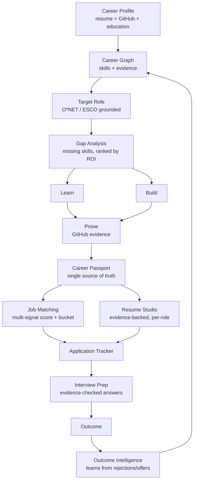
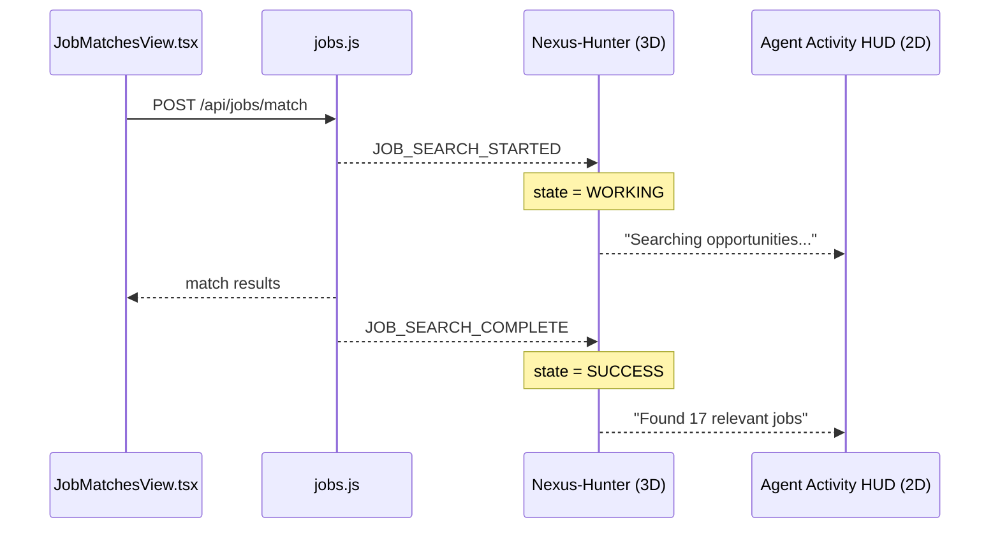
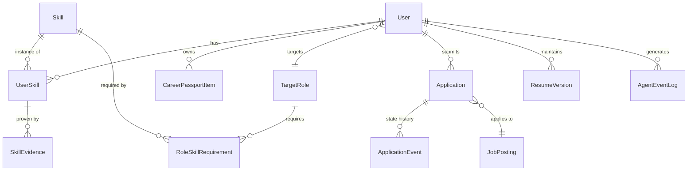
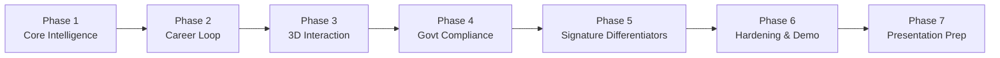

# PROJECT_MASTER_CONTEXT.md

**NEXIS (codebase: Forge v3)** — Evidence-Based Career Operating System
Document version 1.0 — 2026-09-15 — Author: Claude (Sonnet 5), synthesized from SIH brainstorm dump + existing Forge v3 codebase facts

---

## How to use this file

This is the single source of truth for NEXIS. It supersedes every prior brainstorm document, priority list, and feature dump that fed into it. Where this file conflicts with an earlier note, this file wins.

This document is **additive to an existing, partially-working codebase**, not a greenfield spec. Section 4 states exactly what already exists and is CONFIRMED. Everything else is either a planned extension of that system or an explicitly-flagged open question. An implementing agent (Antigravity or otherwise) must read Section 4 and Section 20 before writing any code.

Facts in this document carry one of four tags, used consistently:
- **CONFIRMED** — stated directly by the project owner or demonstrated in the existing codebase description.
- **INFERRED** — a reasonable conclusion from CONFIRMED facts, not independently verified.
- **RECOMMENDED** — this document's own architectural recommendation; not yet built, open to revision only through Section 19's Decision Log process, not by silent drift.
- **UNDECIDED** — Section 22 lists these. An implementing agent should ask rather than guess.

---

## 1. Executive Summary

The source material for this document was a large, repetitive brainstorm (three overlapping passes over nearly the same ~100 feature ideas, several conflicting priority lists, and one already-agreed 4-phase implementation prompt) about how to take an existing SIH hackathon project — a 3D multi-agent career platform called Forge v3 / NEXIS — and make it a national-level winner.

The raw material was strong on ideas and weak on decisions. Three different "final priority list" attempts in the source material disagree with each other. Several features are the same idea under three different names (Career Twin / What-If Simulator / Counterfactual Engine; Evidence Engine / Proof of Skill / Truth Layer / Skill Provenance; Job Trust Score / Job Authenticity). Some recommendations are self-contradicting (e.g., "build 8-10 features to an absurdly high standard" appears twice, immediately followed both times by a list of 20+ features).

This document does the job the brainstorm didn't: it picks. It reconciles the three priority lists into one locked tier list (Section 6), merges duplicate feature names into single canonical concepts, kills several ideas that don't earn their complexity for a hackathon timeline, and maps every kept feature onto the **actual existing file paths and stack** rather than a hypothetical rebuild.

**The one-sentence product definition, locked:**

> NEXIS is an evidence-backed career operating system that builds a living Career Graph of what a person can actually prove, compares it against a target role, and turns the gap into a prioritized sequence of learn → build → prove → apply actions — with every claim it makes traceable to a source.

Everything in this document exists to make that sentence true and demonstrable, not to maximize feature count.

---

## 2. Product Definition

**Product name:** NEXIS (product/brand name, used in UI, pitch, and demo). **Forge v3** is the codebase/repo name — keep both; do not rename the repo.

**One-liner:** An evidence-backed career operating system for job-seeking students — not a resume builder, not a job board, not a chatbot.

**Problem statement:** A student's resume, GitHub history, certificates, courses, job applications, and interview prep live in five disconnected tools. Existing tools tell a student what they *have* (a resume score) or what jobs *exist* (a job list). None of them connect the two: none say, specifically and provably, what's missing between where the student is and the role they want, and none tell them what to do about it in order.

**Target users:**
- **Primary:** Indian college students and recent graduates job-hunting, using phone+OTP login (CONFIRMED — this is already built).
- **Secondary (future, not v1 scope):** college placement cells, viewing aggregate/anonymized readiness data.
- **Admin/operator:** platform staff with GitHub-OAuth login and SUPER_ADMIN / REVIEWER / ANALYST roles (CONFIRMED — already built).

**Why this product, not a generic "AI resume tool" or "AI job finder":** those categories are crowded and already exist at SIH (a 2025 SIH winner, STROTAS/Internship Passport, already combined verified internship records, ATS resume building, AI mock interviews, skill-gap analysis, and curated learning paths — so simply having those features is not differentiation). NEXIS's actual moat is three things working together, none of which is "another AI wrapper":
1. **Structured skill/role data** (O*NET/ESCO-grounded) instead of an LLM guessing what skills matter.
2. **Evidence, not claims** — every skill, resume bullet, and interview answer is provenance-tagged; nothing generated reads as fact without a source.
3. **The 3D agent layer is wired to real backend state**, not decorative animation — it's the only part of the product that visually proves the multi-agent architecture is real, live, in front of a judge who can drag an agent and watch something actually execute.

**Unique differentiators (in order of defensibility):**
| # | Differentiator | Why it's hard to copy in a weekend |
|---|---|---|
| 1 | Career Graph grounded in O*NET/ESCO | Competitors hardcode "important skills" via LLM opinion; this is auditable against a public taxonomy |
| 2 | Evidence Engine (provenance tags on every claim) | Requires GitHub-evidence pipeline + a discipline of never letting the LLM assert unverified facts — most AI resume tools skip this entirely |
| 3 | Event-driven 3D agents (real backend state, not animation loop) | Requires actual event-bus wiring from API calls to 3D state, not just nice models |
| 4 | DPDP consent-scope audit trail | Specific to being a real Indian govt-adjacent platform; generic hackathon projects don't have this at all |
| 5 | Offline/degraded-mode resilience | Most hackathon demos die on venue wifi; surviving it live is a credibility signal judges remember |

**What NEXIS is explicitly NOT:** not a mass-auto-apply tool, not a guaranteed-ATS-pass tool, not a social network, not a generic chatbot wrapper, not a salary-prediction engine with false precision. See Section 11 for the hard rules this implies.

---

## 3. Product Principles

These principles resolve ambiguity when a feature decision isn't explicitly covered elsewhere in this document. Every principle below is used at least once in Section 6 to justify a KEEP or KILL call — they are not decoration.

1. **Evidence over assertion.** If NEXIS can't point to a source for a claim, it says "unsupported," never a plausible-sounding number.
2. **Real data or an honest empty state — never a fake one.** A judge (or user) seeing "87% match" must be able to ask "based on what?" and get a real answer.
3. **Deterministic code does deterministic work.** The LLM explains, summarizes, and converses. It does not compute scores, sort lists, or do arithmetic that plain code can do more cheaply and reliably.
4. **Every external dependency has a fallback.** No single job API, no single AI provider, and no internet connection being present should be able to fully break the demo.
5. **The 3D layer earns its screen time by doing something.** If an agent's animation doesn't correspond to a real event, it doesn't ship.
6. **Extend, don't rebuild.** The five existing views and the existing auth/consent/admin systems are working infrastructure, not a prototype to throw away.
7. **Depth over breadth.** Ten features built to work end-to-end beat thirty features that are 60% done. This principle is why Section 6 kills more than it keeps.
8. **Compliance is not polish.** For a DPDP-consent-gated platform, consent audit trails and data-deletion are P0 requirements, not stretch goals — see Section 12.

---
## 4. Confirmed Existing System (Ground Truth)

Everything in this section is **CONFIRMED**. Do not re-architect it. Do not introduce an alternative to any item here without a documented reason in Section 19.

### 4.1 Stack

| Layer | Technology | Port |
|---|---|---|
| Frontend | React 19 + TypeScript + Vite + TailwindCSS v4 + Three.js + Zustand | 3000 |
| Backend | Express 5 + Prisma ORM (SQLite dev / PostgreSQL prod) | 8787 |
| AI / search providers already integrated | Google Gemini API, Sarvam AI, Serper.dev | — |

**Non-negotiable constraint:** zero additional recurring cost. Prefer local/open-source components (sentence-transformers, Ollama, Docling, O*NET/ESCO data) over new paid APIs. Existing Gemini/Sarvam/Serper usage is the cost ceiling — any new paid API dependency must be flagged explicitly before it is added (see Section 14).

### 4.2 Authentication (two separate systems — do not merge them)

- **Trainee (end-user) auth:** phone + OTP. `server/services/otpService.js`, `server/routes/otpAuth.js`. Console-logged OTP in dev; real SMS via MSG91 in prod when configured.
- **Admin auth:** GitHub OAuth. `server/utils/auth.js`, `server/utils/adminAuth.js`. Roles: `SUPER_ADMIN`, `REVIEWER`, `ANALYST`. All admin actions logged to `AdminActionLog`.
- No Aadhaar dependency anywhere, ever. Do not add an Aadhaar field to any form.

### 4.3 Consent

`src/interface/onboarding/ConsentScreen.tsx` — DPDP consent with 4 scopes:
- `JOB_SEARCH_DATA`
- `EMPLOYER_SHARING`
- `ANALYTICS`
- `GOVT_CROSS_CHECK`

**Known open bug (INFERRED priority: high):** this consent step has previously failed to complete properly. This must be fixed as part of Phase 1 stabilization (Section 15) before any new feature work — a broken consent gate on a DPDP-consent-gated platform is not a cosmetic bug, it's a compliance blocker.

### 4.4 Existing feature views — extend these, never rebuild from scratch

| View | Backend route | Agent brand name | Provider(s) | What it does today |
|---|---|---|---|---|
| `SkillGapsView.tsx` | `server/routes/resume.js` | **Nexus-Strategist** | Gemini | Resume analysis, currently a single opaque score |
| `JobMatchesView.tsx` | `server/routes/jobs.js` | **Nexus-Hunter** | Serper.dev + Gemini | Job matching |
| `InterviewPrepView.tsx` | `server/routes/interview.js` | **Nexus-Mirror** | Gemini | Interview prep |
| `NewCVView.tsx` | — | — | PDFKit/jsPDF | Resume/CV generation |
| `AnalyticsDashboard.tsx` (admin) | — | — | — | Admin analytics |
| `DedupReviewPanel.tsx` (admin) | — | — | — | Deduplication review — **this panel already exists**; Section 6 extends it with a feedback loop rather than building dedup review from zero |

**Important continuity fact:** the agent brand names **Nexus-Strategist / Nexus-Hunter / Nexus-Mirror** are already established product naming, not a brainstorm suggestion. Section 7's agent registry extends this exact naming convention rather than inventing a disconnected "Resume Agent / Job Agent" scheme.

**Known product requirement (CONFIRMED, not yet built):** job-match results must be backed by a real, public job-listing API aggregating actual postings (LinkedIn/Indeed/Naukri-style sources) — not a generic Google search results page. This is a hard requirement for Section 9's Job Source Architecture, not a nice-to-have.

### 4.5 Do-not-break list

Do not, under any circumstance in this build:
- Introduce a new frontend framework, state manager, or ORM.
- Add a paid API dependency without flagging cost explicitly first.
- Fabricate resume content without a provenance tag (Section 11).
- Build automatic mass job application / auto-submit functionality.
- Rebuild `SkillGapsView`, `JobMatchesView`, `InterviewPrepView`, `NewCVView`, or the admin panels from scratch — extend them in place.

---

## 5. The NEXIS Loop

Every feature in Section 6 exists to serve one continuous loop. If a proposed feature doesn't sit somewhere on this loop, it doesn't belong in v1 scope — this is the test applied throughout Section 6.



**Reading this diagram:** the loop closes at the bottom — outcomes (interview results, offers, rejections) feed back into the Career Graph, which is what makes NEXIS a system that improves its own recommendations rather than a one-shot resume grader. This closing arrow (N → B) is the single most important arrow in the whole product: it is the difference between "a resume scorer" and "a career operating system," and it is the sentence to use when a judge asks why NEXIS isn't just ChatGPT (see Section 18).

**The two data pillars everything else hangs off:**
- **Career Graph** (Section 8) — the structured skill/evidence/role model. This is the technical foundation; almost every other feature reads from or writes to it.
- **Career Passport** (Section 8) — the persistent record of everything the user has actually done (credentials, projects, applications). This is what "Career Twin" and "What-If Simulator" in the source brainstorm both turn out to just be views over — see Section 6's consolidation notes for why those are collapsed into one feature.

---
## 6. Locked Feature Set (P0–P3)

The source brainstorm contained three different "final priority" attempts (a Tier S/A/B list, a P0-P4 "priority matrix," and a separate government-compliance list) that do not fully agree with each other. **This section replaces all three.** It is the only feature-priority list an implementing agent should use.

Legend: **P0** = ship-blocking, nothing else matters until these are done. **P1** = the actual product — must be excellent, not merely present. **P2** = signature/differentiating features — build these only once P0+P1 are solid and demoable. **P3** = explicitly out of scope for this build; documented so nobody re-proposes it mid-sprint. Each item cites the Section 3 principle(s) it serves.

### P0 — Foundation & Compliance (ship-blocking)

| # | Item | Principle(s) | Notes |
|---|---|---|---|
| P0.1 | Fix the DPDP consent-screen completion bug | #8 | Blocks every downstream user session; fix before any new feature work |
| P0.2 | Zero-fake-data audit of the 3 existing AI views | #2 | Any number currently hardcoded or estimated without a real calculation gets replaced or removed |
| P0.3 | Multi-dimensional resume scoring, replacing the single score | #1, #3 | Nexus-Strategist returns Role Fit / Skill Fit / Evidence Strength / Experience Fit / Project Fit / ATS Compatibility / Impact / Portfolio Strength — never one number |
| P0.4 | Provenance tagging on every generated claim | #1 | VERIFIED / DECLARED / INFERRED / UNSUPPORTED — see Section 11, this is the Evidence Engine's foundation and touches Nexus-Strategist, Nexus-Mirror, and Resume Studio simultaneously |
| P0.5 | Consent-scope audit trail | #8 | Every AI/data action logs which of the 4 DPDP scopes authorized it, visible in `AdminActionLog` / `AnalyticsDashboard` |
| P0.6 | DPDP right-to-erasure ("delete my data") | #8 | Must cascade across resume, applications, Career Passport — not a soft delete |
| P0.7 | Rate limiting | #4 | Per-phone-number throttle on `otpAuth.js`; per-user daily quota on Gemini/Sarvam/Serper calls |
| P0.8 | Degraded-mode fallback for Nexus-Strategist / Nexus-Hunter / Nexus-Mirror | #4 | On provider rate-limit or failure: cached or rule-based deterministic output, never a spinner or error screen in front of a user |
| P0.9 | Real job-listing API integration | #2 | Replace any Google-search-link behavior with an actual job aggregator API (Section 9) — this was an explicit prior product requirement |
| P0.10 | i18n: Hindi + one regional language toggle | (govt-platform requirement, not a Section 3 principle — a compliance/scoring fact for citizen-facing SIH platforms) | Applies to every citizen-facing view |

### P1 — Core Career Loop (must be excellent, this is the actual product)

| # | Item | Extends | Notes |
|---|---|---|---|
| P1.1 | Skill Graph | New | O*NET or ESCO as the reference taxonomy — never a hand-invented skill-importance list (Section 8) |
| P1.2 | Skill Gap Engine with priority ranking | Nexus-Strategist | Ranks missing skills by: jobs unlocked, role importance, user proximity, learning difficulty — this ranking output is also what Section 6's "Career ROI" (P2) displays, same computation, different view |
| P1.3 | Evidence Engine + GitHub Intelligence pipeline | New (Nexus-Verifier, Section 7) | Repositories → README → languages → commits → technologies → skill evidence. Consolidates "Proof of Skill," "Evidence Chain," "Truth Layer," and "Skill Provenance" from the source material — those were one feature described four times |
| P1.4 | Career Passport | New Prisma model | Single persistent record: skills, projects, education, certificates, courses, GitHub evidence, applications. Everything else reads from this |
| P1.5 | Multi-signal Job Matching + bucketing | Nexus-Hunter | Skill match + experience + title similarity + project relevance + location + education, bucketed into Apply Now / Learn Then Apply / Stretch / Ignore — never a single "84% match" |
| P1.6 | Application Tracker | New Prisma model | Full state machine (Section 8), plus response-rate / interview-rate / offer-rate analytics computed from real logged transitions |
| P1.7 | Learn → Build → Prove loop + Project Generator | New (Nexus-Pathfinder, Section 7) | For a missing skill: free-resource link → project spec (Gemini-generated, tagged "Suggested" not "Completed") → GitHub evidence → Career Passport entry |
| P1.8 | Resume Studio | `NewCVView.tsx` | Multiple resume versions per target role, generated from the Career Passport, not independently re-typed. Same PDF pipeline (PDFKit/jsPDF) — do not introduce a second PDF library |
| P1.9 | Job Trust Score | New | Consolidates "Job Trust Score" and "Job Authenticity" from the source — one feature: company identifiable, valid URL, recent posting date, salary-outlier flag |
| P1.10 | Dedup false-positive review loop | `DedupReviewPanel.tsx` | Extends the **existing** panel with admin accept/reject capture that adjusts the matching threshold — do not rebuild dedup review, it already exists |
| P1.11 | Admin audit log CSV/PDF export | `AdminActionLog` | Govt reviewers need exportable logs, not just an in-app view |

---
### P2 — Signature Differentiators (build only after P0 + P1 are solid and demoable)

| # | Item | Notes |
|---|---|---|
| P2.1 | 3D agent interaction layer | Event-driven state machine + drag/release + activity HUD + agent inspector. See Section 7 in full — this is the highest-effort P2 item and the one most likely to be cut for time if it isn't |
| P2.2 | Career Health + Career Debt + Career ROI | Three different **presentations** of one underlying gap-analysis computation (P1.2). Build together — the marginal cost of the second and third view is small once the first exists |
| P2.3 | What-If Simulator | Consolidated from "Career Twin," "What-If Career Simulator," and "Counterfactual Career Engine" in the source — see consolidation note below |
| P2.4 | Rejection / Outcome Intelligence | Pattern-detect common rejection causes from logged `ApplicationEvent` data; requires P1.6 to exist first and have real transitions logged |
| P2.5 | Interview evidence-checking | Nexus-Mirror extension: when a user's spoken/typed answer contains an unverifiable quantitative claim, flag it — reuses the Evidence Engine (P1.3), doesn't duplicate it |
| P2.6 | Reverse Resume | Job → requirements → current evidence → missing evidence → action plan. Cheap: it's the Skill Gap Engine (P1.2) run in the other direction |
| P2.7 | Demo Mode + Demo Failure Simulation + offline-first caching | See Section 13 for full spec; this line exists here only as a pointer so it isn't missed in sprint planning |
| P2.8 | 3D performance budget | Explicit FPS threshold (30fps sustained for 3s) triggers automatic fallback to a 2D/static agent panel |
| P2.9 (time-permitting, else P3) | Career Pathing (adjacent roles + job ladder) | Collapses "Job Ladder," "Adjacent Role Discovery," and "Career Path Simulator" from the source into one capability: a skill-graph distance function producing both "roles you're closer to than you think" and "your realistic next 2-3 roles." Cheap once P1.1 (Skill Graph) exists; build if schedule allows, defer otherwise |

### P3 — Explicitly deferred (do not build in this cycle)

- Campus Placement Mode + College Intelligence dashboard (real institutional feature — needs a second user type, real college partnerships; keep the Career Passport schema from precluding it later, build nothing now)
- Networking assistant / alumni finder
- Deep Company Intelligence (hiring-activity signals, culture data — needs a paid data source this project doesn't have)
- Salary Intelligence beyond a caveated range (no point-prediction; see Section 11)
- Resume A/B testing **dashboard** (the version-tracking schema is already in P1.8 — the outcome-comparison UI needs a real user population and real time elapsed, which a hackathon demo doesn't have; don't build the comparison view yet)
- Voice-based interview evaluation via browser speech API (cross-browser support is inconsistent; keep interview evaluation text/rubric-based for v1)

### Killed outright (not deferred — these ideas are wrong for this product, full stop)

| Idea (as it appeared in the source) | Why it's killed |
|---|---|
| Gamification / XP system | Low value for a serious, govt-adjacent job platform aimed at job-seekers under real pressure; risks feeling juvenile; judges don't reward point systems |
| "India-First Mode" as a togglable mode | The platform already targets India by default (DPDP consent, MSG91 SMS, GOVT_CROSS_CHECK scope). A toggle implies there's a non-Indian mode to toggle away from — there isn't. Just build it correctly once |
| Blockchain for credentials | Source material self-rejects this already; recorded here only for completeness |
| Autonomous mass-apply / auto-submit | Explicitly forbidden (Section 4.5); a genuine product-safety and platform-trust risk, not a scope question |
| "Guaranteed ATS pass" claim | Not a feature — a claim NEXIS must never make (Section 11). There is no universal ATS formula; claiming one is a credibility risk in front of technically literate judges |
| Full 10+ character 3D agent roster (Credential Agent, Analytics Agent, Integrity Agent, Notification Agent, Career Coach as separate visible agents) | Asset/animation cost scales badly; capped at 5 visible 3D agents (Section 7). Their responsibilities fold into the 5 kept agents or stay backend-only services with no 3D representation |

### Consolidation notes (why several source ideas became one feature here)

The source material describes the same underlying capability under multiple names in different passes. Treating these as separate build items would have doubled the effective scope for no additional value:

1. **"Evidence Engine" = "Proof of Skill" = "Evidence Chain" = "Truth Layer" = "Skill Provenance."** One mechanism (a `VERIFIED / DECLARED / INFERRED / UNSUPPORTED` tag on every generated claim, Section 11), applied uniformly to resume bullets, skill assertions, and interview answers. Building this once, correctly, and applying it everywhere is stronger than five half-built "trust" features.
2. **"Career Twin" = "What-If Career Simulator" = "Counterfactual Career Engine."** These all describe the same thing: simulate the effect of a hypothetical change (learn a skill, target a different role) against the existing Career Passport data. "Career Twin" in the source implied a separate persistent avatar/digital-twin data model — it isn't one; it's a live query over data that already exists. One feature: **What-If Simulator** (P2.3).
3. **"Job Trust Score" = "Job Authenticity."** Same feature (P1.9), two names in two different passes of the source document.
4. **"Career Recovery Mode"** is not a separate feature — it's Career Debt (P2.2) and Rejection Intelligence (P2.4) pointed at a user with a longer, harder job search. No new backend logic required.
5. **"Career Timeline"** is not a new entity — it's a chronological rendering of Career Passport (P1.4) items. No new Prisma model.
6. **"Job Ladder," "Adjacent Role Discovery," "Career Path Simulator"** collapse into one Career Pathing capability (P2.9) — three UI views over one skill-graph-distance computation, not three systems.

---
## 7. Agent Architecture

### 7.1 Naming — extend the existing brand, don't invent a new one

The product already has three named agents in production naming (Section 4.4): **Nexus-Strategist**, **Nexus-Hunter**, **Nexus-Mirror**. New agents below extend the same "Nexus-X" convention.

### 7.2 Agent registry

| Agent | Status | Responsibility | Reads | Writes | 3D-visible in v1? |
|---|---|---|---|---|---|
| **Nexus-Director** | NEW | Orchestrator — routes tasks to the right agent, synthesizes multi-agent results for the UI | Career Passport, task queue | Agent event log | Yes (center character) |
| **Nexus-Strategist** | Extend existing | Resume analysis → multi-dimensional scoring, provenance tagging, skill extraction | Resume, Career Passport | `ResumeVersion`, `UserSkill` | Yes |
| **Nexus-Hunter** | Extend existing | Job discovery + multi-signal matching + bucketing | Career Passport, Job Source Adapter | `JobMatch` | Yes |
| **Nexus-Mirror** | Extend existing | Interview prep + mock interview + evidence-checking of answers | Selected job, Career Passport | Interview session log | Yes |
| **Nexus-Verifier** | NEW | GitHub evidence pipeline — repo → README → languages → commits → skill evidence | GitHub API | `SkillEvidence` | Yes |
| **Nexus-Pathfinder** | NEW | Learning plan + Project Generator (Learn → Build → Prove) | Skill Gap output | `CareerPassportItem` (suggested project) | Backend-only in v1; add as 3D character only if P2.1 is ahead of schedule |
| Credential / Analytics / Integrity services | NEW, backend-only | Career Passport CRUD, admin analytics aggregation, unsupported-claim detection | — | — | No — explicitly killed as separate 3D characters (Section 6) |

### 7.3 Agent contract (structured output, not free text)

Every agent returns a structured object, never a bare paragraph. Example — Nexus-Strategist's skill-gap output:

```json
{
  "skill": "Docker",
  "status": "missing",
  "importance": 0.91,
  "evidence": [],
  "recommended_actions": ["free_course:docker-basics", "build_project:task-queue-service"],
  "confidence": 0.94,
  "source": "role_requirement:ONET-15-1252.00"
}
```

Deterministic code computes `importance` and `confidence` from real inputs (job-requirement frequency, role-taxonomy weight, user's current proximity). The LLM's job is to generate `recommended_actions` text and explain the number — never to invent the number itself. This is principle #3 (Section 3) applied concretely to the agent layer.

### 7.4 Agent state machine — locked baseline

The already-agreed implementation plan specifies this minimum state set; treat it as locked, not a starting suggestion:

```
IDLE → WORKING → SUCCESS
IDLE → WORKING → ERROR
IDLE → THINKING → WORKING → SUCCESS
Any state → DRAGGED → IDLE (on release)
```

Optional additions if P2.1 is ahead of schedule: `HOVER`, `SELECTED`, `WAITING`, `COMMUNICATING`. Do not build these before the locked baseline is solid.

Implementation: Three.js `AnimationMixer` with crossfade between clips per state. Pointer interactivity via React Three Fiber events (`onClick`, `onPointerDown/Up`, `onPointerOver`) + Three.js `DragControls` for drag-and-release; on release, the agent paths back to its default position.

### 7.5 Event-driven wiring — the non-negotiable part

Agent animation state **must** be driven by real backend events, never a decorative loop. This is what turns "cute 3D characters" into "a legitimate visualization of a multi-agent architecture" — it is also the single most common way hackathon 3D features get correctly dismissed by judges as decoration, so it is treated as a hard requirement, not a polish item.



Event names (extend as needed, keep the naming pattern): `RESUME_UPLOADED`, `ROLE_SELECTED`, `SKILL_ANALYSIS_STARTED/COMPLETE`, `JOB_SEARCH_STARTED/COMPLETE`, `EVIDENCE_VERIFICATION_STARTED/COMPLETE`, `RESUME_OPTIMIZATION_STARTED/COMPLETE`, `APPLICATION_SUBMITTED`, `INTERVIEW_STARTED/COMPLETE`. Log every event to `AgentEventLog` (Section 8) — this doubles as the audit trail judges can be shown live and as the data source for the 2D Agent Activity HUD.

### 7.6 Agent Activity HUD (2D, mandatory — not optional)

A lightweight, non-3D overlay listing real-time agent status, sourced from the same event stream as the 3D scene:

```
AGENT ACTIVITY
● Nexus-Hunter      Found 17 relevant jobs
● Nexus-Strategist  Detected 4 skill gaps
● Nexus-Verifier    Verified 3 GitHub projects
○ Nexus-Mirror      Idle
```

This exists for two reasons, both required: (1) accessibility — the 3D scene must never be the only way to see agent state (Section 10.3), and (2) judge legibility — a 3D scene on a projector at a distance is harder to read than a text HUD.

### 7.7 Agent Inspector (click-to-expand)

Clicking an agent in 3D or the HUD opens a panel: current task, inputs, outputs, confidence, and two links — "View evidence" (opens the Evidence Engine detail for whatever it's working on) and "View reasoning" (the short explanation string the LLM generated, always paired with the deterministic number it's explaining, never replacing it).

### 7.8 Drag-to-combine orchestration (stretch, P2 only if ahead of schedule)

The locked Phase 3 baseline (7.4) covers state, pointer interaction, drag-and-release, event wiring, the HUD, and FPS fallback — that is P2.1's actual scope. A further idea from the brainstorm — dragging one agent onto another to trigger a specific cross-agent action (e.g., drag Nexus-Verifier onto Nexus-Strategist to mean "re-check my GitHub evidence against this resume") — is a genuinely good demo moment but is **not** part of the locked baseline. Build it only after 7.4–7.7 are done and working, and treat it as a bonus, not a dependency for anything else in this document.

### 7.9 3D performance budget (P2.8)

Measure actual FPS. If it drops below 30fps for a sustained 3 seconds, automatically degrade to the 2D Agent Activity HUD as the primary interface and hide the 3D canvas. This must be a real measured trigger, not a device/browser sniff — see Section 17 for how to benchmark it.

---
## 8. Data Architecture

**Status of everything in this section: RECOMMENDED.** These are proposed additive Prisma models, not confirmed-existing schema. Before running any migration, an implementing agent must inspect the actual `prisma/schema.prisma`, confirm the real name of the user model (referred to below as `User` — it may be `Trainee`), and reconcile field names rather than assuming these definitions are final.

### 8.1 Career Graph relationships



### 8.2 Proposed models

```prisma
enum EvidenceStatus {
  VERIFIED      // independently confirmed (e.g. GitHub repo scan)
  DECLARED      // user-stated, not independently checked
  INFERRED      // system-inferred from related evidence
  UNSUPPORTED   // claim exists with no backing evidence at all
}

model Skill {
  id             String   @id @default(cuid())
  name           String   @unique
  taxonomySource String   // "ONET" | "ESCO" | "CUSTOM"
  taxonomyCode   String?
  category       String?
  createdAt      DateTime @default(now())
  userSkills     UserSkill[]
  roleRequirements RoleSkillRequirement[]
}

model TargetRole {
  id           String   @id @default(cuid())
  title        String
  taxonomySource String // "ONET" | "ESCO"
  taxonomyCode String?
  requirements RoleSkillRequirement[]
  targetedBy   User[]   @relation("UserTargetRoles")
}

model RoleSkillRequirement {
  id           String     @id @default(cuid())
  roleId       String
  skillId      String
  importance   Float      // 0-1, sourced from taxonomy + job-posting frequency, never LLM-guessed
  role         TargetRole @relation(fields: [roleId], references: [id])
  skill        Skill      @relation(fields: [skillId], references: [id])
  @@unique([roleId, skillId])
}

model UserSkill {
  id          String         @id @default(cuid())
  userId      String
  skillId     String
  proficiency Int?           // 0-100, derived from evidence, never directly user-typed
  status      EvidenceStatus @default(DECLARED)
  updatedAt   DateTime       @updatedAt
  user        User           @relation(fields: [userId], references: [id])
  skill       Skill          @relation(fields: [skillId], references: [id])
  evidence    SkillEvidence[]
  @@unique([userId, skillId])
}

model SkillEvidence {
  id          String    @id @default(cuid())
  userSkillId String
  sourceType  String    // "GITHUB_REPO" | "COURSE" | "CERTIFICATE" | "PROJECT" | "USER_DECLARED"
  sourceRef   String?   // repo URL, course ID, certificate URL
  detail      String?
  confidence  Float?    // 0-1
  verifiedAt  DateTime?
  userSkill   UserSkill @relation(fields: [userSkillId], references: [id])
}

model CareerPassportItem {
  id          String   @id @default(cuid())
  userId      String
  type        String   // "PROJECT" | "COURSE" | "CERTIFICATE" | "INTERNSHIP" | "ACHIEVEMENT"
  title       String
  issuer      String?
  dateEarned  DateTime?
  skillsProven String[] // Skill ids demonstrated
  sourceUrl   String?
  status      String   @default("SUGGESTED") // "SUGGESTED" | "COMPLETED" — Nexus-Pathfinder's generated projects start as SUGGESTED
  user        User     @relation(fields: [userId], references: [id])
}

model JobPosting {
  id          String   @id @default(cuid())
  externalId  String   // id from the real job-listing API (Section 9) — required for dedup
  source      String   // provider name
  title       String
  company     String
  location    String?
  postedAt    DateTime?
  lastVerifiedAt DateTime?
  url         String
  trustScore  Float?   // Job Trust Score, P1.9
  matches     JobMatch[]
  @@unique([source, externalId])
}

model JobMatch {
  id          String     @id @default(cuid())
  userId      String
  jobId       String
  skillScore  Float
  experienceScore Float
  titleScore  Float
  projectScore Float
  overallScore Float
  bucket      String     // "APPLY_NOW" | "LEARN_THEN_APPLY" | "STRETCH" | "IGNORE"
  computedAt  DateTime   @default(now())
  user        User       @relation(fields: [userId], references: [id])
  job         JobPosting @relation(fields: [jobId], references: [id])
}

model Application {
  id          String   @id @default(cuid())
  userId      String
  jobId       String
  resumeVersionId String?
  status      String   // current state, see 8.3 state machine
  createdAt   DateTime @default(now())
  user        User     @relation(fields: [userId], references: [id])
  events      ApplicationEvent[]
}

model ApplicationEvent {
  id            String      @id @default(cuid())
  applicationId String
  fromStatus    String?
  toStatus      String
  note          String?
  occurredAt    DateTime    @default(now())
  application   Application @relation(fields: [applicationId], references: [id])
}

model ResumeVersion {
  id          String   @id @default(cuid())
  userId      String
  targetRoleId String?
  label       String   // e.g. "AI Engineer v3"
  pdfPath     String?
  createdAt   DateTime @default(now())
  user        User     @relation(fields: [userId], references: [id])
}

model AgentEventLog {
  id        String   @id @default(cuid())
  userId    String?
  agent     String   // "NEXUS_DIRECTOR" | "NEXUS_STRATEGIST" | "NEXUS_HUNTER" | "NEXUS_MIRROR" | "NEXUS_VERIFIER" | "NEXUS_PATHFINDER"
  eventType String   // e.g. "JOB_SEARCH_STARTED"
  payload   Json?
  occurredAt DateTime @default(now())
}

model ConsentActionLog {
  id          String   @id @default(cuid())
  userId      String
  action      String   // e.g. "RESUME_ANALYSIS", "JOB_MATCH", "GOVT_CROSS_CHECK_QUERY"
  consentScope String  // one of the 4 DPDP scopes (Section 4.3) that authorized this action
  occurredAt  DateTime @default(now())
}
```

### 8.3 Application state machine

```
DISCOVERED → SHORTLISTED → RESUME_CUSTOMIZED → APPLIED → ASSESSMENT → SCREENING
→ INTERVIEW → TECHNICAL → HR → OFFER → ACCEPTED
```
Side branches, reachable from any state after `APPLIED`: `REJECTED`, `WITHDRAWN`, `GHOSTED`, `ON_HOLD`, `EXPIRED`. Every transition writes an `ApplicationEvent` row — this log is what powers Application Analytics (P1.6) and Rejection Intelligence (P2.4). Do not compute analytics from the current `status` field alone; compute them from the event history, or outcome-rate numbers will be wrong the moment an application is re-opened or corrected.

---
## 9. API Architecture

New endpoints extend the existing route files where the functionality is a natural extension of what's already there; genuinely new capability gets a new route file. Do not invent parallel endpoints for functionality that already exists in `resume.js`, `jobs.js`, or `interview.js`.

### 9.1 Extend existing route files

| Method | Path | File | Change |
|---|---|---|---|
| POST | `/api/resume/analyze` | `resume.js` | Response shape changes from single score to the P0.3 multi-dimensional object, each field provenance-tagged per Section 11 |
| GET | `/api/resume/:id/evidence` | `resume.js` (new handler) | Returns the evidence chain behind a specific resume bullet |
| GET | `/api/jobs/matches` | `jobs.js` | Response includes the full multi-signal breakdown (P1.5) and bucket, not a single percentage |
| POST | `/api/jobs/:id/track` | `jobs.js` (new handler) | Creates an `Application` row, initial status `DISCOVERED` |

### 9.2 New route files

| File | Endpoints | Purpose |
|---|---|---|
| `server/routes/careerGraph.js` | `GET /api/skills/gap?targetRoleId=`, `GET /api/skills/roi`, `POST /api/skills/what-if` | Skill Gap Engine, Career ROI, What-If Simulator (P1.2, P2.2, P2.3) — all three read the same underlying computation |
| `server/routes/evidence.js` | `POST /api/evidence/github-scan`, `GET /api/evidence/:userSkillId` | Nexus-Verifier's GitHub Intelligence pipeline |
| `server/routes/passport.js` | `GET/POST /api/passport`, `DELETE /api/passport/:itemId` | Career Passport CRUD |
| `server/routes/applications.js` | `GET /api/applications`, `PATCH /api/applications/:id/status`, `GET /api/applications/analytics` | Application Tracker + analytics (P1.6) |
| `server/routes/agents.js` | `GET /api/agents/activity` (SSE or polling) | Feeds the Agent Activity HUD (7.6) and the 3D event wiring (7.5) from one source |
| `server/routes/consent.js` (extend if a consent route already exists, else new) | `POST /api/consent/delete-my-data`, `GET /api/consent/audit-trail` | P0.6 and P0.5 |

### 9.3 Job Source Architecture (P0.9 — hard requirement, not optional)

Job matching must be backed by a real job-listing API, not a Google search link — this was a confirmed prior product requirement. Build a provider-adapter layer so no single source is a single point of failure:

```
JobPosting request
      │
      ▼
Job Source Adapter (per-provider fetch/normalize/dedup/rate-limit)
      │
      ▼
Normalization → Deduplication → Job Trust scoring → JobPosting table
      │
      ▼
Nexus-Hunter matching
```

Each provider implements the same interface (`fetch()`, `normalize()`, `validate()`, `deduplicate()`, `rateLimit()`). If the primary provider fails or rate-limits, fall back to the cached `JobPosting` table rather than failing the request (this is the same fallback pattern required in Section 13). Respect every provider's actual terms of service and rate limits — do not scrape job boards whose terms prohibit it.

---

## 10. UX/UI System & Screens

### 10.1 Information architecture — reorganize around the loop, not around feature names

Replace a flat `Dashboard / Resume / Jobs / Courses / Certificates / Settings` navigation with one organized around the actual user workflow (Section 5's loop):

```
Career Command Center (home)
Career Graph & Skill Gaps
Resume Studio
Jobs
Applications
Interview Prep
Career Passport
3D Agent World
Settings & Privacy
```

Admin navigation stays fully separate from candidate navigation — do not interleave them.

### 10.2 The hero dashboard ("Career Command Center")

The home screen must answer, without scrolling: *Who am I? What's my current readiness? What should I do today? What opportunities exist?* Use real backend data only — every number shown must trace to a real computation (Section 11). A minimal version:

```
CAREER HEALTH: 78/100          TARGET: AI Engineer
Current match: 71%             Next milestone: 80%
────────────────────────────────────────
TODAY
1. Finish Docker module
2. Apply to 2 high-match jobs
3. Add your latest GitHub project
────────────────────────────────────────
14 jobs — Apply Now   |   4 high-priority skill gaps
```

Do not build a push-notification system for "Today's actions" — it's a dashboard widget computed on load, not a notification infrastructure this project has no reason to build.

### 10.3 Screen state pattern — define once, apply everywhere

Every asynchronous screen must implement all five states below. This is defined once here rather than repeated per screen in this document; an implementing agent applies it uniformly.

| State | Rule |
|---|---|
| Loading | Skeleton or progress indicator specific to what's happening (e.g., "Analyzing resume…" not a bare spinner) |
| Empty | Explain why it's empty and what action resolves it (e.g., no resume → "Upload a resume to see your skill gaps") |
| Success | Real data, always |
| Error | What happened, why (if known), what the user can do — never "Something went wrong" |
| Degraded | Cached/deterministic fallback when an AI provider fails (Section 13) — this state does not exist on generic screens, only on the AI-dependent ones (Nexus-Strategist, Nexus-Hunter, Nexus-Mirror, Nexus-Verifier) |

### 10.4 Screen inventory

| Screen | Backed by | Primary data source | Notes |
|---|---|---|---|
| Career Command Center | New | Career Passport + Skill Gap Engine | Section 10.2 |
| SkillGapsView (renamed in-UI to "Skill Graph") | Existing, extended | Nexus-Strategist, `RoleSkillRequirement` | Multi-dimensional scores (P0.3), click-to-evidence (Section 11) |
| Resume Studio | `NewCVView.tsx`, extended | `ResumeVersion`, Career Passport | Multiple versions per target role |
| JobMatchesView | Existing, extended | Nexus-Hunter, `JobMatch` | Bucketed results, Job Trust Score badge |
| Applications | New | `Application`, `ApplicationEvent` | State-machine pipeline UI |
| InterviewPrepView | Existing, extended | Nexus-Mirror | Evidence-checked answers (P2.5) |
| Career Passport | New | `CareerPassportItem` | Single source-of-truth record |
| 3D Agent World | Existing 3D scene, rewired | `AgentEventLog` stream | Section 7 in full |
| Admin: Analytics/Dedup/Audit | Existing, extended | `AdminActionLog`, `ConsentActionLog` | Add CSV/PDF export (P1.11), dedup feedback loop (P1.10) |

### 10.5 Language rules for AI-generated UI copy

Do not use "AI MAGIC," "AI-POWERED," "SUPER INTELLIGENCE," "YOUR AI COPILOT," or similar language anywhere in the product. Write outcomes, not mechanisms: "3 skills may reduce your match" rather than "AI detected critical competency gaps." When something is AI-generated content rather than the user's own data, visually distinguish it (e.g., "Suggested wording" label) — never let a generated claim visually read as a verified fact.

### 10.6 Accessibility — the 3D layer is never the only path

Every 3D interaction must have a non-3D equivalent: dragging Nexus-Hunter onto a job to "optimize resume for this job" (if 7.8 is built) must also be reachable via a normal `[Optimize Resume]` button. Screen-reader labels/ARIA on all interactive 3D elements are required, not optional, for a government-adjacent platform (Section 12 covers the compliance reasoning). No color-only status communication.

---
## 11. Evidence & Trust Rules

These rules are the Evidence Engine described from Section 6's consolidation note. They are cross-cutting — they apply to Nexus-Strategist, Nexus-Mirror, Resume Studio, and any future agent equally.

### 11.1 The provenance taxonomy (one taxonomy, used everywhere)

| Tag | Meaning | Example |
|---|---|---|
| `VERIFIED` | Independently confirmed against a real source | "FastAPI" — found in `requirements.txt` of a scanned GitHub repo |
| `DECLARED` | User stated it, not independently checked | "Led a team of 5" — resume text, no corroborating source |
| `INFERRED` | System-derived from related evidence | Proficiency estimate from commit frequency, not a direct claim |
| `UNSUPPORTED` | A claim exists with no evidence at all | "Reduced latency by 40%" with nothing behind it |

**Hard rule:** Nexus-Strategist must never insert an `UNSUPPORTED` quantitative claim into a generated resume bullet. If the user wants to keep such a claim, it renders with a visible "unverified" flag; NEXIS does not silently launder an unsupported number into a polished bullet point.

### 11.2 Never claim a universal ATS pass

Never display or generate the phrase "guaranteed ATS pass" or equivalent. There is no single ATS formula; claiming one is both false and a specific credibility risk with technically literate judges. The correct framing is **Resume Compatibility Analysis** — parsing, structure, terminology coverage, section headings — always shown with the underlying issues list, never as a bare guarantee.

### 11.3 Explainability — every non-trivial number answers "why?"

Any score, ranking, or recommendation must be clickable to its underlying evidence. Minimum required, for every major recommendation:
- **Why** (what triggered it)
- **Based on what** (the actual data/evidence)
- **How confident** (a real confidence value, computed, not invented)
- **What would change it** (the counterfactual — this is what P2.3's What-If Simulator formalizes into a feature, but the explanation itself is required everywhere, not just in that one screen)

### 11.4 Fairness

Do not use protected attributes (gender, caste, religion, race, political affiliation) as matching or scoring inputs anywhere in Nexus-Hunter or Nexus-Strategist. If a user asks why they weren't matched to something, the explanation must be traceable to job-related evidence only.

### 11.5 Human override

Every AI recommendation supports Accept / Edit / Reject / Not relevant. Store the response as feedback; do not silently discard it. This is a cheap feature (a few UI buttons + one logging call) that materially strengthens the "responsible AI" story for judge Q&A (Section 18).

---

## 12. Security, Privacy & DPDP Compliance

This platform is DPDP-consent-gated and India-facing. The items in this section are compliance requirements, not optional hardening — they are P0 in Section 6 for that reason.

### 12.1 Consent-scope audit trail (P0.5)

Every AI or data action must log which of the 4 consent scopes (Section 4.3) authorized it, via the `ConsentActionLog` model (Section 8.2). This is what lets an admin — or a judge asking "how do you handle consent?" — see a real, queryable answer instead of a policy statement: "resume analysis for user X was authorized under `JOB_SEARCH_DATA`, logged at [timestamp]."

### 12.2 Right to erasure (P0.6)

"Delete my data" in trainee settings must cascade across every model that stores personal data: `UserSkill`, `SkillEvidence`, `CareerPassportItem`, `Application`/`ApplicationEvent`, `ResumeVersion`, `ConsentActionLog`. A soft-delete flag that leaves the underlying rows queryable does not satisfy this requirement.

### 12.3 Rate limiting (P0.7)

- Per-phone-number throttle on `otpAuth.js` OTP requests (prevents both cost abuse of MSG91 and OTP-spam harassment of a phone number).
- Per-user daily quota on Gemini/Sarvam/Serper calls. On quota exhaustion, degrade gracefully (Section 13) — never break the three AI-dependent views outright, especially not mid-demo.

### 12.4 Secrets

Never expose API keys, OAuth secrets, or session secrets in frontend code or in Vite environment variables that ship to the browser. GitHub tokens used for the Nexus-Verifier evidence pipeline are server-side only.

### 12.5 i18n as a compliance item, not a polish item

Hindi + at least one regional language toggle (P0.10) applies to every citizen-facing view. This is scored directly in most SIH rubrics under "citizen-centric" criteria for government platforms — treat it with the same priority as a functional bug, not as a stretch goal for the end of the sprint.

---

## 13. Reliability & Offline Architecture

**Design as if the venue wifi will fail during judging.** This is not paranoia — it's a documented pattern from prior SIH winners, and this platform already depends on three external AI/search providers plus a job-listing API, any of which can rate-limit or go down at the worst possible moment.

### 13.1 Fallback-first rule (applies to every external dependency)

```
External call
    │
    ▼ fails or rate-limited?
    │
    ▼ yes
Cached response / deterministic rule-based output
    │
    ▼
Degraded-mode UI state (Section 10.3) — never a bare error screen
```

This applies specifically to Nexus-Strategist, Nexus-Hunter, Nexus-Mirror (P0.8), and the Job Source Adapter (Section 9.3). None of these four should be able to fully break in front of a user or a judge.

### 13.2 Offline-first PWA caching

Cache the last-fetched job list and resume-analysis state via IndexedDB / a service worker, so a demo mid-presentation survives a dropped connection by falling back to the last good state rather than a blank screen.

### 13.3 Demo Mode

A one-click, clearly labeled "Demonstration Data" mode that loads a complete, realistic demo user (resume, GitHub, jobs, skills, courses, applications). Never mixed with real user data. This exists so a judge can experience the full loop (Section 5) without a five-minute account-creation detour.

### 13.4 Demo Failure Simulation

A hidden admin/demo control that can force-simulate: API failure, LLM unavailable, slow network, empty job search, invalid resume, GitHub unavailable. Used to deliberately demonstrate graceful degradation live, in response to the judge question "what happens if your API fails?" (Section 18) — turning a risk into a rehearsed strength.

---
## 14. Zero-Cost Technical Constraints

Existing Gemini/Sarvam/Serper usage is the cost ceiling (Section 4.1). Every new component is categorized:

| Category | Rule | Examples for this project |
|---|---|---|
| A — Local/open-source | Preferred, default choice | Sentence-transformers for embeddings, Docling for resume parsing, Ollama for a local LLM if agent load needs to move off Gemini |
| B — Public/free API with quotas | Allowed, must have a fallback | GitHub API (60/hr unauthenticated, 5,000/hr authenticated — use an authenticated server-side token) |
| C — Optional external integration | Only if a genuinely free tier covers the demo's needs | A secondary job-listing provider as a fallback source |
| D — Paid dependency | Not allowed without explicit flagging and sign-off first | Anything beyond current Gemini/Sarvam/Serper spend |

### 14.1 Deterministic vs. AI split (principle #3, applied concretely)

| Deterministic code (never the LLM) | LLM (Gemini) |
|---|---|
| Scores, rankings, sorting | Explanations, rewriting, summarization |
| Skill-importance weighting (from taxonomy + job-frequency data) | Conversational interview dialogue |
| Date/duplicate/state-machine logic | Project-spec generation (tagged "Suggested") |
| Confidence values | Natural-language "why" text paired with a real number |

### 14.2 Skill taxonomy grounding

Use O*NET or ESCO as the reference dataset for role/skill requirements (`RoleSkillRequirement.importance`, Section 8) rather than hand-invented weights. O*NET data is distributed under CC BY 4.0 with attribution required — attribute it in the product (e.g., a footer credit or an "About the data" panel) if it's used. Verify the current license terms and dataset version before import; do not assume the version described in any earlier brainstorm is still current.

### 14.3 GitHub evidence pipeline cost

Use an authenticated server-side GitHub token for Nexus-Verifier (5,000 requests/hour vs. 60 unauthenticated) — this is a free-tier increase, not a new cost.

---

## 15. Implementation Roadmap (7 Phases)

Phases 1–4 below are **already an agreed, in-progress plan** (confirmed via prior context) using the exact existing file paths from Section 4 — preserve their internal step numbering so this document doesn't conflict with work already scoped or started. Phases 5–7 are new, added by this document to cover the signature-feature layer and hackathon hardening that the original 4-phase plan didn't include.



**Rule for every phase: confirm scope before writing code, then implement, then validate (Section 20) before starting the next phase.** Do not start Phase N+1 work while Phase N has known-broken pieces.

### Phase 1 — Core Intelligence Upgrade
1. Extend `resume.js` / `SkillGapsView.tsx` into the multi-dimensional scoring engine (P0.3): Role Fit, Skills Fit, Evidence Strength, Experience Fit, Project Fit, ATS Compatibility, Impact Score, Portfolio Strength, Learning Readiness, Interview Readiness — per-dimension scores + a short reasoning string from Gemini, never a single opaque number.
2. Build the Skills Graph module (P1.1): user skills vs. target-role skills, using O*NET or ESCO data instead of hardcoded role requirements.
3. Add dependency-ordering to missing skills using the skill graph's prerequisite relationships (feeds P1.2's priority ranking).
4. Add explicit provenance tagging (Section 11) to every resume claim.

### Phase 2 — Career Loop
5. `JobMatchesView.tsx`: replace single-score matching with weighted multi-signal scoring (P1.5); bucket into APPLY NOW / LEARN THEN APPLY / STRETCH / IGNORE.
6. Application Tracker (P1.6): full pipeline (Section 8.3) + Prisma model + analytics endpoint.
7. Career Passport (P1.4): persistent model aggregating skills, projects, experience, education, certificates, achievements, courses, GitHub data, applications — becomes the source of truth other features read from.
8. Project Generator (P1.7, Nexus-Pathfinder): given missing skills, output a scoped project spec via Gemini, tagged "Suggested" not "Completed."

### Phase 3 — Signature 3D Interaction
9. Agent state machine per agent (Section 7.4) — minimum states IDLE/WORKING/THINKING/SUCCESS/ERROR/DRAGGED, via Three.js `AnimationMixer` crossfade.
10. Pointer interactivity (React Three Fiber events) + `DragControls` for drag-and-release; agent paths back to default position on release.
11. Wire agent state to real backend activity (Section 7.5) — no fake/decorative animation loops.
12. 2D "Agent Activity" HUD overlay (Section 7.6).
13. FPS-based fallback: below 30fps sustained for 3s, degrade to 2D/static agent panel (P2.8).

### Phase 4 — Government-Platform-Specific Requirements (compliance, not optional polish)
14. i18n: Hindi + at least one regional language toggle across all citizen-facing views (P0.10).
15. Accessibility: screen-reader labels/ARIA on all interactive 3D elements, plus a non-3D navigable fallback for the entire agent layer (Section 10.6).
16. DPDP data deletion: cascading "delete my data" flow (P0.6, Section 12.2).
17. Consent-scope audit trail (P0.5, Section 12.1).
18. Rate limiting: per-phone-number OTP throttle + per-user AI-call quota, with graceful degraded-mode response (P0.7/P0.8).

### Phase 5 — Signature Differentiators (new)
19. Career Health + Career Debt + Career ROI (P2.2) — three views over one gap-analysis computation.
20. What-If Simulator (P2.3) — consolidated Career Twin/counterfactual feature.
21. Rejection / Outcome Intelligence (P2.4) — requires real `ApplicationEvent` history to be meaningful; do not build this before Phase 2 has real data flowing.
22. Interview evidence-checking (P2.5) and Reverse Resume (P2.6).
23. Career Pathing (P2.9) if schedule allows.

### Phase 6 — Hardening & Demo Prep
24. Offline-first PWA caching (13.2), Demo Mode (13.3), Demo Failure Simulation (13.4).
25. Run the actual benchmark suite (Section 17) — do not write benchmark numbers into the pitch deck before they're measured.
26. Zero-fake-data final audit across every screen (P0.2, re-verified after all new features are added).
27. Admin audit log CSV/PDF export (P1.11), dedup feedback loop (P1.10).

### Phase 7 — Presentation & Q&A Prep
28. Rehearse the demo script (Section 18) against Demo Mode, including at least one deliberate failure-simulation run.
29. Prepare the judge Q&A answers (Section 18.3) as a team — everyone should be able to answer them, not just one teammate.

---
## 16. Acceptance Criteria

Representative criteria for the highest-risk P0/P1 items — an implementing agent should write equivalent criteria for every remaining P1/P2 item before marking it done, using this format.

**Multi-dimensional resume scoring (P0.3)**
> Given a logged-in user with an uploaded resume and a selected target role
> When Nexus-Strategist analyzes the resume
> Then the response contains at least Role Fit, Skill Fit, Evidence Strength, Experience Fit, Project Fit, ATS Compatibility as separate numeric fields
> And no single aggregate "resume score" is displayed without these being visible
> And each field is expandable to a short reasoning string

**Evidence Engine (P0.4 / P1.3)**
> Given a resume bullet generated or edited by Nexus-Strategist
> When the bullet contains a quantitative claim
> Then the system checks for GitHub/course/certificate evidence backing that claim
> And if none exists, the bullet is tagged `UNSUPPORTED` and visibly flagged in the UI
> And the system never silently removes the flag or the claim without user action

**Job matching bucketing (P1.5)**
> Given a user with a Career Passport and a target role
> When Nexus-Hunter returns job matches
> Then each result includes skill/experience/title/project sub-scores and one bucket label (APPLY NOW / LEARN THEN APPLY / STRETCH / IGNORE)
> And the bucket is computed deterministically from the sub-scores, not assigned by the LLM

**Degraded mode (P0.8)**
> Given Gemini, Sarvam, or Serper returns a rate-limit or failure response
> When a user is on SkillGapsView, JobMatchesView, or InterviewPrepView
> Then the screen shows a cached or rule-based deterministic result with a visible "showing cached/offline results" indicator
> And the screen never shows a bare error or infinite spinner

**DPDP deletion (P0.6)**
> Given a user requests data deletion from settings
> When the deletion is confirmed
> Then rows in `UserSkill`, `SkillEvidence`, `CareerPassportItem`, `Application`, `ApplicationEvent`, `ResumeVersion`, and `ConsentActionLog` for that user are actually removed (not soft-deleted)
> And a confirmation is shown listing what was deleted

**3D agent event wiring (Phase 3, item 11)**
> Given a user triggers a job search from JobMatchesView
> When the API call to `jobs.js` starts and completes
> Then the Nexus-Hunter 3D model transitions IDLE → WORKING → SUCCESS/ERROR in sync with the real request lifecycle
> And the Agent Activity HUD shows the same transition at the same time
> And no agent animation plays without a corresponding real event in `AgentEventLog`

---

## 17. Testing & Benchmark Strategy

**Rule: measure, don't invent.** Every number in the pitch deck (Section 18) must trace to a real test run logged somewhere reproducible. "We measured X" beats "we expect X" — this is a direct SIH-judging differentiator, not just good practice.

### 17.1 What to actually benchmark before the pitch deck cites it

| Metric | How to measure |
|---|---|
| Resume parsing accuracy | Run against a held-out set of real resumes; compare extracted fields to manually-verified ground truth |
| Skill extraction accuracy | Same approach, against known skill lists |
| Job-match precision | Manually judge a sample of matches for relevance |
| API latency (per provider) | Log request/response timestamps in production code, not a one-off local test |
| LLM latency | Same, per agent |
| 3D FPS | Real browser performance measurement (e.g., `requestAnimationFrame` delta timing), not an assumption |
| Database query latency | Log slow-query timing for the heaviest endpoints (job matching, skill gap) |

### 17.2 Test types (minimum before calling the project demo-ready)

- **Unit:** scoring functions, matching functions, skill-gap ranking, job normalization/dedup, provenance-tag assignment logic.
- **Integration:** resume upload → parse → score end-to-end; GitHub evidence scan end-to-end; full application state-machine transitions.
- **E2E (one full run, scripted, not automated CI unless time allows):** register → login → upload resume → select target role → view skill graph → view job matches → select a job → generate targeted resume → track application → interview prep.
- **User testing (if time allows before the deadline):** a handful of real students perform the E2E flow above; record completion time, points of confusion, and whether recommendations were accepted. Only cite these results if they were actually collected — do not write "users loved it" without a real session behind it.

### 17.3 Regression checklist before any phase is marked complete

`npm run build`, `npx tsc --noEmit --skipLibCheck`, zero console errors, no broken routes, authentication still works (both trainee OTP and admin GitHub OAuth), the 5 existing views still function, 3D scene still loads and disposes cleanly on unmount, mobile viewport has no horizontal overflow.

---
## 18. Demo & Competition Strategy

### 18.1 The pitch — what NOT to say, then what to say

Do not open with "AI-Powered Career Management Platform" or pitch NEXIS as "AI Resume Builder," "AI Job Finder," "AI Mock Interview," or "Skill Gap Analyzer" — all four are crowded categories already represented at SIH (a 2025 winner, STROTAS, already combined several of these). Open with the gap, not the category:

> "A student can have a degree, projects, certificates, and a GitHub profile — and still not know which jobs they actually qualify for, what's missing, or what to do next. Resume, GitHub, courses, and applications all live in separate places. NEXIS connects them into one living Career Graph that turns the gap between where you are and where you want to go into a prioritized set of actions — and proves every claim it makes."

Then demo immediately. Do not spend more than the sentence above explaining before showing the product.

### 18.2 Canonical demo script (~3 minutes, judge-controlled variant preferred)

This consolidates the several slightly-different demo scripts in the source material into one. Use Demo Mode (13.3) so this is reliable regardless of venue wifi.

| Time | Beat |
|---|---|
| 0:00–0:15 | Problem statement (18.1) |
| 0:15–0:35 | Upload resume (or load Demo Mode) |
| 0:35–0:50 | Select target role |
| 0:50–1:10 | Career Graph / Skill Gap appears, multi-dimensional, click one score to show its evidence |
| 1:10–1:30 | Nexus-Hunter finds jobs, bucketed (Apply Now / Learn Then Apply / Stretch) |
| 1:30–1:50 | Select a job — GitHub evidence (Nexus-Verifier) shown against its requirements |
| 1:50–2:10 | Resume Studio generates a targeted resume version from real evidence |
| 2:10–2:30 | Learning + Project Generator plan for the top-priority missing skill |
| 2:30–2:50 | 3D agents visibly communicate during one of the above steps (point out this is wired to real events, not decoration) |
| 2:50–3:00 | What-If Simulator: "what if I learn Docker?" — score updates live |

**Stronger variant if time allows:** hand control to the judge with four buttons — "Find me a job," "Check my resume," "Show my skill gaps," "Show how the agents work" — and let them drive. This is explicitly more convincing than a scripted walkthrough because it proves the system isn't a fixed-path demo.

**Also rehearse once with Demo Failure Simulation (13.4) triggered mid-demo**, showing the degraded-mode fallback recover gracefully. This single moment is worth more than several extra features — it's a live answer to "what happens when your API fails?"

### 18.3 Judge Q&A — one-line answers

| Question | Answer |
|---|---|
| Why AI at all? | Reasoning, rewriting, and conversational explanation are LLM tasks; scoring and matching are deterministic code (Section 14.1) — we don't use AI where plain code is more reliable |
| Why multi-agent? | Resume analysis, job retrieval, skill mapping, evidence verification, and interview prep are separate reasoning domains with different data contracts — we isolate them into agents with structured contracts (Section 7.3) coordinated by an orchestrator |
| Why 3D? | It's the interaction layer for the multi-agent architecture — agent state, communication, and task execution are visualized in real time from real backend events, making an otherwise invisible orchestration process observable |
| Why not just ChatGPT? | ChatGPT doesn't maintain a structured, evidence-backed Career Graph, connect skills to jobs and learning resources, track real application outcomes, or verify evidence — NEXIS does all four |
| How is match score calculated? | Weighted deterministic combination of skill/experience/title/project/location signals (Section 9.1), never a single LLM opinion — click any score to see the breakdown |
| Where does job data come from? | A real job-listing API via a provider-adapter layer with fallback (Section 9.3), not scraped search results |
| What happens if the API fails? | Degraded mode (Section 13.1) — demonstrate it live via Demo Failure Simulation |
| How do you prevent hallucinated resume claims? | The Evidence Engine (Section 11) — every quantitative claim is provenance-tagged; unsupported claims are flagged, never silently included |
| How do you handle bias? | No protected attributes as scoring inputs (Section 11.4); every rejection explanation is evidence-based |
| What's your cost model? | Existing Gemini/Sarvam/Serper usage is the ceiling; core loop runs without any new paid dependency (Section 14) |
| Can it scale? | Deterministic scoring/matching is cheap to scale horizontally; the LLM layer is the bottleneck and is already rate-limited and quota-managed (Section 12.3) |
| Why would a college use this? | Deferred in this build (Section 6, P3) — answer honestly: "not in this version; the data model doesn't preclude it later" rather than overclaiming a feature that doesn't exist yet |

---
## 19. Decision Log

| ID | Decision | Status | Reason | Alternatives considered |
|---|---|---|---|---|
| D1 | Product positioning = "Evidence-Based Career Operating System" | LOCKED | Only framing in the source material that isn't a crowded SIH category (resume builder / job finder / mock interview all already exist as winning categories) | "AI Career Assistant," "Multi-Agent Job Platform" — both rejected as component-level, not product-level framing |
| D2 | Reconcile 3 conflicting priority lists into one P0-P3 tier list | LOCKED | Source had a Tier S/A/B list, a P0-P4 matrix, and a separate govt-compliance list that didn't agree with each other | Keeping all three and letting the implementer reconcile them — rejected, that's exactly the ambiguity this document exists to remove |
| D3 | Merge "Career Twin," "What-If Simulator," "Counterfactual Engine" into one feature | LOCKED | Same underlying computation (simulate a hypothetical against existing Career Passport data) described three times | Building "Career Twin" as a separate persistent avatar data model — rejected, no real functional difference from a live query |
| D4 | Merge "Evidence Engine / Proof of Skill / Evidence Chain / Truth Layer / Skill Provenance" into one mechanism | LOCKED | One provenance-tag taxonomy applied everywhere is stronger than five half-built trust features | Building each as a separate feature — rejected as scope duplication |
| D5 | Cap 3D-visible agent roster at 5 (Director, Strategist, Hunter, Mirror, Verifier) | LOCKED | Source proposed 10+ agents as separate 3D characters; asset/animation cost scales badly for a hackathon timeline | Full agent roster with Credential/Analytics/Integrity/Notification/Coach as visible characters — rejected, folded into backend services or existing agents |
| D6 | Kill gamification/XP system | LOCKED | Low value for a serious job-seeking platform; risk of feeling juvenile on a govt-adjacent product; not something judges reward | Keep as P3 stretch — rejected outright, not deferred |
| D7 | Kill "India-First Mode" as a toggle | LOCKED | Platform is India-first by default (DPDP, MSG91, GOVT_CROSS_CHECK); a togglable mode implies a non-Indian default that doesn't exist | Build as an optional locale setting — rejected as unnecessary complexity |
| D8 | Treat DPDP compliance items (consent audit trail, deletion, rate limiting, i18n, accessibility) as P0, not polish | LOCKED | This is a real DPDP-consent-gated platform; these are scored/required, not stretch goals | Deferring to a later phase — rejected, source material itself flags these as compliance-critical |
| D9 | Job matching must use a real job-listing API, not Google search links | LOCKED | Confirmed prior product requirement from earlier project context | Continuing with search-result links — rejected |
| D10 | Preserve existing agent brand names (Nexus-Strategist/Hunter/Mirror) rather than renaming | LOCKED | Already-shipped product naming; renaming would break continuity for no benefit | Generic "Resume Agent / Job Agent" naming from the raw brainstorm — rejected |
| D11 | Treat the existing 4-phase implementation plan (Section 15, Phases 1-4) as already-agreed and preserve its step numbering | LOCKED | That plan uses exact existing file paths and reads as a plan already being executed against, not fresh brainstorm | Renumbering everything into a single new sequence — rejected, risks conflicting with in-progress work |
| D12 | Resume A/B testing dashboard deferred to P3; version-tracking schema stays in P1 | RECOMMENDED | Outcome comparison needs a real user population and elapsed time a hackathon demo doesn't have; the schema itself is cheap and worth keeping | Building the full comparison UI now — rejected as premature |
| D13 | Voice-based interview evaluation deferred; text/rubric-based evaluation kept for v1 | RECOMMENDED | Browser speech-recognition support is inconsistent across browsers; risk to demo reliability outweighs the feature's value | Building browser speech evaluation now — rejected for v1, revisit if time allows post-P0/P1 |
| D14 | Career Pathing (Job Ladder + Adjacent Roles + Path Simulator) collapsed into one capability, P2 if time allows | RECOMMENDED | Cheap once Skill Graph exists (one distance function, three UI views) but not required for the core loop to demo well | Building as three separate systems — rejected as scope duplication |
| D15 | Salary Intelligence limited to a caveated range, never a point prediction | LOCKED | Data availability and liability risk; source material itself warns against false precision here | Point-prediction salary estimates — rejected |

---

## 20. Antigravity Operating Instructions

**This document is the source of truth.** If Antigravity's own analysis of the repository conflicts with a claim in this document, the repository wins for facts about what currently exists, and this document wins for decisions about what to build next — flag the conflict rather than silently picking one.

### 20.1 Non-negotiables (restated from throughout this document, collected here for a single scan)

1. No fake data, ever — a displayed number with no real computation behind it is a bug, not a placeholder.
2. Every AI-generated claim carries a provenance tag (Section 11).
3. Never claim a guaranteed ATS pass.
4. No automatic mass-apply / auto-submit functionality.
5. No new frontend framework, state manager, or ORM.
6. No new paid API dependency without flagging cost explicitly first.
7. Compliance features (Section 12) are P0, not polish.
8. The 3D layer must represent real backend state (Section 7.5) or it doesn't ship.
9. Every external dependency has a fallback (Section 13.1).
10. Extend the 5 existing views — never rebuild them from scratch.

### 20.2 Task execution loop

```
UNDERSTAND → INSPECT → PLAN → IMPLEMENT → VALIDATE → REVIEW → FIX → REVALIDATE → DOCUMENT
```

Before modifying anything: inspect the actual repository (architecture, related components, dependencies, `schema.prisma`, existing routes, current behavior), then decide the smallest safe change. After implementation: run the regression checklist (Section 17.3), check runtime behavior and console errors, verify no existing feature regressed, then report status as PASS / PARTIAL / FAIL — never claim PASS without having actually run the check.

### 20.3 Change management

Do not rewrite working architecture unnecessarily. Do not remove a required feature without documenting why in a Decision Log entry (Section 19 format). Do not hardcode a value that should be computed dynamically. Do not mark a feature complete without validation. Do not replace existing functionality for purely stylistic reasons.

### 20.4 Scope confirmation

Confirm scope with the project owner before starting each phase in Section 15, per the existing agreed working pattern (this was already the practice for Phases 1-4). Proceed phase by phase, not all at once.

### 20.5 Token/context efficiency

Inspect only relevant files first; search before reading entire directories; reuse existing abstractions rather than re-deriving them; make small validated changes rather than one enormous diff. Never sacrifice correctness, security, testing, or architectural understanding to save context — efficiency is a tie-breaker, not a reason to skip verification.

---
## 21. Environment Variables

**Status: RECOMMENDED/INFERRED** — reconcile against the actual `.env.example` before relying on these names.

| Variable | Purpose | Client-exposed? |
|---|---|---|
| `DATABASE_URL` | Prisma connection (SQLite dev / PostgreSQL prod) | No |
| `GEMINI_API_KEY` | Google Gemini API | No |
| `SARVAM_API_KEY` | Sarvam AI | No |
| `SERPER_API_KEY` | Serper.dev | No |
| `MSG91_AUTH_KEY` / `MSG91_SENDER_ID` | Production OTP SMS | No |
| `GITHUB_CLIENT_ID` / `GITHUB_CLIENT_SECRET` | Admin OAuth | No (secret); client ID only if the OAuth flow requires it in-browser |
| `GITHUB_EVIDENCE_TOKEN` | New — server-side authenticated GitHub token for Nexus-Verifier's higher rate limit (Section 14.3) | No |
| `SESSION_SECRET` / `JWT_SECRET` | Session/token signing | No |
| `PORT` (backend) | 8787 | N/A |
| `VITE_...` prefixed vars | Frontend-exposed config only — never a secret | Yes, by Vite convention — audit before adding any new one |

---

## 22. Open Questions

Genuinely **UNDECIDED** items this document cannot resolve — an implementing agent should ask rather than assume:

1. Exact current `schema.prisma` contents — does a `Job` model already exist under a different name? Is the user model `User` or `Trainee`? Every Prisma model in Section 8 needs reconciliation against reality before migration.
2. Remaining time before the SIH deadline — this determines how far into Phase 5/6 is realistic; this document intentionally doesn't guess a date.
3. Team size and skill distribution — affects whether Phase 3 (3D) and Phase 5 (signature features) can run in parallel or must be sequential.
4. Is Ollama actually installed and usable in the current dev environment, or is local-LLM fallback (Section 14) aspirational for now? If not installed, Phase 6 hardening should not assume it's available on demo day.
5. Which O*NET or ESCO dataset format will actually be imported (CSV bulk import vs. live API calls) — affects Phase 1, item 2's implementation approach.
6. Current measured baseline FPS of the existing 3D scene, before any Phase 3 changes — needed to know if the 30fps threshold (P2.8) is realistic or needs adjustment.
7. Whether any job-listing API has already been selected/contracted for Section 9.3, or whether provider selection is still open.

---

## 23. Final Non-Negotiables

1. No fake data, ever.
2. Every AI-generated claim carries a provenance tag.
3. Compliance features (consent audit trail, deletion, rate limiting, i18n, accessibility) are P0, not polish.
4. The 3D layer visualizes real backend state or it doesn't ship.
5. Zero new recurring cost beyond the existing Gemini/Sarvam/Serper ceiling.
6. Extend the five existing views — never rebuild from scratch.
7. Measure before a number goes in the pitch deck.
8. When in doubt, cut a feature rather than ship it half-working — ten features done well beat thirty features done partway.

---

*End of PROJECT_MASTER_CONTEXT.md*
