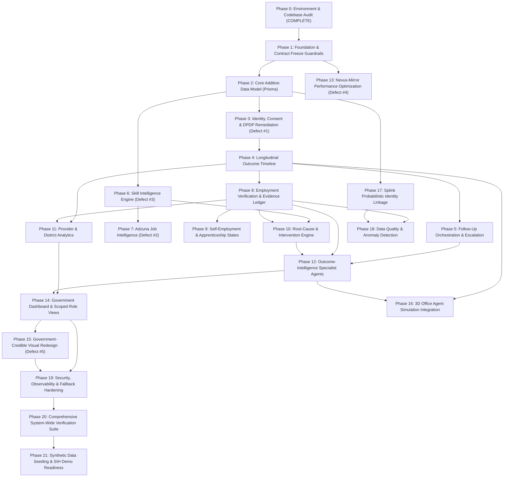

# NEXIS — Master Implementation Plan (22-Phase Execution Contract)

**Document Status:** Formal Execution Plan & System Blueprint  
**Date:** September 20, 2026  
**Problem Statement:** SIH26135 — Longitudinal Skilling Outcomes & Intelligence  
**Sponsor:** Government of Maharashtra (MSIS / Department of Skills, Employment, Entrepreneurship & Innovation)  
**Execution Branch:** `feat/sih26135-master-implementation`  

---

## 1. Executive Strategy & Dependency Architecture

NEXIS is engineered as an evidence-aware longitudinal outcome-intelligence platform built strictly additively on top of the existing NEXIS trainee-assistance architecture (React 19 + Express 5 + Prisma + PostgreSQL + Three.js 3D Office).

### 1.1 Critical Path & Work Classification

- **Critical Path:** Phase 0 → Phase 1 → Phase 2 → Phase 3 → Phase 4 → Phase 8 → Phase 10 → Phase 11 → Phase 14 → Phase 15 → Phase 20 → Phase 21.
- **Parallel-Safe Work:** 
  - Phase 6 (Skill Intelligence) and Phase 7 (Adzuna Job Matching) after Phase 2.
  - Phase 13 (Nexus-Mirror Latency) after Phase 1.
  - Phase 17 (Splink Service) in parallel with Phase 8–11.
- **Demo-Critical Work:** Phase 3 (Consent), Phase 4 (Outcome Timeline), Phase 7 (Real Job Links), Phase 8 (Evidence Ledger), Phase 10 (Intervention Engine), Phase 11 (Analytics), Phase 16 (3D Office), Phase 21 (Seeded Golden Path).
- **High-Risk Work:** Phase 2 (Database Migrations - must be strictly additive), Phase 3 (Consent Withdrawal Enforcement), Phase 16 (Three.js WebGL Performance).

---

## 2. Phase-by-Phase Execution Specifications

---

### Phase 0: Repository & Environment Audit
- **MD Section:** 5, 27 (Phase 0)
- **Status:** **COMPLETE** (Documented in `docs/phase0-audit.md`)
- **Key Findings:** React 19 + Express 5 running live; 75/75 unit tests passing; clean TypeScript compilation (`tsc --noEmit`); confirmed 5 priority defects; Adzuna credentials verified.

---

### Phase 1: Foundation & Regression Guardrails
- **MD Section:** 14.7, 27 (Phase 1), 28
- **Requirement:** Freeze existing API response contracts (`/api/jobs`, `/api/resume`, `/api/interview`, `/api/auth`) and establish empty routers for new namespaces (`/api/outcomes`, `/api/consent`, `/api/followups`, `/api/skills`, `/api/analytics`).
- **Current Implementation:** Existing routes mounted directly in `server/index.js`. No automated contract tests verifying frozen API payloads.
- **Target Implementation:**
  - Automated contract test suite in `tests/contract/` asserting response contracts for all existing endpoints.
  - New modular router files created under `server/routes/` with health-check stubs returning `{ status: 'ready', namespace: '...' }`.
  - Feature flag utility in `server/utils/featureFlags.js` and `src/core/useUiStore.ts`.
- **Affected Files:**
  - [NEW] `tests/contract/existingEndpoints.spec.ts`
  - [NEW] `server/routes/outcomes.js`
  - [NEW] `server/routes/followups.js`
  - [NEW] `server/routes/skills.js`
  - [NEW] `server/routes/analyticsOutcomes.js`
  - [NEW] `server/utils/featureFlags.js`
  - [MODIFY] `server/index.js`
- **DB Changes:** None.
- **API Changes:** Mount `/api/outcomes`, `/api/consent`, `/api/followups`, `/api/skills`, `/api/analytics` namespaces.
- **Tests:** `npx playwright test tests/contract` asserting schema stability.
- **Acceptance Criteria:** Contract suite passes; all new namespaces respond cleanly.
- **Risks & Rollback:** Low risk. Rollback by unmounting new router files.

---

### Phase 2: Core Additive Data Model
- **MD Section:** 13, 27 (Phase 2), 35
- **Requirement:** Implement the additive Prisma schema supporting longitudinal outcomes without mutating or dropping existing tables.
- **Current Implementation:** 26 existing models in `prisma/schema.prisma`.
- **Target Implementation:**
  - Add `publicId` (unique CUID/UUID) to `Trainee`.
  - Add new models: `ContactPoint`, `Consent` (extended), `OutcomeEvent`, `EmploymentRecord`, `WageObservation`, `VerificationEvidence`, `Employer`, `Skill`, `OccupationSkill`, `TraineeSkillEvidence`, `FollowUpAttempt`, `Intervention`, `AgentFinding`, `AuditLog`.
  - Safe additive migration using `npx prisma db push` or safe additive SQL.
- **Affected Files:**
  - [MODIFY] `prisma/schema.prisma`
- **DB Changes:** Additive only. No column renames, no deletions.
- **API Changes:** None yet.
- **Tests:** `npm test` verifying 75 existing unit tests continue to pass; Prisma client generation test.
- **Acceptance Criteria:** Schema compiles, `npx prisma generate` succeeds, existing tables intact.
- **Risks & Rollback:** Foreign key ordering. Rollback: restore previous `schema.prisma` and run `prisma generate`.

---

### Phase 3: Identity, Consent & DPDP Remediation (Defect #1 Fix)
- **MD Section:** 5.3 (#1), 14.1, 22, 27 (Phase 3)
- **Requirement:** Fix the broken consent flow; extend from 4 scopes to 8 granular DPDP purposes; generate `Trainee.publicId`; implement grant, view, and withdrawal APIs; enforce withdrawal server-side.
- **Current Implementation:** `ConsentScreen.tsx` has 4 scopes, sends unbatched requests, lacks withdrawal UI and server-side blocking.
- **Target Implementation:**
  - Endpoints: `POST /api/consent/grant`, `POST /api/consent/:id/withdraw`, `GET /api/consent/me`.
  - 8 Granular DPDP Purposes: `EMPLOYMENT_OUTCOME_TRACKING`, `CONTACT_FOLLOWUP`, `EMPLOYER_VERIFICATION`, `DATA_LINKAGE`, `ANALYTICS_RESEARCH`, `COURSE_RECOMMENDATION`, `INTERVENTION_SERVICES`, `THIRD_PARTY_SHARING`.
  - Server-side enforcement middleware: `enforceConsent(purpose)` blocking requests if consent is revoked.
  - UI: Modernized `ConsentScreen.tsx` with multilingual descriptions and a dedicated `ConsentManagementView.tsx` allowing one-click withdrawal.
- **Affected Files:**
  - [MODIFY] `server/routes/consent.js`
  - [NEW] `server/middleware/consentMiddleware.js`
  - [MODIFY] `src/interface/onboarding/ConsentScreen.tsx`
  - [NEW] `src/interface/views/ConsentManagementView.tsx`
  - [MODIFY] `src/integration/hooks/useTraineeProfile.ts`
  - [NEW] `tests/unit/dpdpPhase3.spec.ts`
- **Acceptance Criteria:** Trainee can grant all 8 purposes; trainee can view active consents; withdrawing a purpose immediately logs an audit record and blocks downstream actions.
- **Risks & Rollback:** Blocking legitimate flows. Mitigated by fail-safe fallback in `resilienceStore`.

---

### Phase 4: Longitudinal Outcome Timeline
- **MD Section:** 14.2, 19.1, 27 (Phase 4)
- **Requirement:** Implement append-only event-sourced outcome tracking (`CERTIFIED`, `SEEKING_WORK`, `EMPLOYED`, `APPRENTICE`, `SELF_EMPLOYED`, `RETAINED`, `SWITCHED_EMPLOYER`, `EXITED`, `UNREACHABLE`).
- **Current Implementation:** Status is represented by basic profile fields without historical event logs.
- **Target Implementation:**
  - Endpoints: `POST /api/outcomes/events` (creates immutable `OutcomeEvent`), `GET /api/outcomes/trainees/:id/timeline` (returns complete chronological event chain).
  - Materialized view service for low-latency current state reads.
  - Trainee timeline UI component (`OutcomeTimelineView.tsx`) displaying status progression with evidence badges.
- **Affected Files:**
  - [MODIFY] `server/routes/outcomes.js`
  - [NEW] `server/services/outcomeService.js`
  - [NEW] `src/interface/views/OutcomeTimelineView.tsx`
  - [NEW] `tests/unit/outcomeTimeline.spec.ts`
- **Acceptance Criteria:** Attempted mutation of existing event throws error; corrections link to `correctionOfId`; historical progression displays cleanly in timeline view.

---

### Phase 5: Follow-Up Orchestration & Escalation
- **MD Section:** 14.3, 19.4, 27 (Phase 5)
- **Requirement:** Checkpoint follow-ups at T+0, T+30, T+90, T+180, T+365 days; multichannel mock adapters (SMS, WhatsApp, Assisted Call); multilingual templates (Marathi, Hindi, English); escalation state machine.
- **Critical Rule:** Non-response is NEVER treated as unemployment; 3 failed attempts escalate to `UNREACHABLE` missing-observation state.
- **Target Implementation:**
  - Endpoints: `POST /api/followups/schedule`, `GET /api/followups/queue`, `POST /api/followups/:id/respond`.
  - Multilingual templates in `server/services/followupTemplates.js`.
  - Operator queue UI for assisted calls.
- **Affected Files:**
  - [MODIFY] `server/routes/followups.js`
  - [NEW] `server/services/followupService.js`
  - [NEW] `server/services/followupTemplates.js`
  - [NEW] `src/interface/views/FollowUpQueueView.tsx`
  - [NEW] `tests/unit/followupEscalation.spec.ts`
- **Acceptance Criteria:** Automated test proves 3 non-responses produce `UNREACHABLE` state with zero status degradation to unemployed.

---

### Phase 6: Skill Intelligence Engine (Defect #3 Fix)
- **MD Section:** 5.3 (#3), 14.5, 17, 27 (Phase 6)
- **Requirement:** Fix unrealistic skill-gap output by structuring findings into 7 evidence classes, requiring non-null `sourceSpan` for extracted skills, and grounding rationale in stated denominators.
- **Target Implementation:**
  - Endpoints: `POST /api/skills/extract` (returns skills with exact `sourceSpan` character offsets), `POST /api/skills/gap-analysis` (computes structured gaps, required levels, evidence class, and denominator-grounded rationale).
  - NSQF & ESCO crosswalk mapping in `server/services/skillTaxonomy.js`.
  - Extend Nexus-Strategist with structured output schema.
  - UI: Enhanced `SkillGapsView.tsx` displaying evidence class tags and verifiable percentages.
- **Affected Files:**
  - [MODIFY] `server/routes/skills.js`
  - [MODIFY] `server/routes/resume.js`
  - [NEW] `server/services/skillEngine.js`
  - [NEW] `server/services/skillTaxonomy.js`
  - [MODIFY] `src/interface/views/SkillGapsView.tsx`
  - [NEW] `tests/unit/skillIntelligence.spec.ts`
- **Acceptance Criteria:** Every gap has a non-null evidence class and stated denominator; no bare ungrounded AI paragraphs.

---

### Phase 7: Adzuna Job Intelligence (Defect #2 Fix)
- **MD Section:** 5.3 (#2), 14.7, 18, 27 (Phase 7)
- **Requirement:** Replace generic search links with real, structured Adzuna listings; enforce official "Jobs by Adzuna" attribution badge (≥116x23px hyperlinked); implement 6-factor deterministic matching score ($M = 0.40S + 0.20E + 0.15L + 0.10Q + 0.10R + 0.05P$).
- **Target Implementation:**
  - Hardened Adzuna service with in-memory TTL caching and rate-limit guardrails.
  - Nexus-Hunter integration with deterministic 6-factor scoring formula and visible configurable weights.
  - UI: `JobMatchesView.tsx` with attribution badge, direct application links, and transparent match factor breakdown.
- **Affected Files:**
  - [MODIFY] `server/routes/jobs.js`
  - [MODIFY] `server/services/jobSearchProvider.js`
  - [MODIFY] `src/interface/views/JobMatchesView.tsx`
  - [NEW] `src/interface/primitives/AdzunaAttributionBadge.tsx`
  - [NEW] `tests/unit/adzunaMatching.spec.ts`
- **Acceptance Criteria:** Zero fallback links to Google search; real clickable postings rendered; attribution badge mounted; matching score strictly follows formula.

---

### Phase 8: Employment Verification & Evidence Ledger
- **MD Section:** 14.4, 19.3, 27 (Phase 8)
- **Requirement:** Implement 4-tier evidence model ($C = \min(100, 25S + 25E + 20D + 15T + 15X)$); signed temporary employer confirmation links (zero friction, no employer account required); dispute conflict management (`CONFLICTING` status, no overwrites).
- **Target Implementation:**
  - Endpoints: `POST /api/employment/:id/evidence`, `POST /api/employers/:employerId/confirm`.
  - Signed token generator for employer confirmation portal.
  - Disputed claim handling preserving both trainee claim and employer contestation.
  - Evidence level badge primitive (`EvidenceBadge.tsx`).
- **Affected Files:**
  - [NEW] `server/routes/verification.js`
  - [NEW] `server/services/verificationEngine.js`
  - [MODIFY] `src/interface/views/EmployerVerificationPage.tsx`
  - [NEW] `src/interface/primitives/EvidenceBadge.tsx`
  - [NEW] `tests/unit/evidenceLedger.spec.ts`
- **Acceptance Criteria:** Formula computes exact score; employer dispute sets record to `CONFLICTING` without overwriting either statement.

---

### Phase 9: Self-Employment, Apprenticeship & Outcome States
- **MD Section:** 2.4, 19.1, 27 (Phase 9)
- **Requirement:** Extend outcome state machine for informal livelihoods, self-employment, family enterprises, and NAPS apprenticeship-to-employment conversions.
- **Target Implementation:**
  - Capture income bands and enterprise types without forcing formal payroll schemas.
  - Link apprenticeship completion events directly to employer conversion records.
- **Affected Files:**
  - [MODIFY] `server/services/outcomeService.js`
  - [MODIFY] `src/interface/views/OutcomeTimelineView.tsx`
  - [NEW] `tests/unit/selfEmploymentApprenticeship.spec.ts`
- **Acceptance Criteria:** Apprenticeship → Conversion → Employer switch golden path executes cleanly.

---

### Phase 10: Root-Cause & Intervention Engine
- **MD Section:** 14.5, 19.5, 27 (Phase 10)
- **Requirement:** Deterministic rule engine mapping observed signals to 10 root causes; intervention recommendation with mandatory human approval before delivery.
- **Target Implementation:**
  - Deterministic classifier: Skill mismatch, experience gap, location mismatch, salary mismatch, transport, language, interview failure, course relevance, employer demand, caregiving.
  - Interventions require reviewer approval (`Intervention.approvedBy`) before status changes to `DELIVERED`.
  - Career Intervention Agent generates personalized trainee-facing copy only after approval.
- **Affected Files:**
  - [NEW] `server/services/rootCauseEngine.js`
  - [NEW] `server/services/interventionService.js`
  - [NEW] `src/interface/views/InterventionManagementView.tsx`
  - [NEW] `tests/unit/rootCauseInterventions.spec.ts`
- **Acceptance Criteria:** Detected gap produces named root cause and intervention; unapproved sensitive intervention cannot be delivered.

---

### Phase 11: Provider & District Analytics
- **MD Section:** 14.6, 20, 27 (Phase 11)
- **Requirement:** `/api/analytics/providers` and `/api/analytics/districts` exposing cohort size, follow-up coverage, and uncertainty indicators alongside every point metric. No naked rankings.
- **Target Implementation:**
  - Cohort aggregation engine computing completion, placement, retention, and wage progression.
  - Small cell suppression rules (< 5 records masked for privacy).
  - UI: Modernized `AnalyticsDashboard.tsx` with district maps, cohort funnels, and confidence intervals.
- **Affected Files:**
  - [MODIFY] `server/routes/analyticsOutcomes.js`
  - [NEW] `server/services/analyticsService.js`
  - [MODIFY] `src/interface/admin/AnalyticsDashboard.tsx`
  - [NEW] `tests/unit/providerDistrictAnalytics.spec.ts`
- **Acceptance Criteria:** Every statistic renders its denominator; comparisons include uncertainty bands.

---

### Phase 12: Outcome-Intelligence Specialist Agents
- **MD Section:** 15, 27 (Phase 12)
- **Requirement:** Implement 8 net-new agents emitting mandatory finding schema (`findingId, agent, timestamp, inputSources, evidenceReferences, confidence, inferenceType, modelVersion, recommendedAction, humanReviewStatus`).
- **Target Implementation:**
  - Agents: Outcome Tracking, Follow-Up, Employment Verification, Employer Intelligence, Career Intervention, Programme Analytics, Policy Intelligence, Data Quality.
  - Pure finding generators; agents never directly mutate production records.
- **Affected Files:**
  - [NEW] `server/services/agents/outcomeAgents.js`
  - [NEW] `server/routes/agentFindings.js`
  - [NEW] `tests/unit/agentFindingSchema.spec.ts`
- **Acceptance Criteria:** All agent outputs adhere strictly to schema; findings route to human review queue.

---

### Phase 13: Nexus-Mirror Performance Optimization (Defect #4 Fix)
- **MD Section:** 5.3 (#4), 16, 27 (Phase 13)
- **Requirement:** Eliminate interview-prep latency without degrading question quality.
- **Target Implementation:**
  - Fast-tier model routing (Gemini 3.5/3.6 Flash).
  - Server-Sent Events token streaming for cross-questioning.
  - Response caching for common role briefings.
- **Affected Files:**
  - [MODIFY] `server/routes/interview.js`
  - [MODIFY] `server/services/interviewEngine.js`
  - [MODIFY] `src/interface/views/InterviewPrepView.tsx`
  - [NEW] `tests/unit/interviewPerformance.spec.ts`
- **Acceptance Criteria:** First-token latency < 1.2s; conversational responsiveness validated.

---

### Phase 14: Government Dashboard & Scoped Role Views
- **MD Section:** 7, 20, 21.2, 27 (Phase 14)
- **Requirement:** Scoped role-based views for Trainee, Provider, Employer, District Officer, State Administrator, Policy Analyst, Data-Quality Operator. Server-side row-level scoping.
- **Target Implementation:**
  - Role-gated route middleware verifying authorization context.
  - Navigation switcher in admin portal.
- **Affected Files:**
  - [NEW] `src/interface/roles/DistrictOfficerView.tsx`
  - [NEW] `src/interface/roles/ProviderAdminView.tsx`
  - [NEW] `src/interface/roles/StatePolicyView.tsx`
  - [MODIFY] `src/App.tsx`
- **Acceptance Criteria:** Unauthorized role access rejected with 403; scoped data filters match caller role.

---

### Phase 15: Government-Credible Visual Redesign (Defect #5 Fix)
- **MD Section:** 5.3 (#5), 21.4, 25.3, 27 (Phase 15)
- **Requirement:** Transform styling into a credible, restrained public-service platform; prominent "Synthetic demonstration data" disclaimers; distinct visual evidence badges.
- **Target Implementation:**
  - High-contrast, accessible typography scale and restrained palette.
  - Prominent banner & badge: *"Synthetic demonstration data — not official Maharashtra government statistics"*.
  - Visual distinction for Verified, Self-Reported, Inferred, and Conflicting data.
- **Affected Files:**
  - [MODIFY] `src/theme/bauhaus.ts`
  - [MODIFY] `src/index.css`
  - [NEW] `src/interface/primitives/SyntheticDataBadge.tsx`
  - [MODIFY] `src/interface/Shell.tsx`
- **Acceptance Criteria:** Visual review confirms serious, dignified public-sector aesthetic; disclaimer visible on all screens.

---

### Phase 16: 3D Office Agent Simulation Integration
- **MD Section:** 12.2, 21, 27 (Phase 16), 28
- **Requirement:** Preserve existing 3D Office; integrate real-time agent activity stream and interactive evidence finding inspector; keep 2D workflows 100% accessible independently.
- **Target Implementation:**
  - 3D Agent HUD connecting to SSE stream (`/api/agents/activity`).
  - Clickable agent workstations opening inspector modal with Section 15.3 finding schema.
  - Accessible 2D toggle for all features.
- **Affected Files:**
  - [MODIFY] `src/three/SceneManager.ts`
  - [MODIFY] `src/interface/views/SimulationView.tsx`
  - [NEW] `src/interface/views/AgentFindingInspectorModal.tsx`
  - [NEW] `tests/unit/threeDIntegration.spec.ts`
- **Acceptance Criteria:** 3D Office renders smoothly; clicking agent displays live findings; closing 3D mode reveals full 2D functionality.

---

### Phase 17: Splink Probabilistic Identity Linkage
- **MD Section:** 4.2, 17.4, 27 (Phase 17)
- **Requirement:** Isolated Python service running Splink v4/v5; probabilistic record linkage for changed contact info; human review queue feeding `DedupReviewPanel.tsx`.
- **Target Implementation:**
  - Standalone service in `services/splink-service/`.
  - Comparison rules on name, DOB, district, normalized phone/email tokens.
  - Integration with `DedupReviewPanel.tsx`.
- **Affected Files:**
  - [NEW] `services/splink-service/main.py`
  - [NEW] `services/splink-service/requirements.txt`
  - [MODIFY] `src/interface/admin/DedupReviewPanel.tsx`
  - [NEW] `tests/unit/splinkLinkage.spec.ts`
- **Acceptance Criteria:** Duplicate trainee with changed phone is flagged with match probability; ambiguous cases require human operator review.

---

### Phase 18: Data Quality & Anomaly Detection
- **MD Section:** 20, 25, 27 (Phase 18)
- **Requirement:** Detect impossible dates, employment before certification, duplicate employers, stale outcomes, and suspicious provider batches.
- **Target Implementation:**
  - Rule-based anomaly scanner in `server/services/dataQualityEngine.js`.
  - Issue review endpoint `GET /api/data-quality/issues`.
- **Affected Files:**
  - [NEW] `server/services/dataQualityEngine.js`
  - [NEW] `src/interface/admin/DataQualityReviewView.tsx`
  - [NEW] `tests/unit/dataQualityAnomalies.spec.ts`
- **Acceptance Criteria:** Synthetic anomalies correctly flagged; zero silent auto-modifications.

---

### Phase 19: Security, Observability & Fallback Hardening
- **MD Section:** 22.4, 23, 27 (Phase 19)
- **Requirement:** Input sanitization (prompt injection guardrails on resume uploads); audit logging on all mutations; verify all Section 23 failure fallbacks.
- **Target Implementation:**
  - Audit logging middleware.
  - Fallback simulation tests (Gemini down → Sarvam fallback → cached output).
- **Affected Files:**
  - [NEW] `server/middleware/securityAudit.js`
  - [MODIFY] `server/services/aiRouter.js`
  - [NEW] `tests/unit/securityAndFallbacks.spec.ts`
- **Acceptance Criteria:** All Section 23 failure scenarios tested and pass with graceful degradation.

---

### Phase 20: Comprehensive System-Wide Verification Suite
- **MD Section:** 25, 27 (Phase 20)
- **Requirement:** Complete automated testing sweep across unit, contract, integration, and UI workflows.
- **Target Implementation:**
  - Execute contract suite, unit test matrix, and end-to-end golden path.
- **Acceptance Criteria:** 100% test pass rate with zero regression in protected functionality.

---

### Phase 21: Synthetic Data Seeding & SIH Demo Readiness
- **MD Section:** 25.3, 27 (Phase 21), 31
- **Requirement:** Seed realistic synthetic demonstration cohort (~500 trainees, 10 providers, 6 districts, 20 employers); verify opening headline stat ("82% claimed vs 41% verified"); rehearse golden path and dispute path; finalize `docs/SIH_JUDGE_READINESS.md`.
- **Target Implementation:**
  - Seeding script `server/scripts/seedSihDemonstrationData.js`.
  - Complete judge readiness playbook `docs/SIH_JUDGE_READINESS.md`.
- **Affected Files:**
  - [NEW] `server/scripts/seedSihDemonstrationData.js`
  - [NEW] `docs/SIH_JUDGE_READINESS.md`
- **Acceptance Criteria:** Golden path runs end-to-end live; all UI numbers match seeded data; judge readiness documentation complete.
